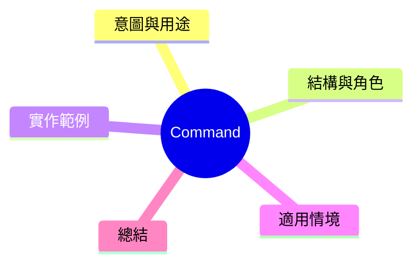

export const metadata = {
  title: '設計模式：命令模式 (Command)',
  date: '2026-06-30',
  excerpt: '介紹行為型設計模式中的命令模式：請求封裝成物件，藉此支援撤銷、重做、排隊、日誌與延遲執行，同時讓發送者與接收者不會緊密耦合。',
  tags: ['軟體設計', '設計模式', 'OOP'],
};

# 設計模式：命令模式 (Command)

Command 把請求封裝成一個物件。這個物件可以被儲存、傳遞、排隊、撤銷或重做，呼叫端完全不需要知道這個請求實際上做了什麼。


```mermaid
mindmap
    root((Command))
        意圖與用途
        結構與角色
        實作範例
        適用情境
        總結
```

- [意圖與用途](#意圖與用途)
- [結構與角色](#結構與角色)
- [實作範例：文字編輯器撤銷重做](#實作範例文字編輯器撤銷重做)
- [適用情境](#適用情境)
- [總結](#總結)

---

## 意圖與用途

假設一個文字編輯器需要支援 Ctrl+Z 撤銷與 Ctrl+Y 重做。如果沒有明確的模式，要追蹤每個操作前後的狀態很快就會變得一團亂。

Command 的解法：把每個操作包進一個物件，這個物件既知道怎麼執行自己，也知道怎麼還原自己。

---

## 結構與角色

- Command：定義 `execute()` 與 `undo()` 的介面
- ConcreteCommand：實作操作本身與它的還原邏輯
- Receiver：真正執行工作的物件 (`TextEditor`)
- Invoker：觸發命令並維護歷史紀錄的物件 (`CommandHistory`)

---

## 實作範例：文字編輯器撤銷重做

```typescript
interface Command {
  execute(): void;
  undo(): void;
}

// Receiver
class TextEditor {
  private content = '';

  getContent(): string { return this.content; }

  insertText(text: string, position: number): void {
    this.content = this.content.slice(0, position) + text + this.content.slice(position);
  }

  deleteText(position: number, length: number): void {
    this.content = this.content.slice(0, position) + this.content.slice(position + length);
  }
}

// ConcreteCommand：插入文字
class InsertCommand implements Command {
  constructor(
    private editor: TextEditor,
    private text: string,
    private position: number,
  ) {}

  execute(): void {
    this.editor.insertText(this.text, this.position);
  }

  undo(): void {
    this.editor.deleteText(this.position, this.text.length);
  }
}

// ConcreteCommand：刪除文字
class DeleteCommand implements Command {
  private deletedText = '';

  constructor(
    private editor: TextEditor,
    private position: number,
    private length: number,
  ) {}

  execute(): void {
    this.deletedText = this.editor.getContent().slice(this.position, this.position + this.length);
    this.editor.deleteText(this.position, this.length);
  }

  undo(): void {
    this.editor.insertText(this.deletedText, this.position);
  }
}

// Invoker：管理命令歷史
class CommandHistory {
  private history: Command[] = [];
  private redoStack: Command[] = [];

  execute(command: Command): void {
    command.execute();
    this.history.push(command);
    this.redoStack = []; // 新操作會清空重做堆疊
  }

  undo(): void {
    const command = this.history.pop();
    if (command) {
      command.undo();
      this.redoStack.push(command);
    }
  }

  redo(): void {
    const command = this.redoStack.pop();
    if (command) {
      command.execute();
      this.history.push(command);
    }
  }
}

// 使用
const editor = new TextEditor();
const history = new CommandHistory();

history.execute(new InsertCommand(editor, 'Hello', 0));
history.execute(new InsertCommand(editor, ' World', 5));
console.log(editor.getContent()); // 'Hello World'

history.undo(); // 撤銷插入 ' World'
console.log(editor.getContent()); // 'Hello'

history.redo(); // 重做插入 ' World'
console.log(editor.getContent()); // 'Hello World'
```

---

## 適用情境

適用時機

- 需要支援撤銷／重做
- 需要把操作排隊、排程或延遲執行
- 需要記錄每個操作的命令日誌 (實現 Audit Trail)

---

## 總結

Command 的核心是「把行為變成物件」。請求一旦成為物件，就能被儲存、被傳遞、排成一列，撤銷也變得自然。
