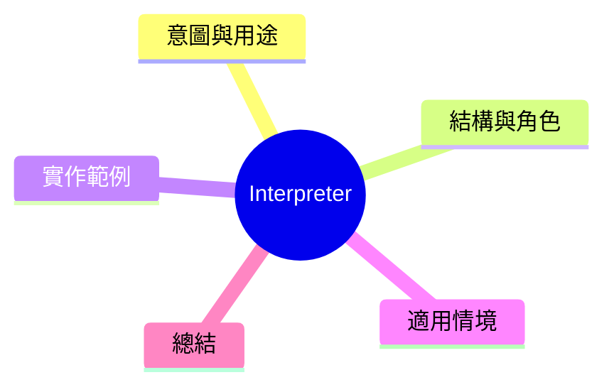

export const metadata = {
  title: '設計模式：解釋器模式 (Interpreter)',
  date: '2026-04-19',
  excerpt: '介紹行為型設計模式中的解釋器模式——為一種語言定義文法表示式，並建立解釋器處理該語言的句子。',
  tags: ['軟體設計', '設計模式', 'OOP'],
};

# 設計模式：解釋器模式 (Interpreter)

Interpreter 為一種語言定義文法的表示方式，並提供解釋器關連具體語句的實作。



- [意圖與用途](#意圖與用途)
- [結構與角色](#結構與角色)
- [實作範例：算術表達式計算器](#實作範例算術表達式計算器)
- [適用情境](#適用情境)
- [總結](#總結)

---

## 意圖與用途

當一種简單語言需要被解釋或執行時，可以將語言的文法表示為一個第層次的物件結構（AST），每個節點都知道如何解釋自己。

Interpreter 比起其他模式較少被直接使用，通常在需要定義簡單語言（設定 DSL、小型指令集）的情境下才需要。

---

## 結構與角色

- **AbstractExpression**：定義 `interpret(context)` 的介面
- **TerminalExpression**：語言中的終符號，不包含其他表達式（如數字、變數）
- **NonTerminalExpression**：包含其他表達式的組合式（如加法、乘法）
- **Context**：解釋過程中使用的外部資訊

---

## 實作範例：算術表達式計算器

```typescript
type Context = Map<string, number>;

interface Expression {
  interpret(context: Context): number;
}

// TerminalExpression: 數字常數
class NumberExpression implements Expression {
  constructor(private value: number) {}

  interpret(_context: Context): number {
    return this.value;
  }
}

// TerminalExpression: 變數
class VariableExpression implements Expression {
  constructor(private name: string) {}

  interpret(context: Context): number {
    const value = context.get(this.name);
    if (value === undefined) throw new Error(`未定義變數: ${this.name}`);
    return value;
  }
}

// NonTerminalExpression: 加法
class AddExpression implements Expression {
  constructor(
    private left: Expression,
    private right: Expression,
  ) {}

  interpret(context: Context): number {
    return this.left.interpret(context) + this.right.interpret(context);
  }
}

// NonTerminalExpression: 乘法
class MultiplyExpression implements Expression {
  constructor(
    private left: Expression,
    private right: Expression,
  ) {}

  interpret(context: Context): number {
    return this.left.interpret(context) * this.right.interpret(context);
  }
}

// NonTerminalExpression: 負號
class NegateExpression implements Expression {
  constructor(private expression: Expression) {}

  interpret(context: Context): number {
    return -this.expression.interpret(context);
  }
}

// 模擬展開表達式: (x + 5) * y
const context: Context = new Map([
  ['x', 3],
  ['y', 4],
]);

const expression = new MultiplyExpression(
  new AddExpression(
    new VariableExpression('x'),
    new NumberExpression(5),
  ),
  new VariableExpression('y'),
);

console.log(expression.interpret(context)); // (3 + 5) * 4 = 32

// 改變 context 不需要修改表達式結構
context.set('x', 10);
console.log(expression.interpret(context)); // (10 + 5) * 4 = 60
```

---

## 適用情境

**適用時機**

- 需要解釋一種簡單語言，且該語言的語句可表示為抽象語法樹
- 設定 DSL、設定檢栖語言、簡單指令集

**注意事項**

- 語言文法複雜時，解釋器模式會導致簡點類別暴增。正式語言通常應考慮使用 ANTLR 這類專業的語法分析工具。
- 這個模式在 GoF 23 種模式中相對少見，明白它的設計思想就夠。

---

## 總結

Interpreter 是將語言的文法映射為物件結構的典型方法。了解它的設計思想，能幫助你讀懂編譯器和觸發器中還差不多的一層設計。
