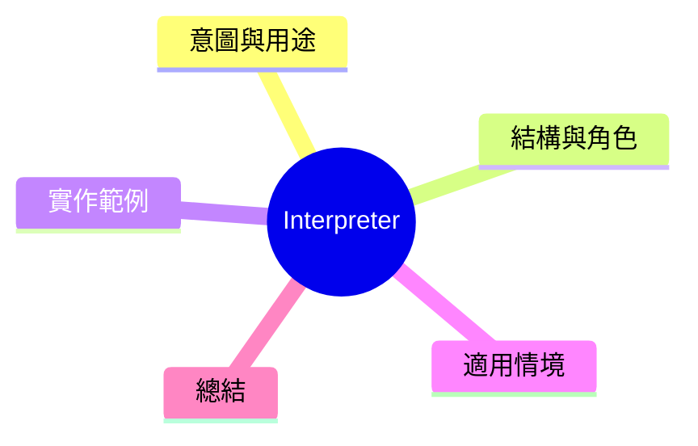

export const metadata = {
  title: '設計模式：解釋器模式 (Interpreter)',
  date: '2026-06-30',
  excerpt: '介紹行為型設計模式中的解釋器模式：為一種語言定義文法的表示方式，並建立一個解釋器來求值該語言的句子。',
  tags: ['軟體設計', '設計模式', 'OOP'],
};

# 設計模式：解釋器模式 (Interpreter)

Interpreter 為一種語言定義文法，並把它的句子對應成一棵物件樹，每個節點都知道如何解釋自己。


```mermaid
mindmap
    root((Interpreter))
        意圖與用途
        結構與角色
        實作範例
        適用情境
        總結
```

- [意圖與用途](#意圖與用途)
- [結構與角色](#結構與角色)
- [實作範例：算術表達式計算器](#實作範例算術表達式計算器)
- [適用情境](#適用情境)
- [總結](#總結)

---

## 意圖與用途

當一種簡單語言需要被求值或執行時，可以把它的文法表示成一個層次化的物件結構 (也就是 AST)，每一種節點都知道如何解釋自己。

Interpreter 在 GoF 模式中相對少被使用。只有當你要定義一種小而受控的語言時，才值得動用它：例如設定用的 DSL、簡單的規則引擎，或一組小型指令集。

---

## 結構與角色

- AbstractExpression：定義 `interpret(context)` 的介面
- TerminalExpression：沒有子表達式的終端符號 (數字、變數)
- NonTerminalExpression：包含其他表達式的組合式 (加法、乘法)
- Context：解釋過程中可取用的外部狀態

---

## 實作範例：算術表達式計算器

```typescript
type Context = Map<string, number>;

interface Expression {
  interpret(context: Context): number;
}

// TerminalExpression：數字常數
class NumberExpression implements Expression {
  constructor(private value: number) {}

  interpret(_context: Context): number {
    return this.value;
  }
}

// TerminalExpression：變數
class VariableExpression implements Expression {
  constructor(private name: string) {}

  interpret(context: Context): number {
    const value = context.get(this.name);
    if (value === undefined) throw new Error(`未定義變數: ${this.name}`);
    return value;
  }
}

// NonTerminalExpression：加法
class AddExpression implements Expression {
  constructor(
    private left: Expression,
    private right: Expression,
  ) {}

  interpret(context: Context): number {
    return this.left.interpret(context) + this.right.interpret(context);
  }
}

// NonTerminalExpression：乘法
class MultiplyExpression implements Expression {
  constructor(
    private left: Expression,
    private right: Expression,
  ) {}

  interpret(context: Context): number {
    return this.left.interpret(context) * this.right.interpret(context);
  }
}

// NonTerminalExpression：負號
class NegateExpression implements Expression {
  constructor(private expression: Expression) {}

  interpret(context: Context): number {
    return -this.expression.interpret(context);
  }
}

// 為 (x + 5) * y 建立 AST
const context: Context = new Map([
  ['x', 3],
  ['y', 4],
]);

const expression = new MultiplyExpression(
  new AddExpression(
    new VariableExpression('x'),
    new NumberExpression(5),
  ),
  new VariableExpression('y'),
);

console.log(expression.interpret(context)); // (3 + 5) * 4 = 32

// 只改 context，不必動表達式樹
context.set('x', 10);
console.log(expression.interpret(context)); // (10 + 5) * 4 = 60
```

---

## 適用情境

適用時機

- 需要求值一種簡單語言，且該語言的句子可以表示成抽象語法樹
- 設定用的 DSL、簡單的規則引擎、小型指令集

注意事項

- 文法一旦變複雜，解釋器模式會導致類別數量爆炸。真正的語言應該改用 ANTLR 這類專門的剖析器產生器。
- 在多數情況下，理解這個模式的設計思想，比直接拿來用更有價值。

---

## 總結

Interpreter 是把語言文法對應成物件樹的經典手法。

理解它，能讓你看懂編譯器與模板引擎背後的其中一層概念設計，即使你從來不需要從頭手刻一個。
