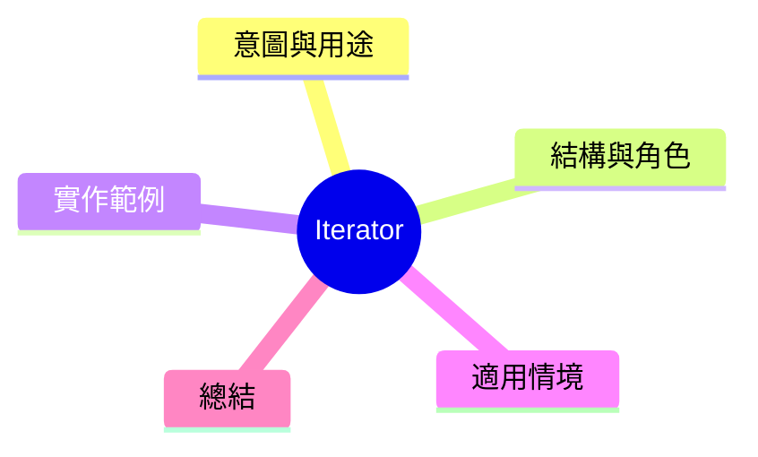

export const metadata = {
  title: '設計模式：迭代器模式 (Iterator)',
  date: '2026-04-05',
  excerpt: '介紹行為型設計模式中的迭代器模式——將遍歷邏輯與集合實作分離，讓客戶端不需知道內部資料結構。',
  tags: ['軟體設計', '設計模式', 'OOP'],
};

# 設計模式：迭代器模式 (Iterator)

Iterator 提供一種方法，將集合元素逐一存取，不暴露內部資料結構。



- [意圖與用途](#意圖與用途)
- [結構與角色](#結構與角色)
- [實作範例：訂單集合遍歷](#實作範例訂單集合遍歷)
- [適用情境](#適用情境)
- [總結](#總結)

---

## 意圖與用途

當一個集合的內部結構複雜時（樹、圖、排序結果、分頁資料），客戶端希望以統一的方式遍歷，不需要知道屇閹是走樹、走陣列還是打 API。

Iterator 提供統一的遍歷介面，集合對外隐藏實作細節。

---

## 結構與角色

- **Iterator**：遍歷的介面 (`next()`、`hasNext()`)
- **Iterable**：可以產生 Iterator 的集合介面
- **ConcreteIterator**：實作遞迴邏輯
- **ConcreteAggregate**：實際的集合物件

---

## 實作範例：訂單集合遍歷

```typescript
interface Iterator<T> {
  next(): T | undefined;
  hasNext(): boolean;
}

interface Iterable<T> {
  createIterator(): Iterator<T>;
}

// 訂單物件
interface Order {
  id: string;
  total: number;
  status: 'pending' | 'shipped' | 'delivered';
}

// ConcreteAggregate: 訂單集合
class OrderCollection implements Iterable<Order> {
  private orders: Order[] = [];

  add(order: Order): void {
    this.orders.push(order);
  }

  createIterator(): Iterator<Order> {
    return new OrderIterator(this.orders);
  }

  // 也可以提供筛選迭代器
  createFilteredIterator(status: Order['status']): Iterator<Order> {
    return new FilteredOrderIterator(this.orders, status);
  }
}

// ConcreteIterator: 小到大遍歷
class OrderIterator implements Iterator<Order> {
  private index = 0;

  constructor(private orders: Order[]) {}

  hasNext(): boolean { return this.index < this.orders.length; }
  next(): Order | undefined { return this.orders[this.index++]; }
}

// ConcreteIterator: 筛選特定狀態
class FilteredOrderIterator implements Iterator<Order> {
  private filtered: Order[];
  private index = 0;

  constructor(orders: Order[], status: Order['status']) {
    this.filtered = orders.filter(o => o.status === status);
  }

  hasNext(): boolean { return this.index < this.filtered.length; }
  next(): Order | undefined { return this.filtered[this.index++]; }
}

// 使用
const collection = new OrderCollection();
collection.add({ id: 'A001', total: 1200, status: 'pending' });
collection.add({ id: 'A002', total: 800, status: 'shipped' });
collection.add({ id: 'A003', total: 500, status: 'pending' });

const iterator = collection.createFilteredIterator('pending');
while (iterator.hasNext()) {
  const order = iterator.next()!;
  console.log(`訂單 ${order.id}: $${order.total}`);
}
```

---

## 適用情境

**適用時機**

- 需要統一的方式遍歷不同結構的集合
- 客戶端不應該實际關心數據的內部表示

**實務處理**

JavaScript/TypeScript 就內建 Iterator 協議（`Symbol.iterator`）和 Generator。自訂義遍歷時，可以用 Generator 很優雅地實作 Iterator。

---

## 總結

Iterator 分離了集合的儲存邏輯與遍歷邏輯。客戶端只需要接受 Iterator，不需要明白內部資料結構。自訂義 Iterator 在視圖行楚、範圍遍歷、API分頁等情境很常用到。
