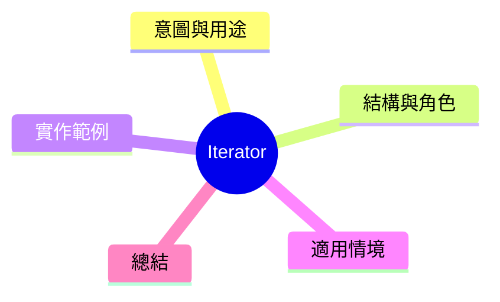

export const metadata = {
  title: '設計模式：迭代器模式 (Iterator)',
  date: '2026-06-30',
  excerpt: '介紹行為型設計模式中的迭代器模 —— 遍歷邏輯與集合的內部實作分離，讓客戶端不必知道集合的內部結構就能逐一走訪。',
  tags: ['軟體設計', '設計模式', 'OOP'],
};

# 設計模式：迭代器模式 (Iterator)

Iterator 提供一種方式，依序存取集合中的每個元素，而不暴露它底層的結構。


```mermaid
mindmap
    root((Iterator))
        意圖與用途
        結構與角色
        實作範例
        適用情境
        總結
```

- [意圖與用途](#意圖與用途)
- [結構與角色](#結構與角色)
- [實作範例：訂單集合遍歷](#實作範例訂單集合遍歷)
- [適用情境](#適用情境)
- [總結](#總結)

---

## 意圖與用途

當一個集合的內部結構很複雜時 (樹、圖、排序後的結果、分頁資料)，客戶端會希望用統一的方式走訪它，而不必知道底層究竟是走樹、走陣列，還是打 API。

Iterator 提供一致的遍歷介面，集合則把實作細節藏在後面。

---

## 結構與角色

- Iterator：遍歷的介面 (`next()`、`hasNext()`)
- Iterable：能產生 Iterator 的集合介面
- ConcreteIterator：實作遍歷邏輯
- ConcreteAggregate：實際的集合物件

---

## 實作範例：訂單集合遍歷

```typescript
interface Iterator<T> {
  next(): T | undefined;
  hasNext(): boolean;
}

interface Iterable<T> {
  createIterator(): Iterator<T>;
}

// 訂單物件
interface Order {
  id: string;
  total: number;
  status: 'pending' | 'shipped' | 'delivered';
}

// ConcreteAggregate：訂單集合
class OrderCollection implements Iterable<Order> {
  private orders: Order[] = [];

  add(order: Order): void {
    this.orders.push(order);
  }

  createIterator(): Iterator<Order> {
    return new OrderIterator(this.orders);
  }

  // 也可以提供篩選用的迭代器
  createFilteredIterator(status: Order['status']): Iterator<Order> {
    return new FilteredOrderIterator(this.orders, status);
  }
}

// ConcreteIterator：依序遍歷
class OrderIterator implements Iterator<Order> {
  private index = 0;

  constructor(private orders: Order[]) {}

  hasNext(): boolean { return this.index < this.orders.length; }
  next(): Order | undefined { return this.orders[this.index++]; }
}

// ConcreteIterator：只走訪特定狀態
class FilteredOrderIterator implements Iterator<Order> {
  private filtered: Order[];
  private index = 0;

  constructor(orders: Order[], status: Order['status']) {
    this.filtered = orders.filter(o => o.status === status);
  }

  hasNext(): boolean { return this.index < this.filtered.length; }
  next(): Order | undefined { return this.filtered[this.index++]; }
}

// 使用
const collection = new OrderCollection();
collection.add({ id: 'A001', total: 1200, status: 'pending' });
collection.add({ id: 'A002', total: 800, status: 'shipped' });
collection.add({ id: 'A003', total: 500, status: 'pending' });

const iterator = collection.createFilteredIterator('pending');
while (iterator.hasNext()) {
  const order = iterator.next()!;
  console.log(`訂單 ${order.id}: $${order.total}`);
}
```

---

## 適用情境

適用時機

- 需要用統一的方式走訪內部結構各異的集合
- 客戶端不需要知道、也不必在意集合內部是怎麼表示的

實務補充

JavaScript／TypeScript 本身就內建了迭代器協定 (`Symbol.iterator`)，而 Generator 函式能讓你很簡潔地實作自訂迭代器。自訂迭代器常用於虛擬捲動、範圍走訪，以及分頁 API 的回應。

---

## 總結

Iterator 把集合的儲存邏輯與遍歷邏輯分了開來。客戶端只管消費一個 Iterator，不需要理解底層的資料結構。這個模式如此基礎，幾乎每一種現代語言的標準函式庫都內建了它。
