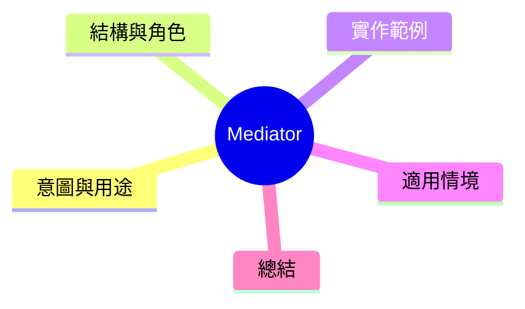

export const metadata = {
  title: '設計模式：中介者模式 (Mediator)',
  date: '2026-06-30',
  excerpt: '介紹行為型設計模式中的中介者模 —— 一個中介物件集中處理物件之間的通訊，把多對多的耦合收斂成一對多。',
  tags: ['軟體設計', '設計模式', 'OOP'],
};

# 設計模式：中介者模式 (Mediator)

Mediator 把物件之間的通訊集中起來。各元件不再彼此直接溝通，而是透過中介者轉發訊息，把多對多的耦合，收斂成星型結構。


```mermaid
mindmap
    root((Mediator))
        意圖與用途
        結構與角色
        實作範例
        適用情境
        總結
```

- [意圖與用途](#意圖與用途)
- [結構與角色](#結構與角色)
- [實作範例：聊天室中介者](#實作範例聊天室中介者)
- [適用情境](#適用情境)
- [總結](#總結)

---

## 意圖與用途

想像一個介面上有多個元件：搜尋框、列表、按鈕、狀態列。當搜尋框內容改變時，它應該要篩選列表、啟用某個按鈕，並更新狀態列。

如果每個元件都直接引用其他元件，就會形成一張糾纏的依賴網。Mediator 把這些通訊全收進一個中央協調者。

---

## 結構與角色

- Mediator：定義元件之間通訊的介面
- ConcreteMediator：實作元件之間的協調邏輯
- Colleague：透過中介者運作的各個元件

---

## 實作範例：聊天室中介者

```typescript
interface ChatMediator {
  sendMessage(message: string, sender: User): void;
  addUser(user: User): void;
}

// Colleague
class User {
  constructor(
    public name: string,
    private mediator: ChatMediator,
  ) {}

  send(message: string): void {
    console.log(`${this.name} 發送：${message}`);
    this.mediator.sendMessage(message, this);
  }

  receive(message: string, from: User): void {
    console.log(`${this.name} 收到來自 ${from.name} 的訊息：${message}`);
  }
}

// ConcreteMediator：公開聊天室
class PublicChatRoom implements ChatMediator {
  private users: User[] = [];

  addUser(user: User): void {
    this.users.push(user);
  }

  sendMessage(message: string, sender: User): void {
    this.users
      .filter(user => user !== sender)
      .forEach(user => user.receive(message, sender));
  }
}

// ConcreteMediator：私訊頻道
class DirectMessageRoom implements ChatMediator {
  private users: User[] = [];
  private messageHistory: string[] = [];

  addUser(user: User): void {
    if (this.users.length >= 2) {
      throw new Error('私訊頻道只支援兩個使用者');
    }
    this.users.push(user);
  }

  sendMessage(message: string, sender: User): void {
    this.messageHistory.push(`[${sender.name}] ${message}`);
    const recipient = this.users.find(u => u !== sender);
    recipient?.receive(message, sender);
  }

  getHistory(): string[] {
    return [...this.messageHistory];
  }
}

// 使用
const publicRoom = new PublicChatRoom();
const alice = new User('Alice', publicRoom);
const bob = new User('Bob', publicRoom);
const charlie = new User('Charlie', publicRoom);

publicRoom.addUser(alice);
publicRoom.addUser(bob);
publicRoom.addUser(charlie);

alice.send('大家好!');
// Bob 收到來自 Alice 的訊息：大家好!
// Charlie 收到來自 Alice 的訊息：大家好!
```

---

## 適用情境

適用時機

- 多個元件彼此直接引用，形成一張高耦合的網
- 需要一個集中的地方來管理元件之間複雜的互動邏輯

Mediator vs. Observer

| | Mediator | Observer |
|---|---|---|
| 通訊方式 | 集中到中介者 | Subject 廣播給所有 Observer |
| 耦合程度 | 低 (元件只認識中介者) | 低 (Observer 彼此互不知情) |
| 典型應用 | 介面對話框管理 | 事件／狀態通知 |

---

## 總結

Mediator 把多對多的耦合，轉成一個星型結構：所有元件都只認識中介者。中介者於是成為整場對話的樞紐，封裝了所有協調邏輯。

在實務上，表單管理器、訊息中心，以及元件庫的事件中樞，骨子裡都是 Mediator。
