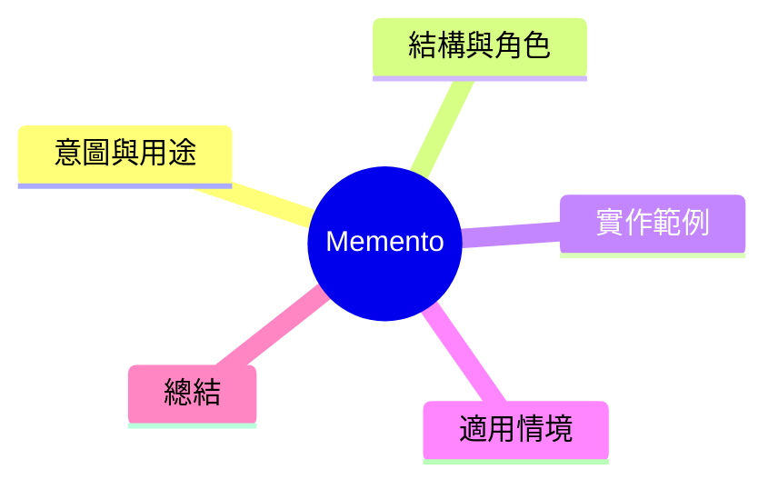

export const metadata = {
  title: '設計模式：備忘錄模式 (Memento)',
  date: '2026-04-15',
  excerpt: '介紹行為型設計模式中的備忘錄模式——將物件內部狀態封裝成備忘錄物件，不暴露細節的情況下支援撤銷與還原。',
  tags: ['軟體設計', '設計模式', 'OOP'],
};

# 設計模式：備忘錄模式 (Memento)

Memento 將物件內部狀態封裝成備忘錄物件。物件外部可儲存、傳遞備忘錄而不暴露物件的內部細節，自然地支援撤銷與還原。



- [意圖與用途](#意圖與用途)
- [結構與角色](#結構與角色)
- [實作範例：文字編輯器還原功能](#實作範例文字編輯器還原功能)
- [適用情境](#適用情境)
- [總結](#總結)

---

## 意圖與用途

備忘錄模式將狀態封裝成備忘錄物件，外部的管理者（Caretaker）儲存歷史記錄而不需知道內部細節。

這與 Command 模式不同：Command 記錄「操作」，Memento 記錄「狀態快照」。兩者常一起使用。

---

## 結構與角色

- **Originator**：產生備忘錄與恢復狀態的物件
- **Memento**：封裝特定時刻狀態的不可變物件
- **Caretaker**：儲存備忘錄歷史，但不操作備忘錄內容

---

## 實作範例：文字編輯器還原功能

```typescript
// Memento
class EditorMemento {
  constructor(
    private readonly content: string,
    private readonly cursorPosition: number,
    private readonly timestamp: Date = new Date(),
  ) {}

  getContent(): string { return this.content; }
  getCursorPosition(): number { return this.cursorPosition; }
  getTimestamp(): Date { return this.timestamp; }
}

// Originator
class TextEditor {
  private content = '';
  private cursorPosition = 0;

  type(text: string): void {
    this.content =
      this.content.slice(0, this.cursorPosition) +
      text +
      this.content.slice(this.cursorPosition);
    this.cursorPosition += text.length;
  }

  moveCursor(position: number): void {
    this.cursorPosition = Math.max(0, Math.min(position, this.content.length));
  }

  getContent(): string { return this.content; }
  getCursor(): number { return this.cursorPosition; }

  // 建立備忘錄
  save(): EditorMemento {
    return new EditorMemento(this.content, this.cursorPosition);
  }

  // 從備忘錄還原
  restore(memento: EditorMemento): void {
    this.content = memento.getContent();
    this.cursorPosition = memento.getCursorPosition();
  }
}

// Caretaker
class EditorHistory {
  private mementos: EditorMemento[] = [];

  save(memento: EditorMemento): void {
    this.mementos.push(memento);
  }

  undo(): EditorMemento | undefined {
    return this.mementos.pop();
  }

  getCount(): number { return this.mementos.length; }
}

// 使用
const editor = new TextEditor();
const history = new EditorHistory();

history.save(editor.save());
editor.type('Hello');

history.save(editor.save());
editor.type(', World');

history.save(editor.save());
editor.type('!');

console.log(editor.getContent()); // 'Hello, World!'

editor.restore(history.undo()!);
console.log(editor.getContent()); // 'Hello, World'

editor.restore(history.undo()!);
console.log(editor.getContent()); // 'Hello'
```

---

## 適用情境

**適用時機**

- 需要撤銷/重做或居期儲存
- 對象內部狀態不應不至暴露給外部

**Memento vs. Command**

Command 記錄請求和如何反轉，Memento 記錄狀態快照。內容編輯器常兩者並用：Command 追蹤操作，Memento 操作前建立快照。

---

## 總結

Memento 的精體：不暴露物件內部細節的情況下，儲存與還原狀態。預存新狀態、恢復旗條、網頁要專離時自動儲存等常見情境都是 Memento 的應用場景。
