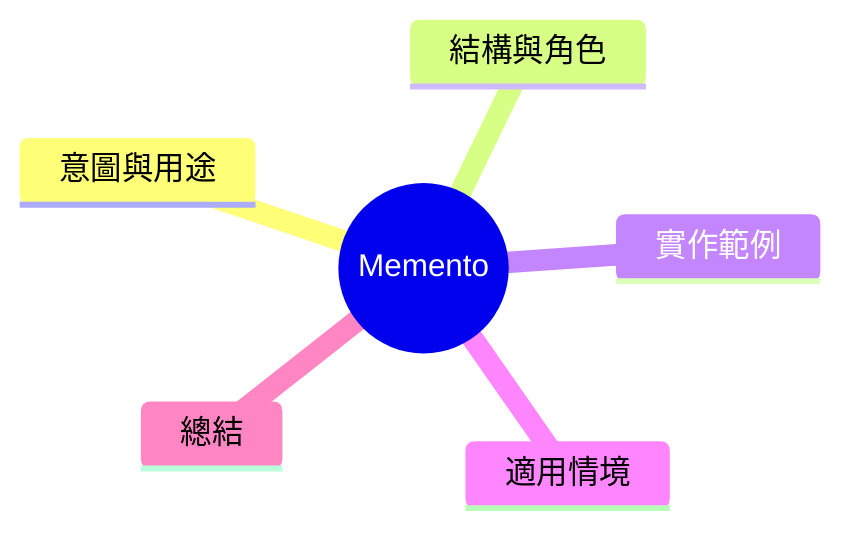

export const metadata = {
  title: '設計模式：備忘錄模式 (Memento)',
  date: '2026-06-30',
  excerpt: '介紹行為型設計模式中的備忘錄模 —— 物件的內部狀態擷取成一份快照物件，讓它日後能被還原，而不必暴露內部細節。',
  tags: ['軟體設計', '設計模式', 'OOP'],
};

# 設計模式：備忘錄模式 (Memento)

Memento 把物件的內部狀態擷取成一份快照。外部的管理者 (Caretaker) 可以儲存並還原這些快照，而不需要知道物件私有的實作細節。


```mermaid
mindmap
    root((Memento))
        意圖與用途
        結構與角色
        實作範例
        適用情境
        總結
```

- [意圖與用途](#意圖與用途)
- [結構與角色](#結構與角色)
- [實作範例：文字編輯器還原功能](#實作範例文字編輯器還原功能)
- [適用情境](#適用情境)
- [總結](#總結)

---

## 意圖與用途

備忘錄模式把狀態打包成快照物件，外部的管理者 (Caretaker) 保管這份歷史，卻不需要知道裡面裝了什麼。

它與 Command 模式的差別在於：Command 記錄的是「操作」以及如何反轉操作；Memento 記錄的是「狀態快照」。在文字編輯器裡，兩者常常搭配使用。

---

## 結構與角色

- Originator：產生備忘錄、也從備忘錄還原狀態的物件
- Memento：某個特定時刻狀態的不可變快照
- Caretaker：保管備忘錄歷史，但不去動它的內容

---

## 實作範例：文字編輯器還原功能

```typescript
// Memento
class EditorMemento {
  constructor(
    private readonly content: string,
    private readonly cursorPosition: number,
    private readonly timestamp: Date = new Date(),
  ) {}

  getContent(): string { return this.content; }
  getCursorPosition(): number { return this.cursorPosition; }
  getTimestamp(): Date { return this.timestamp; }
}

// Originator
class TextEditor {
  private content = '';
  private cursorPosition = 0;

  type(text: string): void {
    this.content =
      this.content.slice(0, this.cursorPosition) +
      text +
      this.content.slice(this.cursorPosition);
    this.cursorPosition += text.length;
  }

  moveCursor(position: number): void {
    this.cursorPosition = Math.max(0, Math.min(position, this.content.length));
  }

  getContent(): string { return this.content; }
  getCursor(): number { return this.cursorPosition; }

  // 建立備忘錄
  save(): EditorMemento {
    return new EditorMemento(this.content, this.cursorPosition);
  }

  // 從備忘錄還原
  restore(memento: EditorMemento): void {
    this.content = memento.getContent();
    this.cursorPosition = memento.getCursorPosition();
  }
}

// Caretaker
class EditorHistory {
  private mementos: EditorMemento[] = [];

  save(memento: EditorMemento): void {
    this.mementos.push(memento);
  }

  undo(): EditorMemento | undefined {
    return this.mementos.pop();
  }

  getCount(): number { return this.mementos.length; }
}

// 使用
const editor = new TextEditor();
const history = new EditorHistory();

history.save(editor.save());
editor.type('Hello');

history.save(editor.save());
editor.type(', World');

history.save(editor.save());
editor.type('!');

console.log(editor.getContent()); // 'Hello, World!'

editor.restore(history.undo()!);
console.log(editor.getContent()); // 'Hello, World'

editor.restore(history.undo()!);
console.log(editor.getContent()); // 'Hello'
```

---

## 適用情境

適用時機

- 需要撤銷／重做，或定期建立快照
- 不希望把物件的內部狀態暴露給外部的儲存機制

Memento vs. Command

Command 記錄的是「發生了什麼」以及如何反轉；Memento 記錄的是「某個時間點的狀態」。文字編輯器常常兩者並用：Command 追蹤操作，Memento 在每次變更前拍下快照。

---

## 總結

Memento 的精髓：在不暴露物件內部細節的前提下，儲存與還原狀態。草稿狀態、還原點，以及離開頁面前的自動儲存，都是 Memento 最自然的應用場景。
