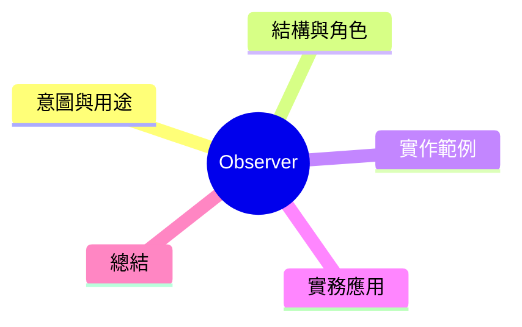

export const metadata = {
  title: '設計模式：觀察者模式 (Observer)',
  date: '2026-03-30',
  excerpt: '介紹行為型設計模式中的觀察者模式——建立一對多的依賴關係，讓物件狀態改變時自動通知所有訂閱者。',
  tags: ['軟體設計', '設計模式', 'OOP'],
};

# 設計模式：觀察者模式 (Observer)

Observer 建立一個一對多的依賴關係。當一個物件（Subject）狀態改變時，所有訂閱它的物件（Observer）都會自動受到通知。



- [意圖與用途](#意圖與用途)
- [結構與角色](#結構與角色)
- [實作範例：電商庫存通知](#實作範例電商庫存通知)
- [實務應用](#實務應用)
- [總結](#總結)

---

## 意圖與用途

Observer 反轉了依賴方向：不是 Observer 主動詢問 Subject 有沒有改變，而是 Subject 有改變時主動推送通知。

常見應用：

- 電商庫存改變時通知訂閱用戶
- 前端狀態管理（如 RxJS、Redux）
- DOM 事件监聽機制

---

## 結構與角色

- **Subject**：被觀察的物件，維護一份 Observer 列表
- **Observer**：訂閱通知的丞上介面
- **ConcreteSubject**：持有狀態，狀態改變時通知剀所有 Observer
- **ConcreteObserver**：實作通知時的反應邏輯

---

## 實作範例：電商庫存通知

```typescript
interface Observer {
  update(product: string, stock: number): void;
}

class StockSubject {
  private observers: Observer[] = [];
  private stock: Map<string, number> = new Map();

  subscribe(observer: Observer): void {
    this.observers.push(observer);
  }

  unsubscribe(observer: Observer): void {
    this.observers = this.observers.filter(o => o !== observer);
  }

  setStock(product: string, amount: number): void {
    this.stock.set(product, amount);
    this.notify(product, amount);
  }

  private notify(product: string, amount: number): void {
    this.observers.forEach(observer => observer.update(product, amount));
  }
}

// ConcreteObserver: 用戶訂閱
 class UserStockAlert implements Observer {
  constructor(private userId: string) {}

  update(product: string, stock: number): void {
    if (stock > 0) {
      console.log(`[${this.userId}] 「${product}」已補貨！剩装 ${stock} 件`);
    }
  }
}

// ConcreteObserver: 庫存監控
class InventoryMonitor implements Observer {
  update(product: string, stock: number): void {
    if (stock < 10) {
      console.log(`[監控] 「${product}」庫存低於 10，請尽快補貨！`);
    }
  }
}

// 使用
const stockManager = new StockSubject();

const user1 = new UserStockAlert('user-001');
const user2 = new UserStockAlert('user-002');
const monitor = new InventoryMonitor();

stockManager.subscribe(user1);
stockManager.subscribe(user2);
stockManager.subscribe(monitor);

stockManager.setStock('iPhone 16', 50); // user1, user2, monitor 全部收到通知
stockManager.setStock('AirPods', 5);    // monitor 發出低庫存警告

// 取消訂閱
stockManager.unsubscribe(user2);
stockManager.setStock('iPhone 16', 100); // 只有 user1 和 monitor 收到
```

---

## 實務應用

**適用時機**

- 物件狀態改變需要通知其他物件，但不知道有多少個、欪是哪些
- 希望解耆 Subject 與 Observer，尚非直接依賴

**特別注意**

- 觀察者調用順序通常不保證
- 如果觀察者很多，大量通知可能成為效能瓶頸

---

## 總結

Observer 是事件驅動架構的基礎。JavaScript 的 `EventEmitter`、RxJS 的 `Observable`、前端狀態管理庫都建立在這個模式上。理解 Observer 可以幫助你讀懂許多現代前端工具的設計主軸。
