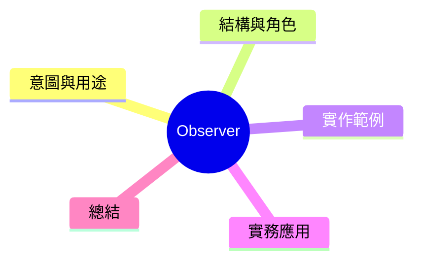

export const metadata = {
  title: '設計模式：觀察者模式 (Observer)',
  date: '2026-06-30',
  excerpt: '介紹行為型設計模式中的觀察者模式：建立一對多的依賴關係，讓物件狀態改變時自動通知所有訂閱者。',
  tags: ['軟體設計', '設計模式', 'OOP'],
};

# 設計模式：觀察者模式 (Observer)

Observer 建立一個一對多的依賴關係。當一個物件 (Subject) 狀態改變時，所有訂閱它的物件 (Observer) 都會自動收到通知並更新。


```mermaid
mindmap
    root((Observer))
        意圖與用途
        結構與角色
        實作範例
        實務應用
        總結
```

- [意圖與用途](#意圖與用途)
- [結構與角色](#結構與角色)
- [實作範例：電商庫存通知](#實作範例電商庫存通知)
- [實務應用](#實務應用)
- [總結](#總結)

---

## 意圖與用途

Observer 反轉了依賴的方向：不是 Observer 主動去問 Subject 有沒有變，而是 Subject 一有改變就主動推送通知。

常見應用：

- 電商庫存改變時通知有訂閱的使用者
- 前端狀態管理 (例如 RxJS、Redux)
- DOM 事件監聽機制

---

## 結構與角色

- Subject：被觀察的物件，維護一份 Observer 清單
- Observer：訂閱者要實作的介面
- ConcreteSubject：持有狀態，狀態改變時通知所有 Observer
- ConcreteObserver：實作收到通知時的反應邏輯

---

## 實作範例：電商庫存通知

```typescript
interface Observer {
  update(product: string, stock: number): void;
}

class StockSubject {
  private observers: Observer[] = [];
  private stock: Map<string, number> = new Map();

  subscribe(observer: Observer): void {
    this.observers.push(observer);
  }

  unsubscribe(observer: Observer): void {
    this.observers = this.observers.filter(o => o !== observer);
  }

  setStock(product: string, amount: number): void {
    this.stock.set(product, amount);
    this.notify(product, amount);
  }

  private notify(product: string, amount: number): void {
    this.observers.forEach(observer => observer.update(product, amount));
  }
}

// ConcreteObserver：使用者訂閱
class UserStockAlert implements Observer {
  constructor(private userId: string) {}

  update(product: string, stock: number): void {
    if (stock > 0) {
      console.log(`[${this.userId}] 「${product}」已補貨！還剩 ${stock} 件`);
    }
  }
}

// ConcreteObserver：庫存監控
class InventoryMonitor implements Observer {
  update(product: string, stock: number): void {
    if (stock < 10) {
      console.log(`[監控] 「${product}」庫存低於 10，請盡快補貨！`);
    }
  }
}

// 使用
const stockManager = new StockSubject();

const user1 = new UserStockAlert('user-001');
const user2 = new UserStockAlert('user-002');
const monitor = new InventoryMonitor();

stockManager.subscribe(user1);
stockManager.subscribe(user2);
stockManager.subscribe(monitor);

stockManager.setStock('iPhone 16', 50); // user1、user2、monitor 全部收到通知
stockManager.setStock('AirPods', 5);    // monitor 發出低庫存警告

// 取消訂閱
stockManager.unsubscribe(user2);
stockManager.setStock('iPhone 16', 100); // 只有 user1 和 monitor 收到
```

---

## 實務應用

適用時機

- 物件狀態改變時需要連動其他物件，但你不知道有多少個、也不知道是哪些
- 希望解耦 Subject 與 Observer，而不是把依賴寫死

特別注意

- 觀察者被通知的順序通常不保證
- 觀察者很多時，頻繁的大量通知可能變成效能瓶頸

---

## 總結

Observer 是事件驅動架構的骨幹。JavaScript 的 `EventEmitter`、RxJS 的 `Observable`、前端的狀態管理函式庫，全都建立在這個模式之上。理解 Observer，能幫你看懂現代前端生態裡多數反應式工具背後的心智模型。
