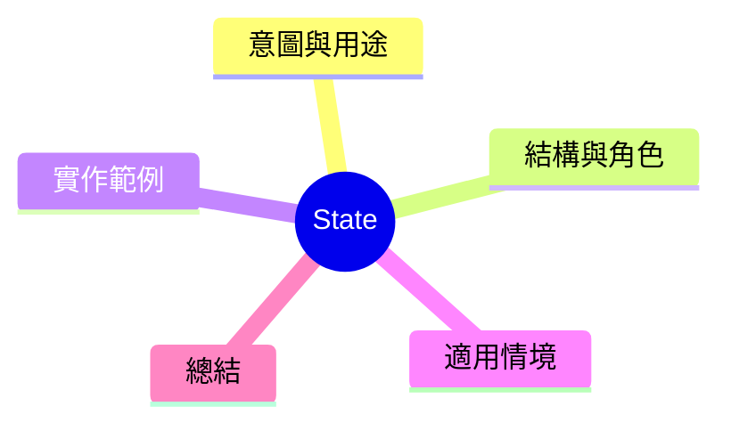

export const metadata = {
  title: '設計模式：狀態模式 (State)',
  date: '2026-04-07',
  excerpt: '介紹行為型設計模式中的狀態模式——將物件的不同狀態轉換為獨立的類別，讓物件在狀態改變時自然地轉換行為。',
  tags: ['軟體設計', '設計模式', 'OOP'],
};

# 設計模式：狀態模式 (State)

State 將物件的不同狀態轉換為獨立的類別。當物件狀態改變時，行為自然地轉換，不需要一塔 if-else 判斷當前狀態。



- [意圖與用途](#意圖與用途)
- [結構與角色](#結構與角色)
- [實作範例：訂單狀態機](#實作範例訂單狀態機)
- [適用情境](#適用情境)
- [總結](#總結)

---

## 意圖與用途

考慮一個訂單物件，本身可以居於不同狀態：`待處理`、`處理中`、`已出貨`、`已完成`。每個狀態下，`cancel()` 的行為完全不同。

如果用 if-else 處理：

```typescript
cancel() {
  if (this.status === 'pending') { /* ... */ }
  else if (this.status === 'processing') { /* ... */ }
  else if (this.status === 'shipped') { /* ... */ }
  else throw new Error('無法取消');
}
```

狀態越多，這種判斷就越難维護。State 將各狀態移進独立的類別。

---

## 結構與角色

- **Context**：持有當前狀態學參的物件 (`Order`)
- **State**：定義狀態行為的介面
- **ConcreteState**：各具體狀態的實作

---

## 實作範例：訂單狀態機

```typescript
interface OrderState {
  name: string;
  confirm(order: Order): void;
  ship(order: Order): void;
  deliver(order: Order): void;
  cancel(order: Order): void;
}

class Order {
  state: OrderState = new PendingState();
  id: string;

  constructor(id: string) { this.id = id; }

  setState(state: OrderState): void { this.state = state; }

  confirm(): void { this.state.confirm(this); }
  ship(): void { this.state.ship(this); }
  deliver(): void { this.state.deliver(this); }
  cancel(): void { this.state.cancel(this); }
}

// 待處理
class PendingState implements OrderState {
  name = '待處理';
  confirm(order: Order): void {
    console.log('訂單已確認，開始處理');
    order.setState(new ProcessingState());
  }
  ship(order: Order): void { throw new Error('尚未確認，無法出貨'); }
  deliver(order: Order): void { throw new Error('尚未出貨'); }
  cancel(order: Order): void {
    console.log('訂單已取消');
    order.setState(new CancelledState());
  }
}

// 處理中
class ProcessingState implements OrderState {
  name = '處理中';
  confirm(order: Order): void { console.log('已確認'); }
  ship(order: Order): void {
    console.log('已出貨');
    order.setState(new ShippedState());
  }
  deliver(order: Order): void { throw new Error('尚未出貨'); }
  cancel(order: Order): void {
    console.log('處理中的訂單已取消，退款處理中');
    order.setState(new CancelledState());
  }
}

// 已出貨
class ShippedState implements OrderState {
  name = '已出貨';
  confirm(order: Order): void { console.log('已出貨'); }
  ship(order: Order): void { console.log('已出貨'); }
  deliver(order: Order): void {
    console.log('已送達');
    order.setState(new DeliveredState());
  }
  cancel(order: Order): void { throw new Error('已出貨，無法取消'); }
}

// 已完成
class DeliveredState implements OrderState {
  name = '已送達';
  confirm(): void { console.log('已完成'); }
  ship(): void { throw new Error('已送達'); }
  deliver(): void { console.log('已送達'); }
  cancel(): void { throw new Error('已送達，無法取消'); }
}

class CancelledState implements OrderState {
  name = '已取消';
  confirm(): void { throw new Error('訂單已取消'); }
  ship(): void { throw new Error('訂單已取消'); }
  deliver(): void { throw new Error('訂單已取消'); }
  cancel(): void { console.log('訂單已經取消'); }
}

// 使用
const order = new Order('ORD-001');
order.confirm();
order.ship();
order.deliver();
// order.cancel(); // 拋出一個錯誤：已送達無法取消
```

---

## 適用情境

**適用時機**

- 物件行為隨狀態變化而大幅不同
- 大量的 if-else 判斷當前狀態已成為維護痛點
- 狀態轉換邏輯需要明確定義

---

## 總結

State 模式的精體：**把 if-else 改寫成多型。**

每個狀態都是一個類別，負責它自己狀態下的行為和轉換邏輯。這樣新增狀態或改變轉換邏輯時，只需動對應的狀態類別。
