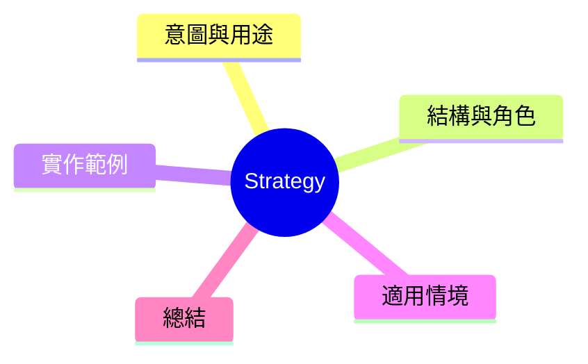

export const metadata = {
  title: '設計模式：策略模式 (Strategy)',
  date: '2026-04-01',
  excerpt: '介紹行為型設計模式中的策略模式——將一系列演算法封裝成可互換的物件，讓客戶端可以在執行時自由切換行為。',
  tags: ['軟體設計', '設計模式', 'OOP'],
};

# 設計模式：策略模式 (Strategy)

Strategy 將一系列演算法或行為封裝成可互換的物件，讓同一方法可以死這棵下实現不同的行為。



- [意圖與用途](#意圖與用途)
- [結構與角色](#結構與角色)
- [實作範例：小購車排序](#實作範例小購車排序)
- [適用情境](#適用情境)
- [總結](#總結)

---

## 意圖與用途

最常解決的問題：一個類別兩用對同一結果的不同算法，使用 if-else 或 switch 匹配。

Strategy 將各種算法移進各自獨立的類別，封裝在同一個介面後面。客戶端可以在執行時切換策略。

---

## 結構與角色

- **Strategy**：定義所有策略的介面
- **ConcreteStrategy**：各種具體算法實作
- **Context**：封裝一個 Strategy 引用，對客戶端提供統一入口

---

## 實作範例：小購車排序

```typescript
interface SortStrategy<T> {
  sort(items: T[]): T[];
}

// 依價格由低到高
class SortByPriceAsc implements SortStrategy<Product> {
  sort(items: Product[]): Product[] {
    return [...items].sort((a, b) => a.price - b.price);
  }
}

// 依價格由高到低
class SortByPriceDesc implements SortStrategy<Product> {
  sort(items: Product[]): Product[] {
    return [...items].sort((a, b) => b.price - a.price);
  }
}

// 依評分由高到低
class SortByRating implements SortStrategy<Product> {
  sort(items: Product[]): Product[] {
    return [...items].sort((a, b) => b.rating - a.rating);
  }
}

// 依名稱字母順
class SortByName implements SortStrategy<Product> {
  sort(items: Product[]): Product[] {
    return [...items].sort((a, b) => a.name.localeCompare(b.name));
  }
}

// Context
class ShoppingCart {
  constructor(
    private items: Product[],
    private sortStrategy: SortStrategy<Product>,
  ) {}

  setStrategy(strategy: SortStrategy<Product>): void {
    this.sortStrategy = strategy;
  }

  getSortedItems(): Product[] {
    return this.sortStrategy.sort(this.items);
  }
}

// 執行時切換策略
const cart = new ShoppingCart(products, new SortByPriceAsc());
console.log(cart.getSortedItems());

cart.setStrategy(new SortByRating());
console.log(cart.getSortedItems());
```

新增一種排序方式，只需實作一個新的 `SortStrategy`。`ShoppingCart` 完全不需要動。

---

## 適用情境

**適用時機**

- 一个操作有多種實作，庺彩用 switch-case 或 if-else 切換
- 封裝复雜的演算法，讓客戶端不需直接接触
- 需要在執行期動態切換行為

**策略模式 vs. OCP**

策略模式是實現 OCP 最直接的抖採——新策略透過新塞類別擴展，不修改 Context。

---

## 總結

Strategy 是最常用到的設計模式之一。只要你用一個介面參數來传入函數，內部的行為可以切換，在某種程度上就是在用 Strategy 模式的緯等价形式。
