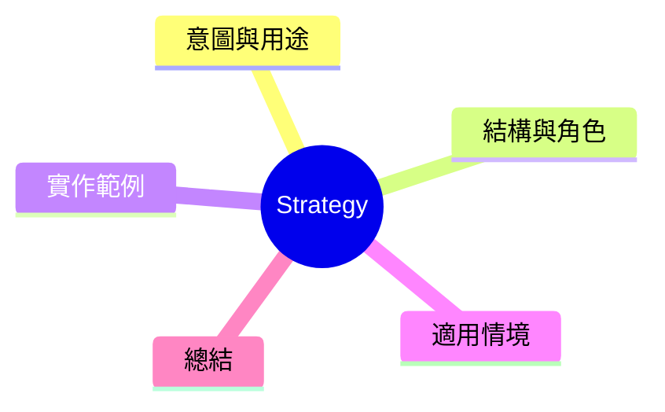

export const metadata = {
  title: '設計模式：策略模式 (Strategy)',
  date: '2026-06-30',
  excerpt: '介紹行為型設計模式中的策略模 —— 一系列演算法封裝成可互換的物件，讓客戶端可以在執行時自由切換行為，而不必改動自己的程式碼。',
  tags: ['軟體設計', '設計模式', 'OOP'],
};

# 設計模式：策略模式 (Strategy)

Strategy 把一系列演算法封裝成可互換的物件。Context 在執行期使用被插進來的那一個策略，而不需要知道它內部是怎麼運作的。


```mermaid
mindmap
    root((Strategy))
        意圖與用途
        結構與角色
        實作範例
        適用情境
        總結
```

- [意圖與用途](#意圖與用途)
- [結構與角色](#結構與角色)
- [實作範例：購物車排序](#實作範例購物車排序)
- [適用情境](#適用情境)
- [總結](#總結)

---

## 意圖與用途

策略模式最常解決的問題是：一個類別針對同一個操作有多種變體，而它用 switch-case 或 if-else 在這些變體之間做選擇。

Strategy 把每一種變體搬進各自的類別，藏在同一個介面後面。Context 持有一個指向策略的引用，把工作委派給它，而完全不知道背後的實作。

---

## 結構與角色

- Strategy：所有演算法共同的介面
- ConcreteStrategy：各個具體的演算法實作
- Context：持有一個 Strategy 引用，對外提供統一的進入點

---

## 實作範例：購物車排序

```typescript
interface SortStrategy<T> {
  sort(items: T[]): T[];
}

// 依價格由低到高
class SortByPriceAsc implements SortStrategy<Product> {
  sort(items: Product[]): Product[] {
    return [...items].sort((a, b) => a.price - b.price);
  }
}

// 依價格由高到低
class SortByPriceDesc implements SortStrategy<Product> {
  sort(items: Product[]): Product[] {
    return [...items].sort((a, b) => b.price - a.price);
  }
}

// 依評分由高到低
class SortByRating implements SortStrategy<Product> {
  sort(items: Product[]): Product[] {
    return [...items].sort((a, b) => b.rating - a.rating);
  }
}

// 依名稱字母順序
class SortByName implements SortStrategy<Product> {
  sort(items: Product[]): Product[] {
    return [...items].sort((a, b) => a.name.localeCompare(b.name));
  }
}

// Context
class ShoppingCart {
  constructor(
    private items: Product[],
    private sortStrategy: SortStrategy<Product>,
  ) {}

  setStrategy(strategy: SortStrategy<Product>): void {
    this.sortStrategy = strategy;
  }

  getSortedItems(): Product[] {
    return this.sortStrategy.sort(this.items);
  }
}

// 執行期切換策略
const cart = new ShoppingCart(products, new SortByPriceAsc());
console.log(cart.getSortedItems());

cart.setStrategy(new SortByRating());
console.log(cart.getSortedItems());
```

新增一種排序方式，只需要實作一個新的 `SortStrategy`，`ShoppingCart` 完全不必動。

---

## 適用情境

適用時機

- 一個操作有多種變體，目前是用 switch-case 或 if-else 在切換
- 想把複雜的演算法封裝起來，讓它們彼此獨立
- 需要在執行期動態切換行為

策略模式與 OCP

策略模式是實現 OCP 最直接的方式之一：用新增策略類別來擴充，永遠不去修改 Context。

---

## 總結

Strategy 是實務上最常用到的模式之一。每當你把一個函式當成參數傳進去、藉此客製內部行為時，其實你已經在用 Strategy 的函式版等價形式了。

而當邏輯複雜到單純一個函式不夠用時，搭配完整類別階層的 Strategy，能給你同樣的彈性，又多了一份結構。
