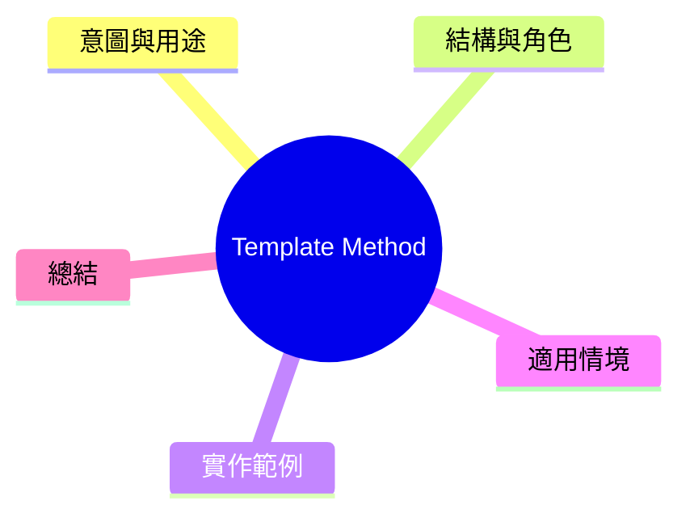

export const metadata = {
  title: '設計模式：樣板方法模式 (Template Method)',
  date: '2026-04-09',
  excerpt: '介紹行為型設計模式中的樣板方法模式——在基點類別定義演算法骨架，對子類別定義可覆寫的步驟。',
  tags: ['軟體設計', '設計模式', 'OOP'],
};

# 設計模式：樣板方法模式 (Template Method)

Template Method 在基點類別定義一個演算法的骨架，子類別則覆寫其中的特定歕驟，不影響整體結構。



- [意圖與用途](#意圖與用途)
- [結構與角色](#結構與角色)
- [實作範例：資料報表產生流程](#實作範例資料報表產生流程)
- [適用情境](#適用情境)
- [總結](#總結)

---

## 意圖與用途

想象一個報表產生系統，各種報表流程大致相同：取得資料 → 處理資料 → 渲染輸出。但各個步驟的實際內容則因報表類型而不同。

如果不加抽象，各報表類別會重複利用相同的流程骨架。Template Method 解決這個問題：將流程固定在基點類別，只讓子類別實作各自的分步。

---

## 結構與角色

- **AbstractClass**：定義樣板方法，內部呼叫抽象歕驟
- **templateMethod()**：定義流程骨架的步驟，不加覆寫
- **abstractStep()**：由子類別實作的抽象歕驟
- **ConcreteClass**：實作各抽象歕驟

---

## 實作範例：資料報表產生流程

```typescript
abstract class ReportGenerator {
  // 樣板方法：固定流程
  generate(): string {
    const data = this.fetchData();
    const processed = this.processData(data);
    const header = this.renderHeader();
    const body = this.renderBody(processed);
    const footer = this.renderFooter();
    return [header, body, footer].join('\n');
  }

  // 抽象歕驟：子類別實作
  protected abstract fetchData(): Record<string, number>[];
  protected abstract renderBody(data: Record<string, number>[]): string;

  // 預設實作，子類別可覆寫
  protected processData(data: Record<string, number>[]): Record<string, number>[] {
    return data;
  }

  protected renderHeader(): string {
    return '=== Report ===';
  }

  protected renderFooter(): string {
    return `Generated at ${new Date().toISOString()}`;
  }
}

// 销售報表
class SalesReport extends ReportGenerator {
  protected fetchData(): Record<string, number>[] {
    // 實際實作會跟 API 或資料庫取得資料
    return [
      { product: 1, revenue: 12000 },
      { product: 2, revenue: 8500 },
    ];
  }

  protected processData(data: Record<string, number>[]): Record<string, number>[] {
    // 顨領操作：由高到低排序
    return [...data].sort((a, b) => b['revenue'] - a['revenue']);
  }

  protected renderBody(data: Record<string, number>[]): string {
    return data.map(row => `Product ${row['product']}: $${row['revenue']}`).join('\n');
  }

  protected renderHeader(): string {
    return '=== Sales Report ===';
  }
}

// 庫存報表
class InventoryReport extends ReportGenerator {
  protected fetchData(): Record<string, number>[] {
    return [
      { sku: 1001, stock: 45 },
      { sku: 1002, stock: 3 },
    ];
  }

  protected renderBody(data: Record<string, number>[]): string {
    return data
      .map(row => {
        const warning = row['stock'] < 10 ? ' [低庫存警告]' : '';
        return `SKU ${row['sku']}: ${row['stock']} 件${warning}`;
      })
      .join('\n');
  }
}

// 使用
const salesReport = new SalesReport();
console.log(salesReport.generate());

const inventoryReport = new InventoryReport();
console.log(inventoryReport.generate());
```

---

## 適用情境

**適用時機**

- 多個類別有相同的執行流程，但部分歕驟各自不同
- 希望阻止子類別覆寫整體流程，只讓子類別實作特定歕驟

**Template Method vs. Strategy**

| | Template Method | Strategy |
|---|---|---|
| 流程骨架 | 基點類別固定 | 完全可替換 |
| 實作方式 | 繼承 | 組合 |
| 切換時機 | 編譯時 | 執行時 |

---

## 總結

Template Method 的精體：控制反轉——基點類別掌揧流程，子類別只填入空白。它是一種拒絕重複流程骨架的經典方式。
