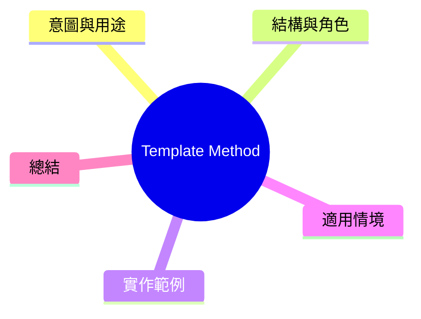

export const metadata = {
  title: '設計模式：範本方法模式 (Template Method)',
  date: '2026-06-30',
  excerpt: '介紹行為型設計模式中的範本方法模式：基底類別定義演算法的骨架，讓子類別填入各自的步驟，而不改動整體結構。',
  tags: ['軟體設計', '設計模式', 'OOP'],
};

# 設計模式：範本方法模式 (Template Method)

Template Method 在基底類別定義一個演算法的骨架，子類別則覆寫其中特定的步驟來客製行為，而不動到整體流程。


```mermaid
mindmap
    root((Template Method))
        意圖與用途
        結構與角色
        實作範例
        適用情境
        總結
```

- [意圖與用途](#意圖與用途)
- [結構與角色](#結構與角色)
- [實作範例：資料報表產生流程](#實作範例資料報表產生流程)
- [適用情境](#適用情境)
- [總結](#總結)

---

## 意圖與用途

想像一個報表系統，每一種報表都會走過相同的步驟：取得資料 → 處理資料 → 渲染輸出。但每個步驟的實際內容，會隨報表類型而不同。

如果不加抽象，每個報表類別都會重複寫出同一套流程骨架。Template Method 把流程鎖在基底類別裡，只讓子類別實作那些會變動的部分。

---

## 結構與角色

- AbstractClass：定義範本方法 (流程骨架) 以及抽象步驟
- templateMethod()：依序呼叫各步驟，本身不應被覆寫
- abstractStep()：留給子類別實作的掛勾
- ConcreteClass：提供各步驟的具體實作

---

## 實作範例：資料報表產生流程

```typescript
abstract class ReportGenerator {
  // 樣板方法：固定的流程
  generate(): string {
    const data = this.fetchData();
    const processed = this.processData(data);
    const header = this.renderHeader();
    const body = this.renderBody(processed);
    const footer = this.renderFooter();
    return [header, body, footer].join('\n');
  }

  // 抽象步驟：由子類別實作
  protected abstract fetchData(): Record<string, number>[];
  protected abstract renderBody(data: Record<string, number>[]): string;

  // 預設實作，子類別可覆寫
  protected processData(data: Record<string, number>[]): Record<string, number>[] {
    return data;
  }

  protected renderHeader(): string {
    return '=== Report ===';
  }

  protected renderFooter(): string {
    return `Generated at ${new Date().toISOString()}`;
  }
}

// 銷售報表
class SalesReport extends ReportGenerator {
  protected fetchData(): Record<string, number>[] {
    // 實際實作會從 API 或資料庫取得資料
    return [
      { product: 1, revenue: 12000 },
      { product: 2, revenue: 8500 },
    ];
  }

  protected processData(data: Record<string, number>[]): Record<string, number>[] {
    // 額外處理：依營收由高到低排序
    return [...data].sort((a, b) => b['revenue'] - a['revenue']);
  }

  protected renderBody(data: Record<string, number>[]): string {
    return data.map(row => `Product ${row['product']}: $${row['revenue']}`).join('\n');
  }

  protected renderHeader(): string {
    return '=== Sales Report ===';
  }
}

// 庫存報表
class InventoryReport extends ReportGenerator {
  protected fetchData(): Record<string, number>[] {
    return [
      { sku: 1001, stock: 45 },
      { sku: 1002, stock: 3 },
    ];
  }

  protected renderBody(data: Record<string, number>[]): string {
    return data
      .map(row => {
        const warning = row['stock'] < 10 ? ' [低庫存警告]' : '';
        return `SKU ${row['sku']}: ${row['stock']} 件${warning}`;
      })
      .join('\n');
  }
}

// 使用
const salesReport = new SalesReport();
console.log(salesReport.generate());

const inventoryReport = new InventoryReport();
console.log(inventoryReport.generate());
```

---

## 適用情境

適用時機

- 多個類別共用同一套執行流程，但個別步驟各有不同
- 想固定住整體結構不讓子類別改動，只開放特定步驟讓它們客製

Template Method vs. Strategy

| | Template Method | Strategy |
|---|---|---|
| 流程骨架 | 固定在基底類別 | 完全可替換 |
| 實作機制 | 繼承 | 組合 |
| 切換時機 | 編譯期 | 執行期 |

---

## 總結

Template Method 是類別層級的控制反轉：是基底類別去呼叫子類別，而不是反過來。

當多個類別共用同一套流程、只在少數幾個步驟上有差異時，Template Method 能乾淨俐落地消除這份重複。
