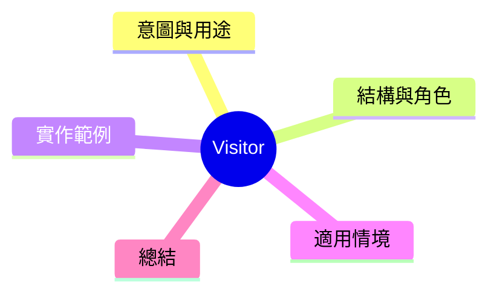

export const metadata = {
  title: '設計模式：訪客模式 (Visitor)',
  date: '2026-04-17',
  excerpt: '介紹行為型設計模式中的訪客模式——將操作與物件結構分離，不修改物件的情況下對它們加入新操作。',
  tags: ['軟體設計', '設計模式', 'OOP'],
};

# 設計模式：訪客模式 (Visitor)

Visitor 將操作封裝成訪客物件，讓你對一組物件加入新操作，不需修改這些物件本身。



- [意圖與用途](#意圖與用途)
- [結構與角色](#結構與角色)
- [實作範例：文件匯出訪客](#實作範例文件匯出訪客)
- [適用情境](#適用情境)
- [總結](#總結)

---

## 意圖與用途

假設有一個文件系統，包含 Folder、TextFile、ImageFile 等節點類型。現在需要實作多種匯出功能：PDF、HTML、Markdown。

如果將各種匯出邏輯劑進各節點類別，每次新增匯出格式就要修改對應類別，從 OCP 角度來看這是很有問題的。

Visitor 將操作抽離出來：每個具體匯出都是一個 Visitor，訪問每個節點。

---

## 結構與角色

- **Visitor**：定義對每種節點進行訪問的介面
- **ConcreteVisitor**：實作具體操作（PDF 專家、HTML 專家…）
- **Element**：定義 `accept(visitor)` 的介面
- **ConcreteElement**：實作 `accept(visitor)`，將 `this` 傳入 Visitor

---

## 實作範例：文件匯出訪客

```typescript
// Element 介面
interface DocumentElement {
  accept(visitor: ExportVisitor): string;
  name: string;
}

// Visitor 介面
interface ExportVisitor {
  visitFolder(folder: Folder): string;
  visitTextFile(file: TextFile): string;
  visitImageFile(file: ImageFile): string;
}

// ConcreteElement: 資料夾
class Folder implements DocumentElement {
  name: string;
  children: DocumentElement[] = [];

  constructor(name: string) { this.name = name; }

  add(element: DocumentElement): void {
    this.children.push(element);
  }

  accept(visitor: ExportVisitor): string {
    return visitor.visitFolder(this);
  }
}

// ConcreteElement: 文字檔
class TextFile implements DocumentElement {
  constructor(public name: string, public content: string) {}

  accept(visitor: ExportVisitor): string {
    return visitor.visitTextFile(this);
  }
}

// ConcreteElement: 圖片檔
class ImageFile implements DocumentElement {
  constructor(public name: string, public width: number, public height: number) {}

  accept(visitor: ExportVisitor): string {
    return visitor.visitImageFile(this);
  }
}

// ConcreteVisitor: HTML 匯出
class HtmlExportVisitor implements ExportVisitor {
  visitFolder(folder: Folder): string {
    const children = folder.children.map(c => c.accept(this)).join('');
    return `<div class="folder" data-name="${folder.name}">${children}</div>`;
  }

  visitTextFile(file: TextFile): string {
    return `<article><h2>${file.name}</h2><p>${file.content}</p></article>`;
  }

  visitImageFile(file: ImageFile): string {
    return ``;
  }
}

// ConcreteVisitor: Markdown 匯出
class MarkdownExportVisitor implements ExportVisitor {
  visitFolder(folder: Folder): string {
    const children = folder.children.map(c => c.accept(this)).join('\n');
    return `## ${folder.name}\n${children}`;
  }

  visitTextFile(file: TextFile): string {
    return `### ${file.name}\n${file.content}`;
  }

  visitImageFile(file: ImageFile): string {
    return ``;
  }
}

// 使用
const root = new Folder('docs');
root.add(new TextFile('README.md', '歡迎使用'));
root.add(new ImageFile('logo.png', 200, 100));

const htmlVisitor = new HtmlExportVisitor();
console.log(root.accept(htmlVisitor));

const mdVisitor = new MarkdownExportVisitor();
console.log(root.accept(mdVisitor));
```

---

## 適用情境

**適用時機**

- 物件結構穩定，但需要對結構加入多種新操作
- 不希望將各種操作邏輯持續加負到節點類別上

**雙開轉發 (Double Dispatch)**

`element.accept(visitor)` 實際上是雙開轉發的實作：第一轉發確定 Element 類型，第二轉發確定 Visitor 物件。

---

## 總結

Visitor 是在不修改物件的前提下，對結構加入新操作的方式。編譯器中的 AST 遍歷、Linter 規則套用等都是它的典型應用。
