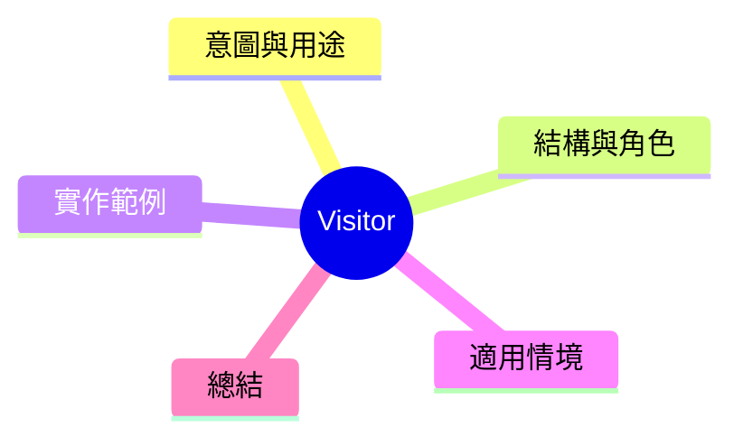

export const metadata = {
  title: '設計模式：訪問者模式 (Visitor)',
  date: '2026-06-30',
  excerpt: '介紹行為型設計模式中的訪問者模式：操作與物件結構分離，讓你在不修改物件本身的情況下，為它們加入新的操作。',
  tags: ['軟體設計', '設計模式', 'OOP'],
};

# 設計模式：訪問者模式 (Visitor)

Visitor 把操作和它所作用的物件分離開來。你透過撰寫新的訪問者來加入新行為，而不是去修改那些 element 類別。


```mermaid
mindmap
    root((Visitor))
        意圖與用途
        結構與角色
        實作範例
        適用情境
        總結
```

- [意圖與用途](#意圖與用途)
- [結構與角色](#結構與角色)
- [實作範例：文件匯出訪問者](#實作範例文件匯出訪問者)
- [適用情境](#適用情境)
- [總結](#總結)

---

## 意圖與用途

假設有一個檔案系統，包含 `Folder`、`TextFile`、`ImageFile` 等節點。現在你需要實作多種匯出格式：PDF、HTML、Markdown。

如果把每一種匯出方法直接塞進各個節點類別，那每新增一種格式，就得修改每一個節點類別，從 OCP 的角度來看，這是個問題。

Visitor 把操作抽離出來：每一種匯出格式都是一個 Visitor，它知道怎麼處理每一種節點。

---

## 結構與角色

- Visitor：為每一種節點型別宣告一個 visit 方法的介面
- ConcreteVisitor：實作具體操作 (PDF 匯出器、HTML 匯出器……)
- Element：宣告 `accept(visitor)` 的介面
- ConcreteElement：呼叫 `visitor.visitXxx(this)`，把自己傳進去

---

## 實作範例：文件匯出訪問者

```typescript
// Element 介面
interface DocumentElement {
  accept(visitor: ExportVisitor): string;
  name: string;
}

// Visitor 介面
interface ExportVisitor {
  visitFolder(folder: Folder): string;
  visitTextFile(file: TextFile): string;
  visitImageFile(file: ImageFile): string;
}

// ConcreteElement：資料夾
class Folder implements DocumentElement {
  name: string;
  children: DocumentElement[] = [];

  constructor(name: string) { this.name = name; }

  add(element: DocumentElement): void {
    this.children.push(element);
  }

  accept(visitor: ExportVisitor): string {
    return visitor.visitFolder(this);
  }
}

// ConcreteElement：文字檔
class TextFile implements DocumentElement {
  constructor(public name: string, public content: string) {}

  accept(visitor: ExportVisitor): string {
    return visitor.visitTextFile(this);
  }
}

// ConcreteElement：圖片檔
class ImageFile implements DocumentElement {
  constructor(public name: string, public width: number, public height: number) {}

  accept(visitor: ExportVisitor): string {
    return visitor.visitImageFile(this);
  }
}

// ConcreteVisitor：HTML 匯出
class HtmlExportVisitor implements ExportVisitor {
  visitFolder(folder: Folder): string {
    const children = folder.children.map(c => c.accept(this)).join('');
    return `<div class="folder" data-name="${folder.name}">${children}</div>`;
  }

  visitTextFile(file: TextFile): string {
    return `<article><h2>${file.name}</h2><p>${file.content}</p></article>`;
  }

  visitImageFile(file: ImageFile): string {
    return ``;
  }
}

// ConcreteVisitor：Markdown 匯出
class MarkdownExportVisitor implements ExportVisitor {
  visitFolder(folder: Folder): string {
    const children = folder.children.map(c => c.accept(this)).join('\n');
    return `## ${folder.name}\n${children}`;
  }

  visitTextFile(file: TextFile): string {
    return `### ${file.name}\n${file.content}`;
  }

  visitImageFile(file: ImageFile): string {
    return ``;
  }
}

// 使用
const root = new Folder('docs');
root.add(new TextFile('README.md', '歡迎使用'));
root.add(new ImageFile('logo.png', 200, 100));

const htmlVisitor = new HtmlExportVisitor();
console.log(root.accept(htmlVisitor));

const mdVisitor = new MarkdownExportVisitor();
console.log(root.accept(mdVisitor));
```

---

## 適用情境

適用時機

- 物件結構穩定，但你需要對這個結構不斷加入新的操作
- 不希望每多一種操作，就往節點類別裡再塞一個方法

雙重分派 (Double Dispatch)

`element.accept(visitor)` 正是雙重分派的一種實作：第一次分派決定 element 的型別，第二次分派決定 visitor 的操作。

---

## 總結

Visitor 是在不修改物件的前提下，為一個穩定結構加入新操作的模式。編譯器中的 AST 遍歷、Linter 規則的套用，以及文件序列化，全都是 Visitor 的經典舞台。
