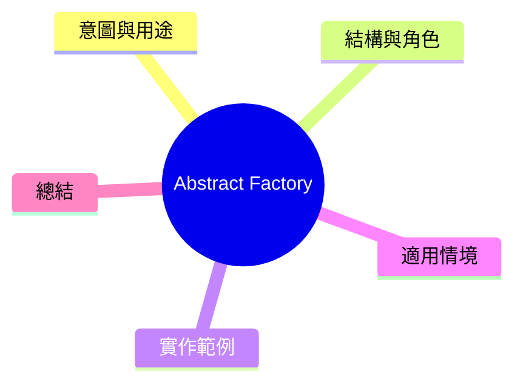

export const metadata = {
  title: '設計模式：抽象工廠 (Abstract Factory)',
  date: '2026-03-09',
  excerpt: '介紹創建型設計模式中的抽象工廠——如何建立一系列相關物件的工廠，在不指定具體類別的情況下確保物件之間的相容性。',
  tags: ['軟體設計', '設計模式', 'OOP'],
};

# 設計模式：抽象工廠 (Abstract Factory)

抽象工廠 (Abstract Factory) 是 Factory Method 的進階版本。它不只建立單一物件，而是**建立一整族相關的物件，並保證物件之間的相容性。**



- [意圖與用途](#意圖與用途)
- [結構與角色](#結構與角色)
- [實作範例：UI 主題系統](#實作範例-ui-主題系統)
- [適用情境](#適用情境)
- [總結](#總結)

---

## 意圖與用途

想象建立一個支援亮色主題和暗色主題的 UI 元件庫。各主題會有自己的按鈕、輸入框、對話框……

問題是：如何決定主題後建立的所有元件都是同一族的？

抽象工廠的解決方式：建立一個工廠介面，具體的工廠實作對應於某個主題的整族元件。

---

## 結構與角色

- **AbstractFactory**：宣告建立各種物件的介面 (`UIFactory`)
- **ConcreteFactory**：實作工廠，負責建立同族的物件 (`LightThemeFactory`、`DarkThemeFactory`)
- **AbstractProduct**：各種物件的介面 (`Button`、`Input`)
- **ConcreteProduct**：具體實作 (`LightButton`、`DarkButton`)

---

## 實作範例：UI 主題系統

```typescript
// AbstractProduct 介面
interface Button {
  render(): string;
}

interface Input {
  render(): string;
}

// LightTheme 實作
class LightButton implements Button {
  render(): string { return '<button class="light-btn">Click</button>'; }
}

class LightInput implements Input {
  render(): string { return '<input class="light-input" />'; }
}

// DarkTheme 實作
class DarkButton implements Button {
  render(): string { return '<button class="dark-btn">Click</button>'; }
}

class DarkInput implements Input {
  render(): string { return '<input class="dark-input" />'; }
}

// AbstractFactory 介面
interface UIFactory {
  createButton(): Button;
  createInput(): Input;
}

// ConcreteFactory
class LightThemeFactory implements UIFactory {
  createButton(): Button { return new LightButton(); }
  createInput(): Input { return new LightInput(); }
}

class DarkThemeFactory implements UIFactory {
  createButton(): Button { return new DarkButton(); }
  createInput(): Input { return new DarkInput(); }
}

// 使用層只知道 UIFactory——完全不需要知道具體主題
function buildForm(factory: UIFactory): void {
  const button = factory.createButton();
  const input = factory.createInput();
  console.log(input.render());
  console.log(button.render());
}

const isDark = true;
const factory: UIFactory = isDark ? new DarkThemeFactory() : new LightThemeFactory();
buildForm(factory);
```

新增一種主題？只需新增一個 ConcreteFactory 區塊和對應的 ConcreteProduct。`buildForm` 完全不需要動。

---

## 適用情境

**適用時機**

- 系統需要建立一整族相關的物件，並需保證它們之間的相容性
- 支援多個「廠商」或「主題」，每個都有自己的一族物件
- 希望透過檢查工廠的型別來確保一致性

**與 Factory Method 的差別**

Factory Method 建立一種物件，Abstract Factory 建立一族相關的物件。

---

## 總結

Abstract Factory 是「工廠的工廠」——它不只管单一物件的建立，而是管一整族相關物件的建立。

最大的價値在於**相容性保證**：客戶端程式碼不需要知道具體實作，只需導入不同的工廠，就能得到一旴的物件族。
