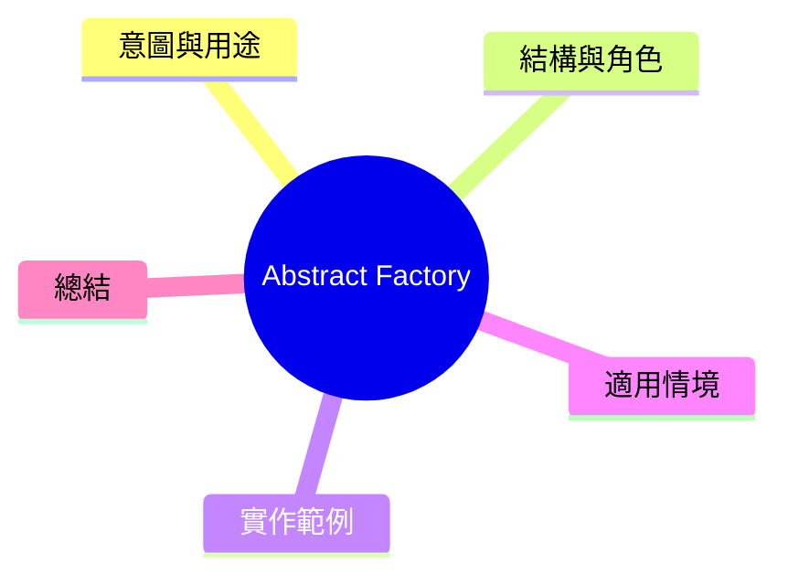

export const metadata = {
  title: '設計模式：抽象工廠 (Abstract Factory)',
  date: '2026-06-30',
  excerpt: '介紹創建型設計模式中的抽象工 —— 何建立一整族相關物件的工廠，在不指定具體類別的情況下，確保物件之間彼此相容。',
  tags: ['軟體設計', '設計模式', 'OOP'],
};

# 設計模式：抽象工廠 (Abstract Factory)

抽象工廠 (Abstract Factory) 可以看作 Factory Method 再往上提一層。它不只建立單一物件，而是建立一整族相關的物件，並保證這些物件彼此相容。


```mermaid
mindmap
    root((Abstract Factory))
        意圖與用途
        結構與角色
        實作範例
        適用情境
        總結
```

- [意圖與用途](#意圖與用途)
- [結構與角色](#結構與角色)
- [實作範例：UI 主題系統](#實作範例ui-主題系統)
- [適用情境](#適用情境)
- [總結](#總結)

---

## 意圖與用途

想像要打造一套同時支援亮色主題與暗色主題的 UI 元件庫，每個主題都有自己的按鈕、輸入框、對話框……

問題在於：一旦選定主題後，怎麼確保接下來建立的所有元件都屬於同一個主題？

抽象工廠的解法：定義一個工廠介面，每種元件型別對應一個建立方法；每個具體工廠則為某一個主題實作這個介面，產出一整族一致的元件。

---

## 結構與角色

- AbstractFactory：宣告各種建立方法的介面 (`UIFactory`)
- ConcreteFactory：實作工廠，負責建立同一族的物件 (`LightThemeFactory`、`DarkThemeFactory`)
- AbstractProduct：各種產品的介面 (`Button`、`Input`)
- ConcreteProduct：具體實作 (`LightButton`、`DarkButton`)

---

## 實作範例：UI 主題系統

```typescript
// AbstractProduct 介面
interface Button {
  render(): string;
}

interface Input {
  render(): string;
}

// LightTheme 實作
class LightButton implements Button {
  render(): string { return '<button class="light-btn">Click</button>'; }
}

class LightInput implements Input {
  render(): string { return '<input class="light-input" />'; }
}

// DarkTheme 實作
class DarkButton implements Button {
  render(): string { return '<button class="dark-btn">Click</button>'; }
}

class DarkInput implements Input {
  render(): string { return '<input class="dark-input" />'; }
}

// AbstractFactory 介面
interface UIFactory {
  createButton(): Button;
  createInput(): Input;
}

// ConcreteFactory
class LightThemeFactory implements UIFactory {
  createButton(): Button { return new LightButton(); }
  createInput(): Input { return new LightInput(); }
}

class DarkThemeFactory implements UIFactory {
  createButton(): Button { return new DarkButton(); }
  createInput(): Input { return new DarkInput(); }
}

// 呼叫端只認得 UIFactor —— 全不需要知道是哪個主題
function buildForm(factory: UIFactory): void {
  const button = factory.createButton();
  const input = factory.createInput();
  console.log(input.render());
  console.log(button.render());
}

const isDark = true;
const factory: UIFactory = isDark ? new DarkThemeFactory() : new LightThemeFactory();
buildForm(factory);
```

要新增一種主題？只需新增一個 ConcreteFactory 與對應的一族 ConcreteProduct，`buildForm` 完全不必動。

---

## 適用情境

適用時機

- 系統需要建立一整族相關的物件，而且必須保證它們之間彼此相容
- 要支援多個「廠商」或「主題」，每一個都有自己的一族物件
- 希望讓「工廠的型別」本身成為確保一致性的機制

與 Factory Method 的差別

Factory Method 建立一種物件，Abstract Factory 建立一族相關的物件。

當你發現手上有好幾個在邏輯上理應綁在一起的工廠方法，那就是抽象工廠的訊號。

---

## 總結

Abstract Factory 是「工廠的工廠 —— 管的不是單一物件的建立，而是一整族彼此協調的物件。

它最大的價值在於相容性保證：呼叫端永遠不需要知道具體實作，只要換一個工廠，就能得到一組完全不同、但內部彼此一致的物件。
