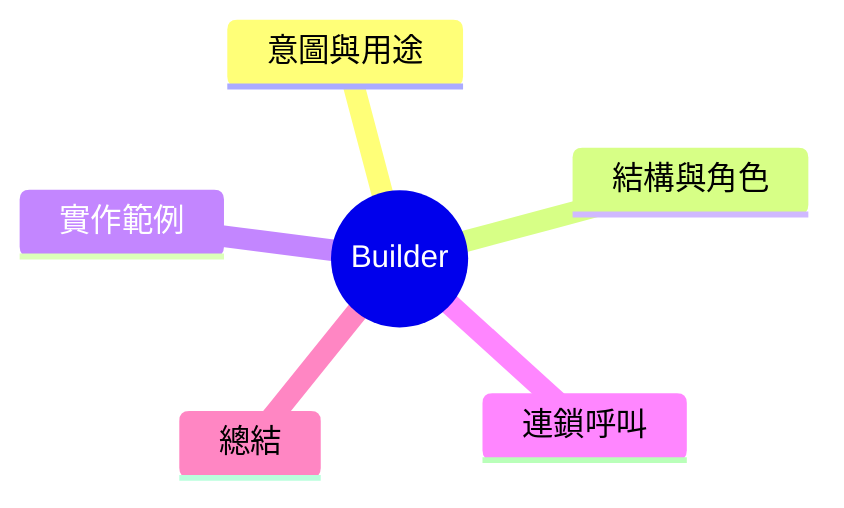

export const metadata = {
  title: '設計模式：建範者模式 (Builder)',
  date: '2026-03-11',
  excerpt: '介紹創建型設計模式中的建範者模式——如何一步一步建立複雜物件，避免多參數構造子的對惡，並讓建立過程清晰可讀。',
  tags: ['軟體設計', '設計模式', 'OOP'],
};

# 設計模式：建範者模式 (Builder)

Builder 模式將複雜物件的建立過程拆分成一步一步的操作，不需要往構造子剁進一大堆參數。

適用於：**物件有很多唉6性，但並不是每次建立都需要全部。**



- [意圖與用途](#意圖與用途)
- [結構與角色](#結構與角色)
- [實作範例：HTTP Request Builder](#實作範例-http-request-builder)
- [連鎖呼叫 (Method Chaining)](#連鎖呼叫-method-chaining)
- [總結](#總結)

---

## 意圖與用途

假設要建立一個 HTTP Request 物件：

```typescript
// 國限內只有少數必要參數
const req = new HttpRequest('GET', '/api/users');

// 還有很多可選項：headers、timeout、retries、auth、cache...
const req2 = new HttpRequest('POST', '/api/users', { 'Content-Type': 'application/json' }, 
  null, 30000, 3, 'Bearer token123', false, true, ...);
```

當參數厁多時，使用者很難記住順序，也很難看出各自的意義。
Builder 把這個建立過程變成標明的一步一步。

---

## 結構與角色

- **Product**：要建立的複雜物件 (`HttpRequest`)
- **Builder**：建立物件的步驟介面
- **ConcreteBuilder**：實作建立步驟 (`HttpRequestBuilder`)
- **Director** (optional)：定義建立步驟的順序，對於常用組合很有用

---

## 實作範例：HTTP Request Builder

```typescript
interface RequestOptions {
  method: string;
  url: string;
  headers: Record<string, string>;
  body?: unknown;
  timeout: number;
  retries: number;
}

class HttpRequestBuilder {
  private options: RequestOptions = {
    method: 'GET',
    url: '',
    headers: {},
    timeout: 5000,
    retries: 0,
  };

  method(method: string): this {
    this.options.method = method;
    return this;
  }

  url(url: string): this {
    this.options.url = url;
    return this;
  }

  header(key: string, value: string): this {
    this.options.headers[key] = value;
    return this;
  }

  body(body: unknown): this {
    this.options.body = body;
    return this;
  }

  timeout(ms: number): this {
    this.options.timeout = ms;
    return this;
  }

  retries(count: number): this {
    this.options.retries = count;
    return this;
  }

  build(): RequestOptions {
    if (!this.options.url) throw new Error('URL is required');
    return { ...this.options };
  }
}

// 可讀性正常
 const request = new HttpRequestBuilder()
  .method('POST')
  .url('/api/users')
  .header('Content-Type', 'application/json')
  .header('Authorization', 'Bearer token123')
  .body({ name: 'Alice' })
  .timeout(10000)
  .retries(3)
  .build();
```

每個步驟都有語義化的方法名稱，讀起來就像在描述一件事。

---

## 連鎖呼叫 (Method Chaining)

注意 `return this` ——每個方法回傳 Builder 本身，所以可以連鎖呼叫。這是 Builder 模式的標志性寫法，很多庫例如 `fetch` API、ORM query builder、測試庫的 assertion chain 都用了這個技巧。

---

## 總結

Builder 最適合這兩種情境：

1. 物件有很多選項性參數，不同情境建立的組合很不一樣
2. 建立過程有明確的步驟順序，每步的意義清晰

此時宧建構造子領一堆參數，改用 Builder 就能大幅提升程式碼的可讀性與可維護性。
