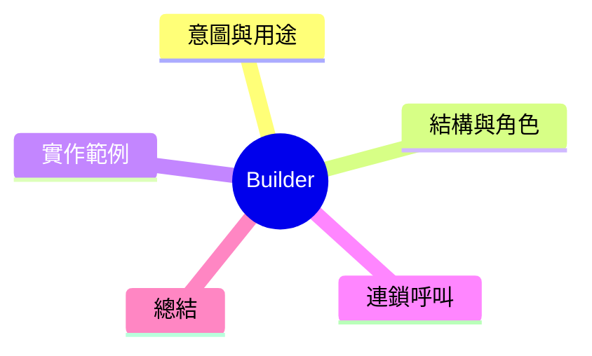

export const metadata = {
  title: '設計模式：建造者模式 (Builder)',
  date: '2026-06-30',
  excerpt: '介紹創建型設計模式中的建造者模式：如何一步一步建立複雜物件，避開多參數建構子的惡夢，並讓建立過程清晰可讀。',
  tags: ['軟體設計', '設計模式', 'OOP'],
};

# 設計模式：建造者模式 (Builder)

Builder 模式把複雜物件的「建立過程」與「最終表示」分開，改用一步一步的方式組裝，而不是擠進一個龐大的建構子。

它最適合這種情況：物件有很多選擇性屬性，而不同情境需要的組合都不一樣。


```mermaid
mindmap
    root((Builder))
        意圖與用途
        結構與角色
        實作範例
        連鎖呼叫
        總結
```

- [意圖與用途](#意圖與用途)
- [結構與角色](#結構與角色)
- [實作範例：HTTP Request Builder](#實作範例http-request-builder)
- [連鎖呼叫 (Method Chaining)](#連鎖呼叫-method-chaining)
- [總結](#總結)

---

## 意圖與用途

假設要建立一個 HTTP Request 物件：

```typescript
// 最精簡的情況
const req = new HttpRequest('GET', '/api/users');

// 但選項其實很多：headers、timeout、retries、auth、cache...
const req2 = new HttpRequest('POST', '/api/users', { 'Content-Type': 'application/json' },
  null, 30000, 3, 'Bearer token123', false, true);
```

當建構子要吃這麼多參數時，呼叫端很難記住順序，而且光看呼叫的那一行，幾乎看不出每個參數代表什麼意思。

Builder 把這整個過程，變成清楚標示、一步一步的建立。

---

## 結構與角色

- Product：要建立的複雜物件 (`HttpRequest`)
- Builder：定義建立步驟的介面
- ConcreteBuilder：實作建立步驟 (`HttpRequestBuilder`)
- Director (選用)：定義步驟的順序，對於常用的預設組合特別有用

---

## 實作範例：HTTP Request Builder

```typescript
interface RequestOptions {
  method: string;
  url: string;
  headers: Record<string, string>;
  body?: unknown;
  timeout: number;
  retries: number;
}

class HttpRequestBuilder {
  private options: RequestOptions = {
    method: 'GET',
    url: '',
    headers: {},
    timeout: 5000,
    retries: 0,
  };

  method(method: string): this {
    this.options.method = method;
    return this;
  }

  url(url: string): this {
    this.options.url = url;
    return this;
  }

  header(key: string, value: string): this {
    this.options.headers[key] = value;
    return this;
  }

  body(body: unknown): this {
    this.options.body = body;
    return this;
  }

  timeout(ms: number): this {
    this.options.timeout = ms;
    return this;
  }

  retries(count: number): this {
    this.options.retries = count;
    return this;
  }

  build(): RequestOptions {
    if (!this.options.url) throw new Error('URL is required');
    return { ...this.options };
  }
}

const request = new HttpRequestBuilder()
  .method('POST')
  .url('/api/users')
  .header('Content-Type', 'application/json')
  .header('Authorization', 'Bearer token123')
  .body({ name: 'Alice' })
  .timeout(10000)
  .retries(3)
  .build();
```

每個步驟都有語義化的方法名稱，整段呼叫讀起來就像在描述「正在組裝的這個請求」。

---

## 連鎖呼叫 (Method Chaining)

注意每個方法最後的 `return this`，是刻意的，它回傳 Builder 本身，所以呼叫可以一路串接下去。這正是 Builder 模式的標誌性寫法。

你會在很多地方看到它：Fetch API、ORM 的 query builder、測試框架的 assertion chain。每當一個 API 用起來很自然就能一步步組合時，背後通常都是 Builder。

---

## 總結

Builder 最適合兩種情境：

1. 物件有很多選擇性參數，而不同呼叫端需要的組合很不一樣
2. 建立過程有明確的步驟順序，每一步都有自己的語義

當你的建構子參數越積越多，呼叫端甚至得傳一堆 `null` 或 `undefined`，只為了帶到真正想設定的那一個時，Builder 就是對症下藥的解法。
