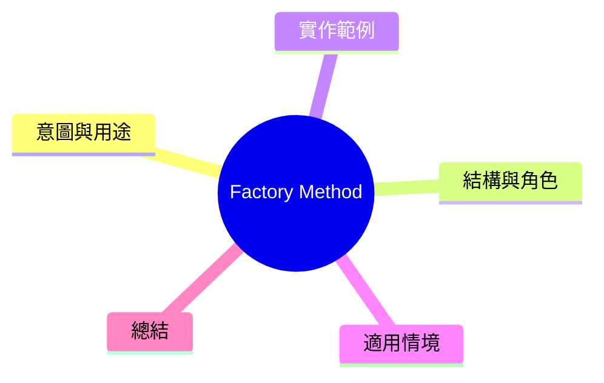

export const metadata = {
  title: '設計模式：工廠方法 (Factory Method)',
  date: '2026-03-07',
  excerpt: '介紹創建型設計模式中的工廠方法——將物件的建立延遲到子類別，讓建立邏輯可以在不修改原始程式碼的情況下擴展。',
  tags: ['軟體設計', '設計模式', 'OOP'],
};

# 設計模式：工廠方法 (Factory Method)

工廠方法 (Factory Method) 是創建型模式，用來解決一個問題：**一個父類別知道需要建立物件，但不知道該建立哪個具體型別。**

它定義一個建立物件的介面 (factory method)，但交由子類別決定該建立哪個具體類別。



- [意圖與用途](#意圖與用途)
- [結構與角色](#結構與角色)
- [實作範例：通知系統](#實作範例通知系統)
- [適用情境](#適用情境)
- [總結](#總結)

---

## 意圖與用途

想象一個送出通知的系統，具體的通知方式可能是 Email、SMS、Push。建立通知的邏輯根據環境變數或使用者設定而不同。

工廠方法讓我們可以：

- 將建立通知物件的邏輯封裝在子類別
- 新增通知方式時，不需修改原有程式碼
- 對外的使用層只知道抽象的 `Notification` 介面

---

## 結構與角色

Factory Method 有四個重要角色：

- **Product**：被建立物件的抽象介面 (`Notification`)
- **ConcreteProduct**：具體的產品實作 (`EmailNotification`、`SMSNotification`)
- **Creator**：宣告工廠方法的抽象類別 (`NotificationSender`)
- **ConcreteCreator**：實作工廠方法的子類別 (`EmailSender`、`SMSSender`)

---

## 實作範例：通知系統

```typescript
// Product 介面
interface Notification {
  send(message: string): void;
}

// ConcreteProduct 實作
class EmailNotification implements Notification {
  constructor(private to: string) {}

  send(message: string): void {
    console.log(`Sending email to ${this.to}: ${message}`);
  }
}

class SMSNotification implements Notification {
  constructor(private phone: string) {}

  send(message: string): void {
    console.log(`Sending SMS to ${this.phone}: ${message}`);
  }
}

class PushNotification implements Notification {
  constructor(private deviceToken: string) {}

  send(message: string): void {
    console.log(`Sending push to ${this.deviceToken}: ${message}`);
  }
}

// Creator 抽象類別——定義工廠方法
abstract class NotificationSender {
  // 工廠方法：由子類別實作
  abstract createNotification(target: string): Notification;

  // 共用的業務邏輯
  notify(target: string, message: string): void {
    const notification = this.createNotification(target);
    notification.send(message);
  }
}

// ConcreteCreator
class EmailSender extends NotificationSender {
  createNotification(email: string): Notification {
    return new EmailNotification(email);
  }
}

class SMSSender extends NotificationSender {
  createNotification(phone: string): Notification {
    return new SMSNotification(phone);
  }
}

class PushSender extends NotificationSender {
  createNotification(deviceToken: string): Notification {
    return new PushNotification(deviceToken);
  }
}

// 使用
const sender: NotificationSender = new EmailSender();
sender.notify('user@example.com', '你的訂單已出貨');

// 新增 LINE 通知？只需新增類別，不需動其他程式碼
class LineNotification implements Notification {
  constructor(private userId: string) {}
  send(message: string): void {
    console.log(`Sending LINE to ${this.userId}: ${message}`);
  }
}

class LineSender extends NotificationSender {
  createNotification(userId: string): Notification {
    return new LineNotification(userId);
  }
}
```

新增 LINE 通知時，`NotificationSender`、`EmailSender`、`SMSSender` 完全不需要動。

---

## 適用情境

**適用時機**

- 建立物件的具體型別需待子類別決定
- 相同的建立流程這些常用在子類別中的方法需要共用
- 預期未來會新增更多型別，希望擴展時不動現有程式碼

**與簡單 Factory Function 的差別**

如果只是需要封裝建立邏輯，一個簡單的 factory function 就夠了：

```typescript
function createNotification(type: 'email' | 'sms', target: string): Notification {
  if (type === 'email') return new EmailNotification(target);
  return new SMSNotification(target);
}
```

Factory Method 的價値在於結合継承的共用邏輯——當 Creator 中除了工廠方法還有共用的業務邏輯時，就是適合的時機。

---

## 總結

Factory Method 的女體就是「將建立物件的職責延遲到子類別」。

這樣的好處是父類別可以建立物件而不需要知道具體型別，子類別則控制具體的建立方式。新增型別時，只需新增子類別，包括現有的父類別在內一切程式碼都不需要動。
