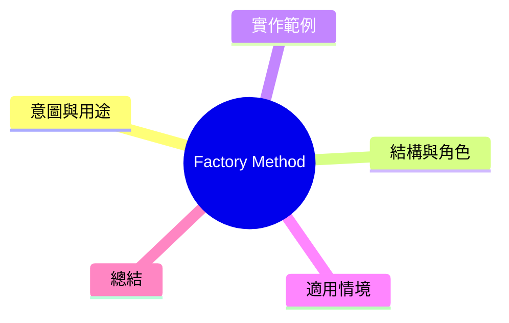

export const metadata = {
  title: '設計模式：工廠方法 (Factory Method)',
  date: '2026-06-30',
  excerpt: '介紹創建型設計模式中的工廠方 —— 物件的建立延遲到子類別，讓建立邏輯可以在不修改原有程式碼的情況下擴充。',
  tags: ['軟體設計', '設計模式', 'OOP'],
};

# 設計模式：工廠方法 (Factory Method)

工廠方法 (Factory Method) 是創建型模式，用來解決一個問題：一個父類別知道自己需要建立物件，卻不知道該建立哪個具體型別。

它把建立物件這件事定義成一個介面 (也就是工廠方法)，再交由子類別決定要實例化哪個具體類別。


```mermaid
mindmap
    root((Factory Method))
        意圖與用途
        結構與角色
        實作範例
        適用情境
        總結
```

- [意圖與用途](#意圖與用途)
- [結構與角色](#結構與角色)
- [實作範例：通知系統](#實作範例通知系統)
- [適用情境](#適用情境)
- [總結](#總結)

---

## 意圖與用途

想像一個發送通知的系統，具體的通知方式可能是 Email、SMS 或 Push，要走哪個管道則取決於使用者設定或環境變數。

工廠方法讓我們可以：

- 把各種通知的建立邏輯，封裝在各自的子類別裡
- 新增通知管道時，不必修改既有程式碼
- 讓呼叫端只跟抽象的 `Notification` 介面打交道

---

## 結構與角色

Factory Method 有四個重要角色：

- Product：被建立物件的抽象介面 (`Notification`)
- ConcreteProduct：具體的產品實作 (`EmailNotification`、`SMSNotification`)
- Creator：宣告工廠方法的抽象類別 (`NotificationSender`)
- ConcreteCreator：實作工廠方法的子類別 (`EmailSender`、`SMSSender`)

---

## 實作範例：通知系統

```typescript
// Product 介面
interface Notification {
  send(message: string): void;
}

// ConcreteProduct 實作
class EmailNotification implements Notification {
  constructor(private to: string) {}

  send(message: string): void {
    console.log(`Sending email to ${this.to}: ${message}`);
  }
}

class SMSNotification implements Notification {
  constructor(private phone: string) {}

  send(message: string): void {
    console.log(`Sending SMS to ${this.phone}: ${message}`);
  }
}

class PushNotification implements Notification {
  constructor(private deviceToken: string) {}

  send(message: string): void {
    console.log(`Sending push to ${this.deviceToken}: ${message}`);
  }
}

// Creator 抽象類 —— 義工廠方法
abstract class NotificationSender {
  // 工廠方法：由子類別實作
  abstract createNotification(target: string): Notification;

  // 共用的業務邏輯，會用到工廠方法
  notify(target: string, message: string): void {
    const notification = this.createNotification(target);
    notification.send(message);
  }
}

// ConcreteCreator
class EmailSender extends NotificationSender {
  createNotification(email: string): Notification {
    return new EmailNotification(email);
  }
}

class SMSSender extends NotificationSender {
  createNotification(phone: string): Notification {
    return new SMSNotification(phone);
  }
}

class PushSender extends NotificationSender {
  createNotification(deviceToken: string): Notification {
    return new PushNotification(deviceToken);
  }
}

// 使用
const sender: NotificationSender = new EmailSender();
sender.notify('user@example.com', '你的訂單已出貨');

// 新增 LINE 通知？只需新增類別，其他程式碼都不用動
class LineNotification implements Notification {
  constructor(private userId: string) {}
  send(message: string): void {
    console.log(`Sending LINE to ${this.userId}: ${message}`);
  }
}

class LineSender extends NotificationSender {
  createNotification(userId: string): Notification {
    return new LineNotification(userId);
  }
}
```

新增 LINE 通知時，`NotificationSender`、`EmailSender`、`SMSSender` 完全不需要動。

---

## 適用情境

適用時機

- 要建立的具體型別得交由子類別決定
- Creator 裡有共用的業務邏輯，而這段邏輯會用到工廠方法
- 預期未來會新增更多型別，希望擴充時只是「加東西」而不是改舊程式碼

與簡單 Factory Function 的差別

如果只是想把建立邏輯集中起來，一個單純的 factory function 通常就夠了：

```typescript
function createNotification(type: 'email' | 'sms', target: string): Notification {
  if (type === 'email') return new EmailNotification(target);
  return new SMSNotification(target);
}
```

Factory Method 的價值，在於它結合了繼承帶來的共用邏 ——  Creator 除了工廠方法之外還有共用的業務邏輯、整個樣板方法 (Template Method) 結構已經就位時，就是它派上用場的時機。

---

## 總結

Factory Method 的核心就是「將建立物件的職責延遲到子類別」。

這麼做的好處是，父類別不必知道具體型別就能操作物件，而子類別則掌控具體的建立方式。新增型別時，只要新增一個子類 —— 不必去改一條越長越長的 if-else，也不必動到既有的類別。
