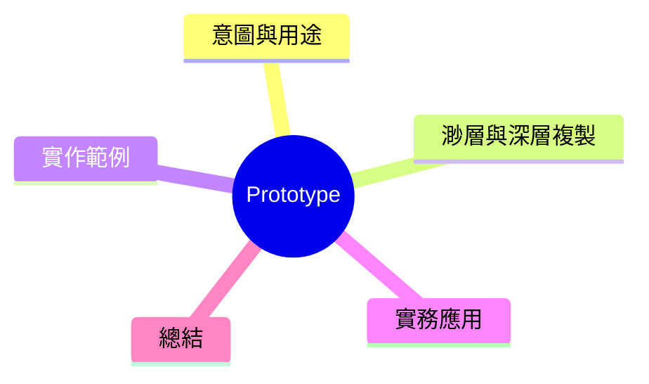

export const metadata = {
  title: '設計模式：原型模式 (Prototype)',
  date: '2026-03-13',
  excerpt: '介紹創建型設計模式中的原型模式——透過複製已有物件來建立新物件，進而避免重複的初始化流程。',
  tags: ['軟體設計', '設計模式', 'OOP'],
};

# 設計模式：原型模式 (Prototype)

Prototype 模式透過複製已有物件，來建立新物件。不必重走一次初始化流程，直接從現有的實例出發。

適用於：**物件初始化費時或費資源，而建立新物件只是要加上小差异。**



- [意圖與用途](#意圖與用途)
- [渺層與深層複製](#渺層與深層複製)
- [實作範例：圖形編輯器](#實作範例圖形編輯器)
- [實務應用](#實務應用)
- [總結](#總結)

---

## 意圖與用途

核心想法：從現有物件複製一份，如果需要再對副本實例進行小調整。

常見使用情境：

- 圖形編輯器中複製圖形層
- 游戲引擎中複製物件模板（子彈、NPC 類型）
- 設定頁面中有预設的設定等待使用者修改

---

## 渺層與深層複製

這是 Prototype 模式最需要注意的地方。

**渺層複製**：只複製最外層。内此的物件、陣列仍然對到兩個實例。

```typescript
const original = { a: 1, b: { c: 2 } };
const shallow = { ...original }; // 渺層複製

shallow.b.c = 99;
console.log(original.b.c); // 99——兩者共用同一個物件！
```

**深層複製**：連內此的物件一起複製，兩個實例完全獨立。

```typescript
const deep = JSON.parse(JSON.stringify(original)); // 簡單深層複製
deep.b.c = 99;
console.log(original.b.c); // 2——安全
```

`JSON.parse(JSON.stringify(...))` 簡單但有限制（不支援 `undefined`、`Date`、函式等）。更完整的方案是寫一個 `clone()` 方法。

---

## 實作範例：圖形編輯器

```typescript
interface Cloneable {
  clone(): this;
}

class Shape implements Cloneable {
  constructor(
    public type: string,
    public x: number,
    public y: number,
    public style: { color: string; strokeWidth: number },
  ) {}

  // 深層複製——style 物件也一起複製
  clone(): this {
    return Object.assign(Object.create(Object.getPrototypeOf(this)), {
      ...this,
      style: { ...this.style },
    });
  }

  moveTo(x: number, y: number): this {
    this.x = x;
    this.y = y;
    return this;
  }
}

const original = new Shape('circle', 10, 20, { color: 'red', strokeWidth: 2 });

// 複製一份，移到新位置
const cloned = original.clone().moveTo(50, 60);

console.log(original.x, original.y); // 10, 20——未改變
cloned.style.color = 'blue';
console.log(original.style.color); // 'red'——安全
```

---

## 實務應用

**適用時機**

- 物件建立費時或費資源，建立新物件只需少量修改
- 需要抓存某個物件的狀態，並在未來從這個快照出發

**注意事項**

- 複製對象有內部引用時，必須决定是渺層還是深層
- `clone()` 方法要處理所有內部狀態，包括繼承來的屬性

---

## 總結

Prototype 讓你可以不需知道物件實際的類別，直接複製一個現有實例。常被用於預設物件的複製、狀態快照、對象池初始化等情境。

隨時記得：預設渺層複製。物件內部有引用屬性時，應該主動實作 `clone()`。
