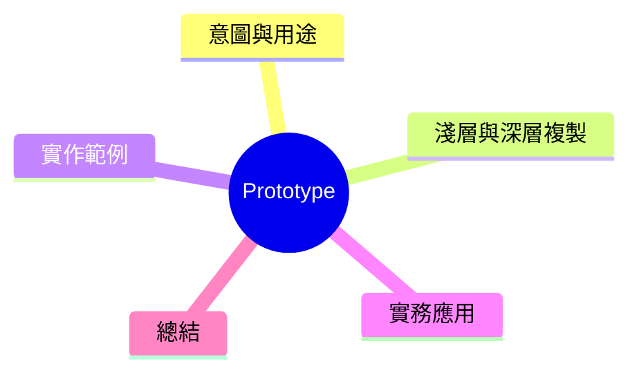

export const metadata = {
  title: '設計模式：原型模式 (Prototype)',
  date: '2026-06-30',
  excerpt: '介紹創建型設計模式中的原型模式：透過複製既有物件來建立新物件，藉此避開重複的初始化流程，並說明為什麼淺層與深層複製的差別比想像中重要。',
  tags: ['軟體設計', '設計模式', 'OOP'],
};

# 設計模式：原型模式 (Prototype)

Prototype 模式透過複製既有物件來建立新物件。不必把初始化流程再走一遍，而是直接從現有的實體出發，再從那裡微調。

它最適合這種情況：物件初始化的成本很高，而新物件多半只是既有物件的細微變化。


```mermaid
mindmap
    root((Prototype))
        意圖與用途
        淺層與深層複製
        實作範例
        實務應用
        總結
```

- [意圖與用途](#意圖與用途)
- [淺層與深層複製](#淺層與深層複製)
- [實作範例：圖形編輯器](#實作範例圖形編輯器)
- [實務應用](#實務應用)
- [總結](#總結)

---

## 意圖與用途

核心想法：複製一份既有物件，再針對副本做些小調整。

常見的使用情境：

- 設計工具中複製圖層
- 遊戲引擎中複製物件模板 (子彈、各種 NPC 類型)
- 設定頁面中提供預設值，讓使用者在其基礎上修改

---

## 淺層與深層複製

這是使用 Prototype 時最需要留意的地方。

淺層複製：只複製最外層的屬性。內層的物件、陣列仍然由原件與副本共用。

```typescript
const original = { a: 1, b: { c: 2 } };
const shallow = { ...original }; // 淺層複製

shallow.b.c = 99;
console.log(original.b.c); // 99，兩者指向同一個物件！
```

深層複製：連內層的物件都一起複製，兩個實體完全獨立。

```typescript
const deep = JSON.parse(JSON.stringify(original)); // 簡單的深層複製
deep.b.c = 99;
console.log(original.b.c); // 2，安全
```

`JSON.parse(JSON.stringify(...))` 簡單但有限，無法處理 `undefined`、`Date`、函式，也無法處理循環引用。物件一旦複雜，正確的做法是自己寫一個 `clone()` 方法。

---

## 實作範例：圖形編輯器

```typescript
interface Cloneable {
  clone(): this;
}

class Shape implements Cloneable {
  constructor(
    public type: string,
    public x: number,
    public y: number,
    public style: { color: string; strokeWidth: number },
  ) {}

  // 深層複製：style 物件也一起複製
  clone(): this {
    return Object.assign(Object.create(Object.getPrototypeOf(this)), {
      ...this,
      style: { ...this.style },
    });
  }

  moveTo(x: number, y: number): this {
    this.x = x;
    this.y = y;
    return this;
  }
}

const original = new Shape('circle', 10, 20, { color: 'red', strokeWidth: 2 });

// 複製一份，移到新位置
const cloned = original.clone().moveTo(50, 60);

console.log(original.x, original.y); // 10, 20，沒有被改到
cloned.style.color = 'blue';
console.log(original.style.color); // 'red'，安全，是各自獨立的副本
```

---

## 實務應用

適用時機

- 物件建立成本高或很吃資源，而新物件只需要少量修改
- 需要對某個物件的狀態拍下快照，未來再從這個快照分支出去

注意事項

- 物件內部含有引用型別時，必須決定要做淺層還是深層複製
- `clone()` 方法要處理所有內部狀態，包括繼承而來的屬性

---

## 總結

Prototype 讓你不必知道物件真正的類別，就能直接複製一個現有實體。它常被用於預設物件的複製、物件模板、狀態快照，以及物件池的初始化。

永遠對淺層複製保持警覺：只要物件帶有引用型別的屬性，就應該主動實作 `clone()`。
