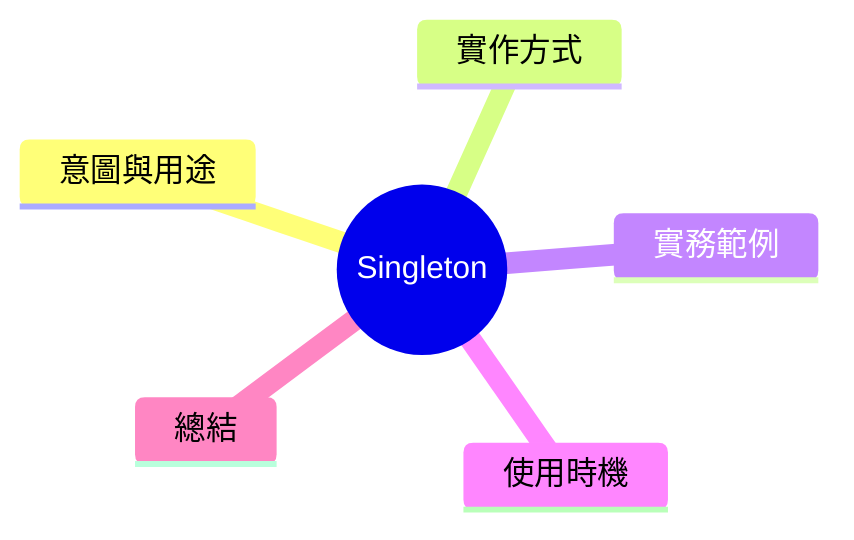

export const metadata = {
  title: '設計模式：單例模式 (Singleton)',
  date: '2026-03-05',
  excerpt: '介紹創建型設計模式中的單例模式——確保一個類別只有一個實例的最簡單實作方式，以及作為全局狀態的適用情境與陰鈱。',
  tags: ['軟體設計', '設計模式', 'OOP'],
};

# 設計模式：單例模式 (Singleton)

Singleton 是最簡單也最常被溺用的設計模式之一。目標只有一個：**確保整個應用程式內，某個類別只會有一個實例，並提供全局存取點。**



- [意圖與用途](#意圖與用途)
- [實作方式](#實作方式)
- [實務範例：結構化日誌系統](#實務範例結構化日誌系統)
- [使用時機與魔鬼](#使用時機與魔鬼)
- [總結](#總結)

---

## 意圖與用途

Singleton 適用於這類情境：

- 全局配置物件（應用程式不同部份都讀同一份設定）
- 日誌記錄器（所有模組共用同一個 Logger）
- 資料庫連線池（連線建立費時，共用同一個 Pool 有意義）
- 繯存（整個應用共用改變的資料）

共同特張：這些資源建立有代價，或者需要共用狀態，重複建立對應用程式沒有好處。

---

## 實作方式

TypeScript 中最直接的實作：

```typescript
class Singleton {
  private static instance: Singleton;

  // 私有構造子——防止外部直接 new
  private constructor() {}

  static getInstance(): Singleton {
    if (!Singleton.instance) {
      Singleton.instance = new Singleton();
    }
    return Singleton.instance;
  }

  doSomething(): void {
    console.log('Singleton is working');
  }
}

const a = Singleton.getInstance();
const b = Singleton.getInstance();
console.log(a === b); // true
```

構造子標記為 `private` 是關鍵，這樣外部程式碼就無法直接使用 `new Singleton()`，只能透過 `getInstance()` 尋取實例。

---

## 實務範例：結構化日誌系統

```typescript
type LogLevel = 'info' | 'warn' | 'error';

class Logger {
  private static instance: Logger;
  private logs: string[] = [];

  private constructor(private prefix: string = '[App]') {}

  static getInstance(): Logger {
    if (!Logger.instance) {
      Logger.instance = new Logger();
    }
    return Logger.instance;
  }

  log(level: LogLevel, message: string): void {
    const entry = `${this.prefix} [${level.toUpperCase()}] ${new Date().toISOString()} - ${message}`;
    this.logs.push(entry);
    console.log(entry);
  }

  getLogs(): string[] {
    return [...this.logs];
  }
}

// 不同模組中取得的都是同一個 Logger 實例
const logger1 = Logger.getInstance();
const logger2 = Logger.getInstance();

logger1.log('info', 'Application started');
logger2.log('warn', 'Memory usage high');

console.log(logger1.getLogs()); // 包含上面兩條 log
```

不管在應用程式哪個模組取得 Logger，都是同一個實例。所有日誌集中在同一個地方，不會分散。

---

## 使用時機與魔鬼

**適用時機**

- 整個應用程式就是只需要一份資源
- 共用狀態是有必要的（不是為了方便而用）
- 資源建立有成本且建立一次即可

**常見魔鬼**

- **測試困難**：實例對種式測試最大的困擾。測試A廣留的狀態會漏入測試B，導致測試不穩定。
- **隱輸全局狀態**：模組密密依賴同一個實例，依賴關係隱形，難以追蹤。
- **追求方便而溺用**：很多情況不需要單例，依賴注入即可解決。

實務建議：**第一先考慮依賴注入；確認真的需要共用實例時，再用 Singleton。**

---

## 總結

Singleton 解決的問題很明確：消除重複建立資源的浪費，並提供一個一致的全局存取點。

不過它兩面刀刃就在於「全局實例」這件事本身。全局狀態讓程式各部份之間的依賴變得隱性，測試寫起來也更麻烦。用得對，它很高效。用得不對，它會成為系統中隱藏最深的耐耐。
