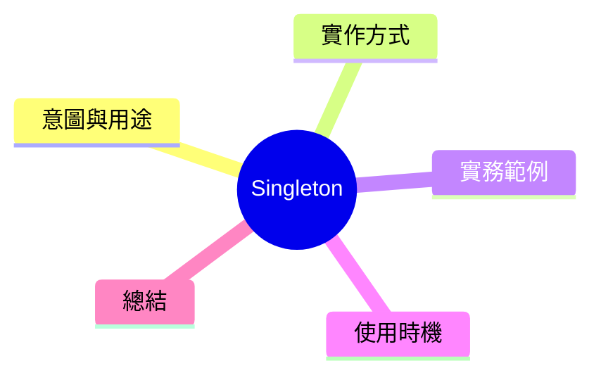

export const metadata = {
  title: '設計模式：單例模式 (Singleton)',
  date: '2026-06-30',
  excerpt: '介紹創建型設計模式中的單例模式：確保一個類別只有一個實體的最簡單實作方式，以及它作為全域狀態的適用情境與必須承擔的取捨。',
  tags: ['軟體設計', '設計模式', 'OOP'],
};

# 設計模式：單例模式 (Singleton)

Singleton 是最簡單、也最常被濫用的設計模式之一。它的目標只有一個：確保一個類別在整個應用程式中只會有一個實體，並提供一個全域的存取點。


```mermaid
mindmap
    root((Singleton))
        意圖與用途
        實作方式
        實務範例
        使用時機
        總結
```

- [意圖與用途](#意圖與用途)
- [實作方式](#實作方式)
- [實務範例：結構化日誌系統](#實務範例結構化日誌系統)
- [使用時機](#使用時機)
- [總結](#總結)

---

## 意圖與用途

Singleton 適用於這類情境：

- 全域配置物件 (應用程式的不同部分都要讀同一份設定)
- 日誌記錄器 (所有模組共用同一個 Logger，把記錄集中在一起)
- 資料庫連線池 (建立連線成本高，共用同一個 Pool 才划算)
- 快取 (整個應用共用一份需要跨模組存取的資料)

共同的特徵是：這些資源建立有成本，或者狀態本來就需要共用，重複建立對應用程式沒有好處。

---

## 實作方式

TypeScript 中最直接的實作：

```typescript
class Singleton {
  private static instance: Singleton;

  // 私有建構函式，阻止外部直接 new
  private constructor() {}

  static getInstance(): Singleton {
    if (!Singleton.instance) {
      Singleton.instance = new Singleton();
    }
    return Singleton.instance;
  }

  doSomething(): void {
    console.log('Singleton is working');
  }
}

const a = Singleton.getInstance();
const b = Singleton.getInstance();
console.log(a === b); // true
```

把建構子標記為 `private` 是關鍵，這樣外部程式碼就無法直接呼叫 `new Singleton()`，唯一的入口是 `getInstance()`，在第一次被呼叫時才建立實體，之後都回傳同一份快取下來的實體。

---

## 實務範例：結構化日誌系統

```typescript
type LogLevel = 'info' | 'warn' | 'error';

class Logger {
  private static instance: Logger;
  private logs: string[] = [];

  private constructor(private prefix: string = '[App]') {}

  static getInstance(): Logger {
    if (!Logger.instance) {
      Logger.instance = new Logger();
    }
    return Logger.instance;
  }

  log(level: LogLevel, message: string): void {
    const entry = `${this.prefix} [${level.toUpperCase()}] ${new Date().toISOString()} - ${message}`;
    this.logs.push(entry);
    console.log(entry);
  }

  getLogs(): string[] {
    return [...this.logs];
  }
}

// 不論在哪個模組呼叫 getInstance()，拿到的都是同一個 Logger
const logger1 = Logger.getInstance();
const logger2 = Logger.getInstance();

logger1.log('info', 'Application started');
logger2.log('warn', 'Memory usage high');

console.log(logger1.getLogs()); // 包含上面兩條記錄
```

不論在應用程式的哪個模組取得 Logger，都是同一個實體，所有日誌集中在同一個地方，不會分散。

---

## 使用時機

適用時機

- 整個應用程式確實只需要一份資源
- 共用狀態是真的有必要，而不是為了方便才這樣用
- 實體的「全域性」本身就是你要的特性，而非副作用

常見陷阱

- 測試困難：共用狀態是單元測試最大的麻煩。測試 A 殘留的狀態會滲入測試 B，導致測試不穩定、結果還跟執行順序有關。
- 隱性的全域狀態：模組默默依賴同一個實體，這層依賴是看不見的，難以追蹤。
- 貪圖方便而濫用：很多看似需要單例的情況，其實用依賴注入就能解決，而且能讓依賴關係保持明確。

實務原則：先考慮依賴注入；只有在真的需要共用實體語意時，才動用 Singleton。

---

## 總結

Singleton 解決的問題很明確：消除重複建立資源的浪費，並提供一個一致的全域存取點。

它的缺點，恰恰就是它吸引人的地方：那個全域實體。全域狀態會讓各部分之間的依賴變得隱性，也讓測試變得脆弱。

用對地方，它高效又乾淨；當成「我到處都要用這個」的捷徑來用，它就會變成你半年後得花好幾個小時除錯的隱患。
