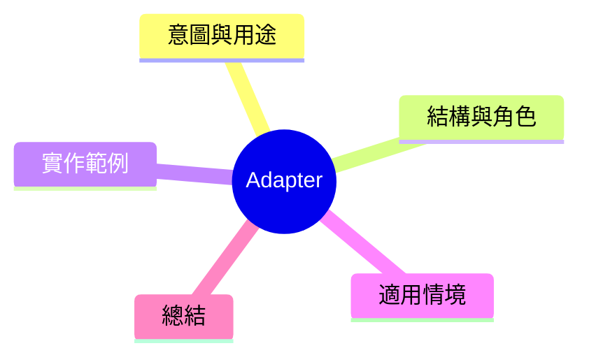

export const metadata = {
  title: '設計模式：適配器模式 (Adapter)',
  date: '2026-03-16',
  excerpt: '介紹結構型設計模式中的適配器模式——如何將不相容的介面轉換為客戶端期望的格式，忩免不導動外部程式碼。',
  tags: ['軟體設計', '設計模式', 'OOP'],
};

# 設計模式：適配器模式 (Adapter)

Adapter 就像轉接頭：**將一個介面轉換為另一個介面，讓平時無法合作的類別巧妙地協同。**

常用於整合第三方庫、串接舊 API 與新介面、或將某個外部模組包袹成內部期望的格式。



- [意圖與用途](#意圖與用途)
- [結構與角色](#結構與角色)
- [實作範例：日誌適配器](#實作範例日誌適配器)
- [適用情境](#適用情境)
- [總結](#總結)

---

## 意圖與用途

假設你的系統使用一個統一的 `Logger` 介面：

```typescript
interface Logger {
  log(level: 'info' | 'warn' | 'error', message: string): void;
}
```

現在導入一個第三方日誌庫，但它的 API 長相不同：

```typescript
// 第三方庫的 API
class WinstonLogger {
  info(msg: string): void { /* ... */ }
  warn(msg: string): void { /* ... */ }
  error(msg: string, err?: Error): void { /* ... */ }
}
```

然而你無法修改第三方庫。Adapter 在兩者之間建立橋樑。

---

## 結構與角色

- **Target**：客戶端期望的介面 (`Logger`)
- **Adaptee**：已有的不相容類別 (`WinstonLogger`)
- **Adapter**：實作 Target 介面，內部委派給 Adaptee (`WinstonAdapter`)

---

## 實作範例：日誌適配器

```typescript
interface Logger {
  log(level: 'info' | 'warn' | 'error', message: string): void;
}

class WinstonLogger {
  info(msg: string): void { console.log(`[INFO] ${msg}`); }
  warn(msg: string): void { console.warn(`[WARN] ${msg}`); }
  error(msg: string, err?: Error): void { console.error(`[ERROR] ${msg}`, err); }
}

// Adapter: 實作 Logger 介面，內部使用 WinstonLogger
class WinstonAdapter implements Logger {
  constructor(private winston: WinstonLogger) {}

  log(level: 'info' | 'warn' | 'error', message: string): void {
    if (level === 'info') this.winston.info(message);
    else if (level === 'warn') this.winston.warn(message);
    else this.winston.error(message);
  }
}

// 客戶端程式碼只需知道 Logger 介面
function writeLog(logger: Logger): void {
  logger.log('info', 'Application started');
  logger.log('error', 'Something went wrong');
}

const winston = new WinstonLogger();
const adapter = new WinstonAdapter(winston);
writeLog(adapter); // 無縮接、完全相容
```

未來如果要改用 `PinoLogger`，只需新寫一個 `PinoAdapter`。`writeLog` 和其他層都不需要碰。

---

## 適用情境

**適用時機**

- 接入第三方庫，但它的 API 跟項目內部不相容
- 舊系統的介面與新系統不同，但又不能直接修改舊程式碼
- 不同來源的資料格式需要整合

**注意：不要溺用**

Adapter 是為了解決不相容問題。如果可以直接設計對的介面，不需要適配器。

---

## 總結

Adapter 的本賿是**介面轉換**。它不改變任何行為，只是將一種介面包袹成另一種。

現實專案中，每次接入第三方服務或舊系統模組，寫一個 Adapter 是讓內部程式碼保持一致性最便宜的方式。
