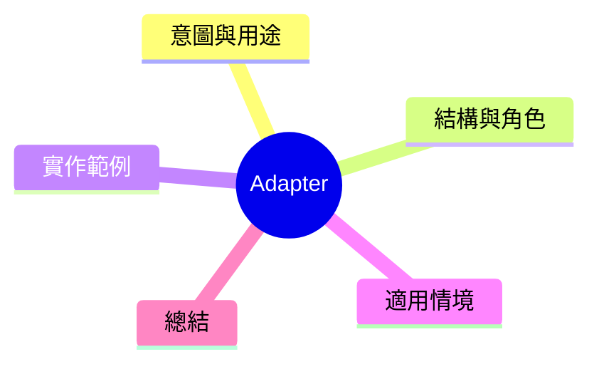

export const metadata = {
  title: '設計模式：適配器模式 (Adapter)',
  date: '2026-06-30',
  excerpt: '介紹結構型設計模式中的適配器模式：如何將不相容的介面轉換成客戶端期望的格式，讓兩個原本無法合作的類別協同運作，且不必改動任何一方。',
  tags: ['軟體設計', '設計模式', 'OOP'],
};

# 設計模式：適配器模式 (Adapter)

Adapter 就像程式世界裡的轉接頭：把一個介面轉換成另一個介面，讓原本無法合作的類別能夠順暢地協同運作。

它最常用於整合第三方函式庫、把舊程式碼接上新介面，或是把某個外部模組包裝成內部期望的格式。


```mermaid
mindmap
    root((Adapter))
        意圖與用途
        結構與角色
        實作範例
        適用情境
        總結
```

- [意圖與用途](#意圖與用途)
- [結構與角色](#結構與角色)
- [實作範例：日誌適配器](#實作範例日誌適配器)
- [適用情境](#適用情境)
- [總結](#總結)

---

## 意圖與用途

假設你的系統使用一個統一的 `Logger` 介面：

```typescript
interface Logger {
  log(level: 'info' | 'warn' | 'error', message: string): void;
}
```

現在你想導入一個第三方日誌函式庫，但它的 API 長得不一樣：

```typescript
// 第三方函式庫的 API
class WinstonLogger {
  info(msg: string): void { /* ... */ }
  warn(msg: string): void { /* ... */ }
  error(msg: string, err?: Error): void { /* ... */ }
}
```

而你無法修改這個第三方函式庫。這時就由 Adapter 在兩者之間搭起橋樑。

---

## 結構與角色

- Target：客戶端期望的介面 (`Logger`)
- Adaptee：已存在、但不相容的類別 (`WinstonLogger`)
- Adapter：實作 Target 介面，內部再委派給 Adaptee (`WinstonAdapter`)

---

## 實作範例：日誌適配器

```typescript
interface Logger {
  log(level: 'info' | 'warn' | 'error', message: string): void;
}

class WinstonLogger {
  info(msg: string): void { console.log(`[INFO] ${msg}`); }
  warn(msg: string): void { console.warn(`[WARN] ${msg}`); }
  error(msg: string, err?: Error): void { console.error(`[ERROR] ${msg}`, err); }
}

// Adapter：實作 Logger 介面，內部使用 WinstonLogger
class WinstonAdapter implements Logger {
  constructor(private winston: WinstonLogger) {}

  log(level: 'info' | 'warn' | 'error', message: string): void {
    if (level === 'info') this.winston.info(message);
    else if (level === 'warn') this.winston.warn(message);
    else this.winston.error(message);
  }
}

// 客戶端程式碼只需要知道 Logger 介面
function writeLog(logger: Logger): void {
  logger.log('info', 'Application started');
  logger.log('error', 'Something went wrong');
}

const winston = new WinstonLogger();
const adapter = new WinstonAdapter(winston);
writeLog(adapter); // 無縫接軌、完全相容
```

未來如果要改用 `PinoLogger`，只要再寫一個 `PinoAdapter` 就好，`writeLog` 和其他呼叫端都不必動。

---

## 適用情境

適用時機

- 要接入第三方函式庫，但它的 API 跟專案內部的約定不相容
- 要把舊程式碼接上新介面，但又不能直接改動舊程式碼
- 要把多個來源、格式各異的資料整合成統一格式

不要濫用

Adapter 是用來解決「不相容」的。如果一開始就能把介面設計成相容的，那就不需要適配器。

---

## 總結

Adapter 的本質是介面轉換。它不改變任何行為，只是把一種介面包裝起來，再以另一種介面呈現。

在現實專案裡，每次引入第三方服務或舊模組時，寫一個 Adapter 往往是讓內部程式碼保持一致最省事的方式。
