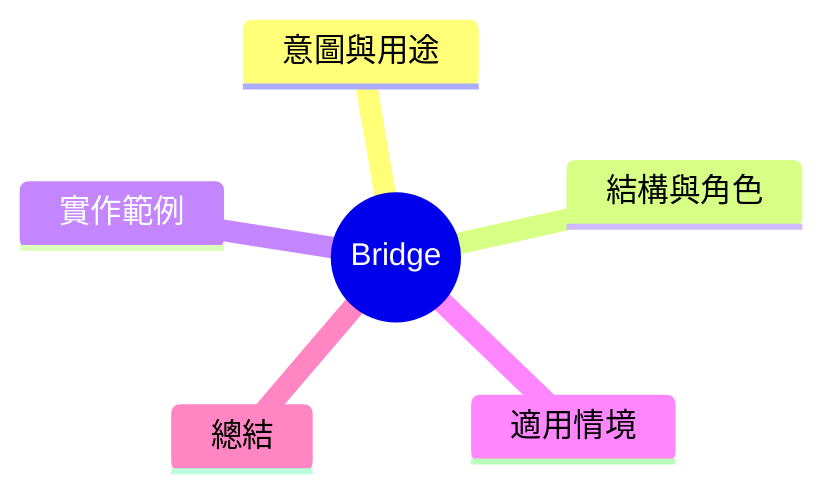

export const metadata = {
  title: '設計模式：橋接模式 (Bridge)',
  date: '2026-03-18',
  excerpt: '介紹結構型設計模式中的橋接模式——如何將抽象與實作分離，避免繼承層級爬滀，讓兩歷可以獨立演展。',
  tags: ['軟體設計', '設計模式', 'OOP'],
};

# 設計模式：橋接模式 (Bridge)

Bridge 將抽象與實作分離，讓兩者可以獨立演展。課轉一次繼承，改用組合。



- [意圖與用途](#意圖與用途)
- [結構與角色](#結構與角色)
- [實作範例：連態遊戰這控器](#實作範例連態遊戰這控器)
- [適用情境](#適用情境)
- [總結](#總結)

---

## 意圖與用途

這講暫時存於的問題：

想象一個這控器，可以控制電視和音響。如果以繼承表达：

- `RemoteControl`
- `TVRemoteControl extends RemoteControl`
- `SoundBarRemoteControl extends RemoteControl`
- `SmartTVRemoteControl extends TVRemoteControl`
- `SmartSoundBarRemoteControl extends SoundBarRemoteControl`
- `PremiumSmartTVRemoteControl extends SmartTVRemoteControl`
- ...類別爬滀

類別等比級數是「這控器型別 × 對應設備型別」。兩個維度都在繼承層級裡混在一起。

Bridge 的解決方式：將「這控器型別」和「設備型別」分開，各自獨立演展。

---

## 結構與角色

- **Abstraction**：這控器的抽象層 (`RemoteControl`)
- **RefinedAbstraction**：擴展的抽象層 (`SmartRemoteControl`)
- **Implementor**：設備實作的介面 (`Device`)
- **ConcreteImplementor**：具體設備 (`TV`、`SoundBar`)

---

## 實作範例：連態遊戰這控器

```typescript
// Implementor 介面
interface Device {
  isOn(): boolean;
  turnOn(): void;
  turnOff(): void;
  getVolume(): number;
  setVolume(volume: number): void;
}

// ConcreteImplementor
class TV implements Device {
  private on = false;
  private volume = 50;

  isOn(): boolean { return this.on; }
  turnOn(): void { this.on = true; console.log('TV on'); }
  turnOff(): void { this.on = false; console.log('TV off'); }
  getVolume(): number { return this.volume; }
  setVolume(volume: number): void {
    this.volume = Math.max(0, Math.min(100, volume));
  }
}

class SoundBar implements Device {
  private on = false;
  private volume = 30;

  isOn(): boolean { return this.on; }
  turnOn(): void { this.on = true; console.log('SoundBar on'); }
  turnOff(): void { this.on = false; console.log('SoundBar off'); }
  getVolume(): number { return this.volume; }
  setVolume(volume: number): void {
    this.volume = Math.max(0, Math.min(100, volume));
  }
}

// Abstraction——這控器含一個指向 Device 的引用（橋接）
class RemoteControl {
  constructor(protected device: Device) {}

  togglePower(): void {
    if (this.device.isOn()) this.device.turnOff();
    else this.device.turnOn();
  }

  volumeUp(): void {
    this.device.setVolume(this.device.getVolume() + 10);
  }

  volumeDown(): void {
    this.device.setVolume(this.device.getVolume() - 10);
  }
}

// RefinedAbstraction——擴展功能，不動 Device 層
class SmartRemoteControl extends RemoteControl {
  mute(): void {
    this.device.setVolume(0);
    console.log('Muted');
  }
}

// 不同組合，自由搭配
const tvRemote = new RemoteControl(new TV());
const smartSoundbar = new SmartRemoteControl(new SoundBar());

tvRemote.togglePower();
smartSoundbar.mute();
```

繼承層級由「型別 × 設備」縮成兩個獨立的繼承層級，各自独立擴展。

---

## 適用情境

**適用時機**

- 某個類別有兩個獨立演展的維度，繼承會導致類別數量狀爆
- 希望在執行時命期內動態替換實作

---

## 總結

Bridge 的核心是「繼承 → 組合」的轉化。

一旦發現某個類別可能對兩個維度演展，就應該思考是否將其中一個維度提取出來作為独立的也就是橋。此方法在兩個維度需要同時獨立全面演展時办發最大價値。
