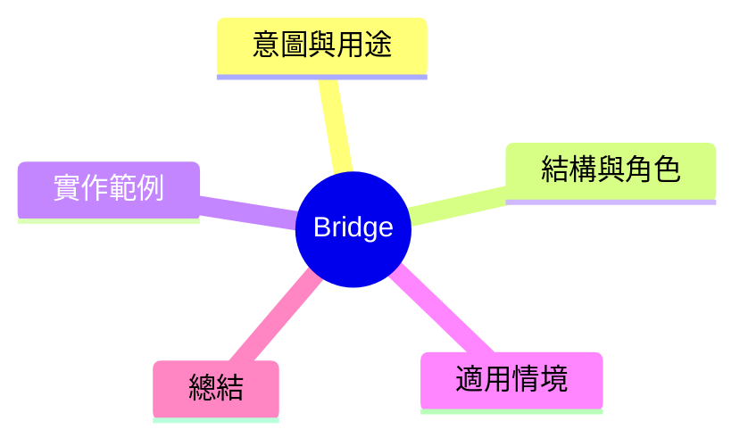

export const metadata = {
  title: '設計模式：橋接模式 (Bridge)',
  date: '2026-06-30',
  excerpt: '介紹結構型設計模式中的橋接模 —— 何將抽象與實作分離，避免繼承層級爆炸，讓兩邊可以各自獨立演進。',
  tags: ['軟體設計', '設計模式', 'OOP'],
};

# 設計模式：橋接模式 (Bridge)

Bridge 把抽象與實作分離，讓兩邊可以各自獨立變化。它的核心轉變是：以組合取代繼承。


```mermaid
mindmap
    root((Bridge))
        意圖與用途
        結構與角色
        實作範例
        適用情境
        總結
```

- [意圖與用途](#意圖與用途)
- [結構與角色](#結構與角色)
- [實作範例：遙控器](#實作範例遙控器)
- [適用情境](#適用情境)
- [總結](#總結)

---

## 意圖與用途

Bridge 要解決的問題是這樣的：

想像一個遙控器，要能同時操作電視和音響。如果用繼承來表達：

- `RemoteControl`
- `TVRemoteControl extends RemoteControl`
- `SoundBarRemoteControl extends RemoteControl`
- `SmartTVRemoteControl extends TVRemoteControl`
- `SmartSoundBarRemoteControl extends SoundBarRemoteControl`

類別的數量是「遙控器型別 × 設備型別」。兩個彼此獨立的維度，全擠在同一條繼承層級裡糾纏在一起。

Bridge 把它們拆開：遙控器型別走一條繼承層級，設備型別走另一條，兩邊都能各自獨立成長。

---

## 結構與角色

- Abstraction：遙控器的高層抽象 (`RemoteControl`)
- RefinedAbstraction：擴充後的抽象 (`SmartRemoteControl`)
- Implementor：設備的介面 (`Device`)
- ConcreteImplementor：具體設備 (`TV`、`SoundBar`)

---

## 實作範例：遙控器

```typescript
// Implementor 介面
interface Device {
  isOn(): boolean;
  turnOn(): void;
  turnOff(): void;
  getVolume(): number;
  setVolume(volume: number): void;
}

// ConcreteImplementor
class TV implements Device {
  private on = false;
  private volume = 50;

  isOn(): boolean { return this.on; }
  turnOn(): void { this.on = true; console.log('TV on'); }
  turnOff(): void { this.on = false; console.log('TV off'); }
  getVolume(): number { return this.volume; }
  setVolume(volume: number): void {
    this.volume = Math.max(0, Math.min(100, volume));
  }
}

class SoundBar implements Device {
  private on = false;
  private volume = 30;

  isOn(): boolean { return this.on; }
  turnOn(): void { this.on = true; console.log('SoundBar on'); }
  turnOff(): void { this.on = false; console.log('SoundBar off'); }
  getVolume(): number { return this.volume; }
  setVolume(volume: number): void {
    this.volume = Math.max(0, Math.min(100, volume));
  }
}

// Abstractio —— 控器持有一個指向 Device 的引用 (這就是橋)
class RemoteControl {
  constructor(protected device: Device) {}

  togglePower(): void {
    if (this.device.isOn()) this.device.turnOff();
    else this.device.turnOn();
  }

  volumeUp(): void {
    this.device.setVolume(this.device.getVolume() + 10);
  }

  volumeDown(): void {
    this.device.setVolume(this.device.getVolume() - 10);
  }
}

// RefinedAbstractio —— 充功能，完全不動 Device 層
class SmartRemoteControl extends RemoteControl {
  mute(): void {
    this.device.setVolume(0);
    console.log('Muted');
  }
}

// 任意組合都能自由搭配
const tvRemote = new RemoteControl(new TV());
const smartSoundbar = new SmartRemoteControl(new SoundBar());

tvRemote.togglePower();
smartSoundbar.mute();
```

原本要為每一種組合各開一個類別，現在變成兩條獨立的繼承層級，各自獨立成長。

---

## 適用情境

適用時機

- 某個類別有兩個彼此獨立變化的維度，用繼承會導致類別數量爆炸
- 希望在執行期動態替換實作

---

## 總結

Bridge 的核心就是「繼承 → 組合」的轉變。

一旦發現某個類別可能往兩個彼此獨立的方向成長，就該考慮把其中一個維度抽出來、做成獨立的介 —— 就是橋。如此一來，兩邊都能完整擴充，而不必互相牽動。
