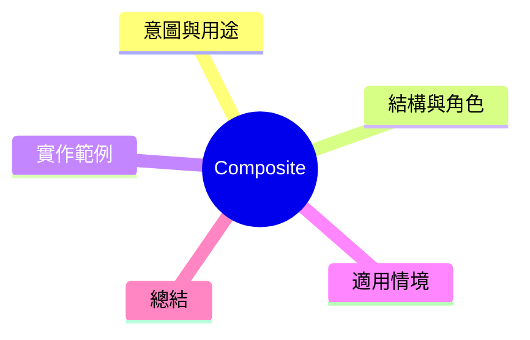

export const metadata = {
  title: '設計模式：組合模式 (Composite)',
  date: '2026-06-30',
  excerpt: '介紹結構型設計模式中的組合模式：如何將物件組合成樹狀結構，並讓客戶端程式碼一視同仁地對待單一物件與組合。',
  tags: ['軟體設計', '設計模式', 'OOP'],
};

# 設計模式：組合模式 (Composite)

Composite 把物件組合成樹狀結構，讓客戶端程式碼能用同一種方式對待單一節點與容器。


```mermaid
mindmap
    root((Composite))
        意圖與用途
        結構與角色
        實作範例
        適用情境
        總結
```

- [意圖與用途](#意圖與用途)
- [結構與角色](#結構與角色)
- [實作範例：檔案系統](#實作範例檔案系統)
- [適用情境](#適用情境)
- [總結](#總結)

---

## 意圖與用途

檔案系統是最經典的例子：檔案和資料夾都可以被移動、刪除、列出。但如果把兩者分開處理，程式碼就會被 `if (isFile)` 和 `if (isDirectory)` 的分支塞滿。

Composite 的目標：讓檔案和資料夾實作同一個介面，客戶端不需要知道自己處理的是葉節點還是容器。

---

## 結構與角色

- Component：共同的介面 (`FileSystemNode`)
- Leaf：沒有子節點的葉節點 (`File`)
- Composite：可以容納子節點的容器 (`Directory`)

---

## 實作範例：檔案系統

```typescript
// Component 介面
interface FileSystemNode {
  name: string;
  getSize(): number;
  print(indent?: string): void;
}

// Leaf
class File implements FileSystemNode {
  constructor(public name: string, private size: number) {}

  getSize(): number { return this.size; }

  print(indent = ''): void {
    console.log(`${indent}📄 ${this.name} (${this.size}B)`);
  }
}

// Composite
class Directory implements FileSystemNode {
  private children: FileSystemNode[] = [];

  constructor(public name: string) {}

  add(node: FileSystemNode): void {
    this.children.push(node);
  }

  remove(node: FileSystemNode): void {
    this.children = this.children.filter(c => c !== node);
  }

  // 遞迴加總子節點的大小，客戶端不必知道細節
  getSize(): number {
    return this.children.reduce((sum, child) => sum + child.getSize(), 0);
  }

  print(indent = ''): void {
    console.log(`${indent}📁 ${this.name}`);
    this.children.forEach(child => child.print(indent + '  '));
  }
}

// 建立樹狀結構
const root = new Directory('project');
const src = new Directory('src');
const dist = new Directory('dist');

src.add(new File('index.ts', 1200));
src.add(new File('utils.ts', 800));
dist.add(new File('bundle.js', 45000));

root.add(src);
root.add(dist);
root.add(new File('package.json', 400));

root.print();
console.log(`Total: ${root.getSize()}B`); // 遞迴、透明
```

呼叫 `root.getSize()` 和呼叫 `file.getSize()` 用起來一模一樣，不需要依型別分支。

---

## 適用情境

適用時機

- 資料天然形成樹狀結構 (檔案系統、UI 元件樹、組織圖、帳單明細)
- 客戶端確實需要一視同仁地處理單一物件與組合

---

## 總結

Composite 讓樹狀結構的遞迴操作變得自然。客戶端對葉節點和容器呼叫相同的方法，剩下的交給樹自己處理。檔案系統、UI 元件樹、AST 是它最常見的應用。
