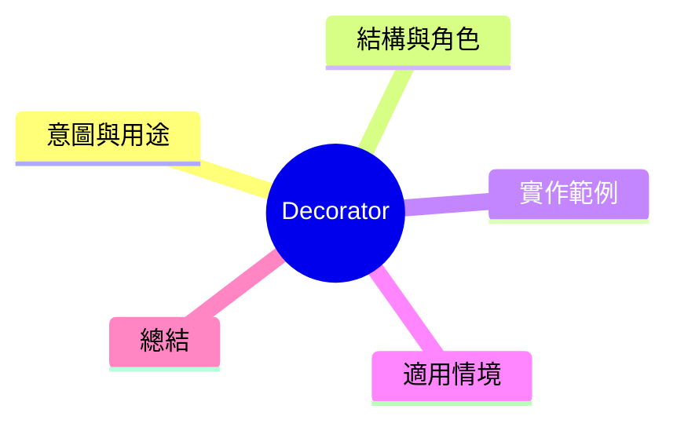

export const metadata = {
  title: '設計模式：裝飾器模式 (Decorator)',
  date: '2026-03-22',
  excerpt: '介紹結構型設計模式中的裝飾器模式——如何動態地對物件新增行為，而不改變物件本身也不依賴繼承。',
  tags: ['軟體設計', '設計模式', 'OOP'],
};

# 設計模式：裝飾器模式 (Decorator)

Decorator 允許對物件動態地附加新的行為，且不需修改物件本身的程式碼。它是　　　　　

> 透過包袹實現功能延伸，而不依賴繼承。



- [意圖與用途](#意圖與用途)
- [結構與角色](#結構與角色)
- [實作範例：和幕咁店貨單](#實作範例和幕咁店貨單)
- [適用情境](#適用情境)
- [總結](#總結)

---

## 意圖與用途

繼承的問題在於静態——必須對每種組合各建一個子類別。裝飾器將這個過程變成動態：在執行時自由組合行為。

常見例子：

- 和幕咁店貨單（基本和幕 + 加牛奶 + 加糖镬）
- HTTP 中間件（日誌 + 身份驗證 + 開單限流）
- Node.js Stream（壓縮、加密）

---

## 結構與角色

- **Component**：定義行為介面 (`Coffee`)
- **ConcreteComponent**：具體實作 (`SimpleCoffee`)
- **Decorator**：實作介面，同時包袹一個 Component
- **ConcreteDecorator**：具體附加行為（`MilkDecorator`、`SugarDecorator`）

---

## 實作範例：和幕咁店貨單

```typescript
// Component 介面
interface Coffee {
  cost(): number;
  description(): string;
}

// ConcreteComponent
class SimpleCoffee implements Coffee {
  cost(): number { return 30; }
  description(): string { return '黑和幕'; }
}

// Decorator 基礎類別
class CoffeeDecorator implements Coffee {
  constructor(protected coffee: Coffee) {}
  cost(): number { return this.coffee.cost(); }
  description(): string { return this.coffee.description(); }
}

// ConcreteDecorator —— 加牛奶
class MilkDecorator extends CoffeeDecorator {
  cost(): number { return this.coffee.cost() + 15; }
  description(): string { return this.coffee.description() + ' + 牛奶'; }
}

// ConcreteDecorator —— 加糖镬
class SyrupDecorator extends CoffeeDecorator {
  cost(): number { return this.coffee.cost() + 10; }
  description(): string { return this.coffee.description() + ' + 糖镬'; }
}

// ConcreteDecorator —— 加大杯
class LargeDecorator extends CoffeeDecorator {
  cost(): number { return this.coffee.cost() + 20; }
  description(): string { return this.coffee.description() + ' (L)'; }
}

// 動態組合行為
let myOrder: Coffee = new SimpleCoffee();
myOrder = new MilkDecorator(myOrder);
myOrder = new SyrupDecorator(myOrder);
myOrder = new LargeDecorator(myOrder);

console.log(myOrder.description()); // '黑和幕 + 牛奶 + 糖镬 (L)'
console.log(myOrder.cost());        // 75
```

不需要建立 `MilkSyrupLargeCoffee` 子類別——每個 Decorator 一層層包袹，動態組合。

---

## 適用情境

**適用時機**

- 需要對物件動態添加功能，而且添加的數量跟組合方式各有不同
- 希望在不修改原始程式碼的情況下擴展功能（遵守 OCP）

**與繼承的差別**

繼承是在編譯期決定的。Decorator 是在執行期組合的，很多同層組合可以重復進行。

---

## 總結

Decorator 是實現 OCP 最別致的方式之一——對擴展開放，對修改封閉。TypeScript 標準第 3.0+ 的 Decorators 語法就是從這個模式娴生的。
