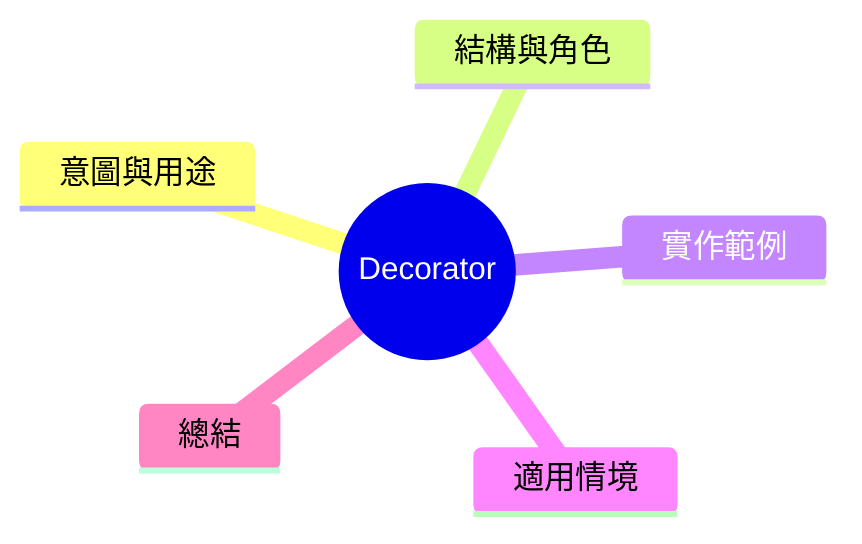

export const metadata = {
  title: '設計模式：裝飾器模式 (Decorator)',
  date: '2026-06-30',
  excerpt: '介紹結構型設計模式中的裝飾器模式：如何透過包裝在執行期動態地對物件附加新行為，而不需修改原始類別，也不依賴繼承。',
  tags: ['軟體設計', '設計模式', 'OOP'],
};

# 設計模式：裝飾器模式 (Decorator)

Decorator 透過「包裝」在執行期動態地對物件附加新行為，不必修改底層類別，也不必為每一種組合各開一個子類別。


```mermaid
mindmap
    root((Decorator))
        意圖與用途
        結構與角色
        實作範例
        適用情境
        總結
```

- [意圖與用途](#意圖與用途)
- [結構與角色](#結構與角色)
- [實作範例：咖啡店](#實作範例咖啡店)
- [適用情境](#適用情境)
- [總結](#總結)

---

## 意圖與用途

繼承是靜態的，每一種行為組合都得新建一個子類別。Decorator 把這種組合變成動態的：在執行期自由疊加行為。

常見的例子：

- 咖啡店點單 (基本咖啡 + 加牛奶 + 加糖漿)
- HTTP middleware (日誌 + 身份驗證 + 限流)
- Node.js stream (壓縮、加密)

---

## 結構與角色

- Component：行為的介面 (`Coffee`)
- ConcreteComponent：基礎實作 (`SimpleCoffee`)
- Decorator：實作介面，同時包裝一個 Component
- ConcreteDecorator：附加具體行為 (`MilkDecorator`、`SyrupDecorator`)

---

## 實作範例：咖啡店

```typescript
// Component 介面
interface Coffee {
  cost(): number;
  description(): string;
}

// ConcreteComponent
class SimpleCoffee implements Coffee {
  cost(): number { return 30; }
  description(): string { return '黑咖啡'; }
}

// Decorator 基礎類別
class CoffeeDecorator implements Coffee {
  constructor(protected coffee: Coffee) {}
  cost(): number { return this.coffee.cost(); }
  description(): string { return this.coffee.description(); }
}

// ConcreteDecorator：牛奶
class MilkDecorator extends CoffeeDecorator {
  cost(): number { return this.coffee.cost() + 15; }
  description(): string { return this.coffee.description() + ' + 牛奶'; }
}

// ConcreteDecorator：糖漿
class SyrupDecorator extends CoffeeDecorator {
  cost(): number { return this.coffee.cost() + 10; }
  description(): string { return this.coffee.description() + ' + 糖漿'; }
}

// ConcreteDecorator：大杯
class LargeDecorator extends CoffeeDecorator {
  cost(): number { return this.coffee.cost() + 20; }
  description(): string { return this.coffee.description() + ' (L)'; }
}

// 動態疊加行為
let myOrder: Coffee = new SimpleCoffee();
myOrder = new MilkDecorator(myOrder);
myOrder = new SyrupDecorator(myOrder);
myOrder = new LargeDecorator(myOrder);

console.log(myOrder.description()); // '黑咖啡 + 牛奶 + 糖漿 (L)'
console.log(myOrder.cost());        // 75
```

不需要建立 `MilkSyrupLargeCoffee` 這種子類別，每個 Decorator 都包住前一層，一層層動態組合起來。

---

## 適用情境

適用時機

- 需要對物件動態附加行為，而且組合方式變化多端
- 希望在不修改既有程式碼的前提下擴充功能 (遵守 OCP)

與繼承的差別

繼承是在編譯期決定的；Decorator 是在執行期組合的，而且同一個 Decorator 還能重複套用好幾層。

---

## 總結

Decorator 是實務上實現 OCP 最乾淨俐落的方式之一：對擴充開放，對修改封閉。TypeScript 的 Decorators 語法 (TC39 提案) 正是直接以這個模式命名的。
