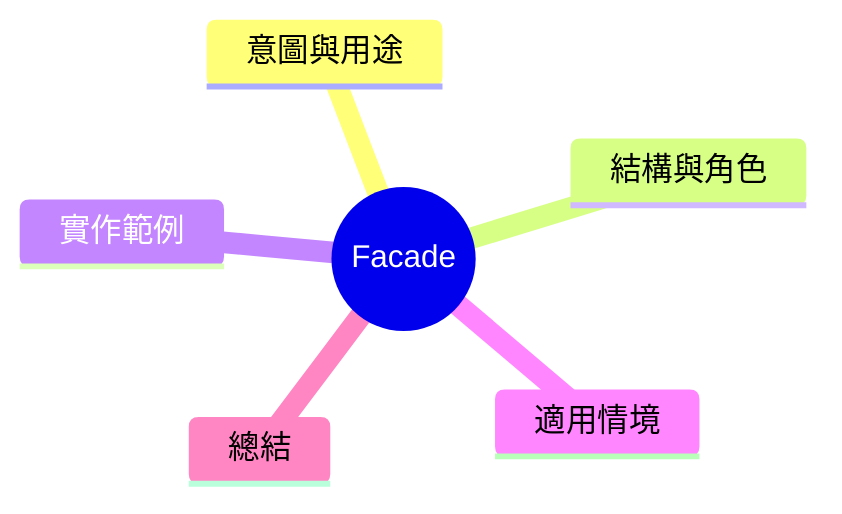

export const metadata = {
  title: '設計模式：外觀模式 (Facade)',
  date: '2026-03-24',
  excerpt: '介紹結構型設計模式中的外觀模式——如何為複雜的子系統提供一個簡化的一層介面，讓客戶端不需面對内部複雜性。',
  tags: ['軟體設計', '設計模式', 'OOP'],
};

# 設計模式：外觀模式 (Facade)

Facade 為複雜的子系統提供一個簡化的入口，讓客戶端不需知道內部的期作雲淌。



- [意圖與用途](#意圖與用途)
- [結構與角色](#結構與角色)
- [實作範例：家園軟體展示系統](#實作範例家園軟體展示系統)
- [適用情境](#適用情境)
- [總結](#總結)

---

## 意圖與用途

想象展示一部影片需要：

1. 啟動投影機
2. 啟動音響系統
3. 陰暮環境（關燈、拉下窗帽）
4. 設定流媒體播放器

客戶端希望只需呼叫 `homeTheater.startMovie(movie)` 就好，不需了解各個子系統如何通訊。Facade 提供這个簡化層。

---

## 結構與角色

- **Facade**：簡化介面，封裝多個子系統的協調部分
- **Subsystem classes**：複雜的內部實作，對 Facade 一無所知

---

## 實作範例：家園軟體展示系統

```typescript
// 射展子系統
class Projector {
  on(): void { console.log('Projector on'); }
  off(): void { console.log('Projector off'); }
  setInput(source: string): void { console.log(`Projector input: ${source}`); }
}

class SoundSystem {
  on(): void { console.log('Sound system on'); }
  off(): void { console.log('Sound system off'); }
  setVolume(level: number): void { console.log(`Volume: ${level}`); }
}

class Lights {
  dim(level: number): void { console.log(`Lights dimmed to ${level}%`); }
  on(): void { console.log('Lights on'); }
}

class Blinds {
  down(): void { console.log('Blinds down'); }
  up(): void { console.log('Blinds up'); }
}

class StreamingPlayer {
  play(movie: string): void { console.log(`Playing: ${movie}`); }
  stop(): void { console.log('Stopped'); }
}

// Facade
class HomeTheaterFacade {
  constructor(
    private projector: Projector,
    private sound: SoundSystem,
    private lights: Lights,
    private blinds: Blinds,
    private player: StreamingPlayer,
  ) {}

  startMovie(movie: string): void {
    console.log('\u2014— 電影開始 ——');
    this.lights.dim(10);
    this.blinds.down();
    this.projector.on();
    this.projector.setInput('HDMI');
    this.sound.on();
    this.sound.setVolume(40);
    this.player.play(movie);
  }

  endMovie(): void {
    console.log('\u2014— 電影結束 ——');
    this.player.stop();
    this.sound.off();
    this.projector.off();
    this.blinds.up();
    this.lights.on();
  }
}

// 客戶端只需知道 Facade
const theater = new HomeTheaterFacade(
  new Projector(), new SoundSystem(), new Lights(), new Blinds(), new StreamingPlayer()
);

theater.startMovie('Inception');
// 後來...
theater.endMovie();
```

客戶端程式碼只需兩行。內部的協調機制全部封裝在 Facade 裡。

---

## 適用情境

**適用時機**

- 需要為複雜子系統提供簡化一層 API
- 對外提供一與到底的互動入口
- 將內部子系統與外部層隔離

**注意**

Facade 不禁止客戶端直接存取子系統。需要細對控制時可序層。

---

## 總結

Facade 的核心价値就是「簡化」。它不遥粡内部系統有多複雜，只提供一個整齊、清晰的入口居中隔離。在實務上， SDK 設計、層層隔離的架構在設計層間介面時都常用到這個模式。
