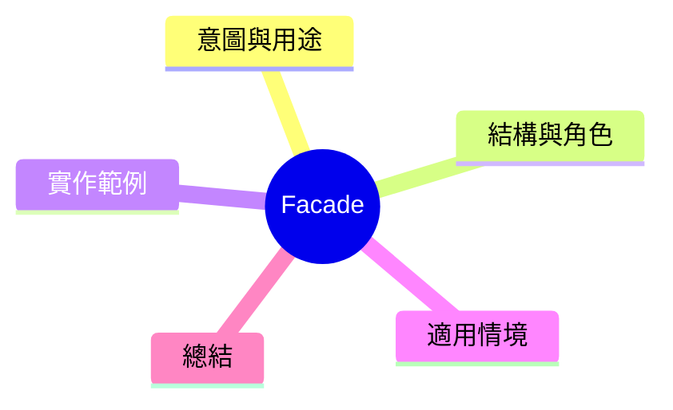

export const metadata = {
  title: '設計模式：外觀模式 (Facade)',
  date: '2026-06-30',
  excerpt: '介紹結構型設計模式中的外觀模式：如何為複雜的子系統提供一個簡化的入口介面，讓客戶端不必面對底下的種種細節。',
  tags: ['軟體設計', '設計模式', 'OOP'],
};

# 設計模式：外觀模式 (Facade)

Facade 為複雜的子系統提供一個簡化的入口，讓客戶端不必知道底下究竟是怎麼運作的。


```mermaid
mindmap
    root((Facade))
        意圖與用途
        結構與角色
        實作範例
        適用情境
        總結
```

- [意圖與用途](#意圖與用途)
- [結構與角色](#結構與角色)
- [實作範例：家庭劇院系統](#實作範例家庭劇院系統)
- [適用情境](#適用情境)
- [總結](#總結)

---

## 意圖與用途

想像要播放一部電影，需要：

1. 開啟投影機
2. 開啟音響系統
3. 調暗燈光、放下窗簾
4. 設定串流播放器

客戶端其實只想呼叫 `homeTheater.startMovie(movie)` 就好。Facade 把這一連串協調工作，全包進一個乾淨的方法裡。

---

## 結構與角色

- Facade：簡化的介面，負責協調各個子系統
- Subsystem classes：複雜的內部實作，對 Facade 一無所知

---

## 實作範例：家庭劇院系統

```typescript
class Projector {
  on(): void { console.log('Projector on'); }
  off(): void { console.log('Projector off'); }
  setInput(source: string): void { console.log(`Projector input: ${source}`); }
}

class SoundSystem {
  on(): void { console.log('Sound system on'); }
  off(): void { console.log('Sound system off'); }
  setVolume(level: number): void { console.log(`Volume: ${level}`); }
}

class Lights {
  dim(level: number): void { console.log(`Lights dimmed to ${level}%`); }
  on(): void { console.log('Lights on'); }
}

class Blinds {
  down(): void { console.log('Blinds down'); }
  up(): void { console.log('Blinds up'); }
}

class StreamingPlayer {
  play(movie: string): void { console.log(`Playing: ${movie}`); }
  stop(): void { console.log('Stopped'); }
}

// Facade
class HomeTheaterFacade {
  constructor(
    private projector: Projector,
    private sound: SoundSystem,
    private lights: Lights,
    private blinds: Blinds,
    private player: StreamingPlayer,
  ) {}

  startMovie(movie: string): void {
    console.log('===== 電影開始 =====');
    this.lights.dim(10);
    this.blinds.down();
    this.projector.on();
    this.projector.setInput('HDMI');
    this.sound.on();
    this.sound.setVolume(40);
    this.player.play(movie);
  }

  endMovie(): void {
    console.log('===== 電影結束 =====');
    this.player.stop();
    this.sound.off();
    this.projector.off();
    this.blinds.up();
    this.lights.on();
  }
}

// 客戶端只需要知道 Facade
const theater = new HomeTheaterFacade(
  new Projector(), new SoundSystem(), new Lights(), new Blinds(), new StreamingPlayer()
);

theater.startMovie('Inception');
// 之後...
theater.endMovie();
```

客戶端只寫兩行，所有協調工作都藏在 Facade 裡。

---

## 適用情境

適用時機

- 複雜的子系統需要一個簡化的對外 API
- 想為某個常見流程提供單一的進入點
- 要把內部子系統與外部層隔離開來

注意

Facade 並不禁止客戶端在需要更細緻的控制時，直接存取子系統。它是一層便利層，而不是一道鎖。

---

## 總結

Facade 的價值在於簡化。它不在乎內部有多複雜，只負責提供一個乾淨、一致的入口，把協調的細節藏起來。

在實務上，SDK 設計、分層架構的邊界，以及各種服務層級的抽象，都不斷地用到這個模式。
