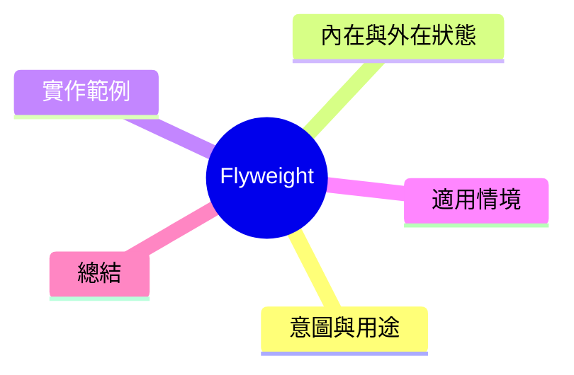

export const metadata = {
  title: '設計模式：享元模式 (Flyweight)',
  date: '2026-03-26',
  excerpt: '介紹結構型設計模式中的享元模式——如何在大量細小物件的情境下，透過共享內部狀態大幅減少記憶體使用量。',
  tags: ['軟體設計', '設計模式', 'OOP'],
};

# 設計模式：享元模式 (Flyweight)

Flyweight 透過共享物件之間相同的內部狀態，將大量細小物件的記憶體使用減到實際可接受的程度。



- [意圖與用途](#意圖與用途)
- [內在與外在狀態](#內在與外在狀態)
- [實作範例：文字渲染引擎](#實作範例文字渲染引擎)
- [適用情境](#適用情境)
- [總結](#總結)

---

## 意圖與用途

假設一個文字編輯器有 100,000 個字元，每個字元都有字型、大小、顏色、位置下等屬性。如果每個字元都持有字型 + 大小 + 顏色的複本，記憶體使用會熸炸。

寫樣相同字型的字元共享同一個字型物件，只幆記個別的位置資訊。

---

## 內在與外在狀態

Flyweight 的關鍵是將物件的狀態分成兩類：

- **內在狀態 (Intrinsic State)**：共享且不改變的部分 → 存在 Flyweight 物件中
- **外在狀態 (Extrinsic State)**：各實例獨有、不同的部分 → 由客戶端在呼叫時傳入

---

## 實作範例：文字渲染引擎

```typescript
// 內在狀態：字型和樣式（可共享）
interface CharacterStyle {
  font: string;
  size: number;
  color: string;
  render(char: string, x: number, y: number): void;
}

class ConcreteCharacterStyle implements CharacterStyle {
  constructor(
    public font: string,
    public size: number,
    public color: string,
  ) {}

  render(char: string, x: number, y: number): void {
    console.log(`'${char}' at (${x},${y}) [${this.font} ${this.size}px ${this.color}]`);
  }
}

// Flyweight Factory——控制共享實例
class CharacterStyleFactory {
  private cache = new Map<string, CharacterStyle>();

  getStyle(font: string, size: number, color: string): CharacterStyle {
    const key = `${font}-${size}-${color}`;
    if (!this.cache.has(key)) {
      this.cache.set(key, new ConcreteCharacterStyle(font, size, color));
      console.log(`建立新樣式: ${key}`);
    }
    return this.cache.get(key)!;
  }

  getCount(): number { return this.cache.size; }
}

// 外在狀態：字元與位置（各實例獨有）
interface CharInstance {
  char: string;
  x: number;
  y: number;
  style: CharacterStyle;
}

// 文字編輯器
const factory = new CharacterStyleFactory();
const characters: CharInstance[] = [];

// 假設大量字元，大多數是 'Arial 14px black'
for (let i = 0; i < 100; i++) {
  characters.push({
    char: String.fromCharCode(65 + (i % 26)),
    x: i * 10, y: 0,
    style: factory.getStyle('Arial', 14, 'black'),
  });
}

// 少數窗體
['H', 'e', 'l', 'l', 'o'].forEach((char, i) => {
  characters.push({
    char, x: i * 20, y: 50,
    style: factory.getStyle('Georgia', 18, 'red'),
  });
});

console.log(`實际字元數: ${characters.length}`);
console.log(`共享樣式數: ${factory.getCount()}`);
// 實际字元數: 105、共享樣式數: 2

// 渲染時傳入外在狀態
characters.slice(0, 3).forEach(c => c.style.render(c.char, c.x, c.y));
```

105 個字元，只建立了 2 個樣式物件。

---

## 適用情境

**適用時機**

- 需要大量細小物件，且它們間有大量重複的內部狀態
- 記憶體使用是究須關注的瓶頸

**對比**

Flyweight 幸換時間複雜度（工廠查找缓存）來換取記憶體。如果物件數量不多或內部狀態重複率不高，不需要使用。

---

## 總結

Flyweight 是性能導向的模式，不是日常建構的首選。確認真的有記憶體底谷再導入。常見應用：游戲引擎的粒子系統、文字渲染引擎、地圖上大量重複的圖場物件。
