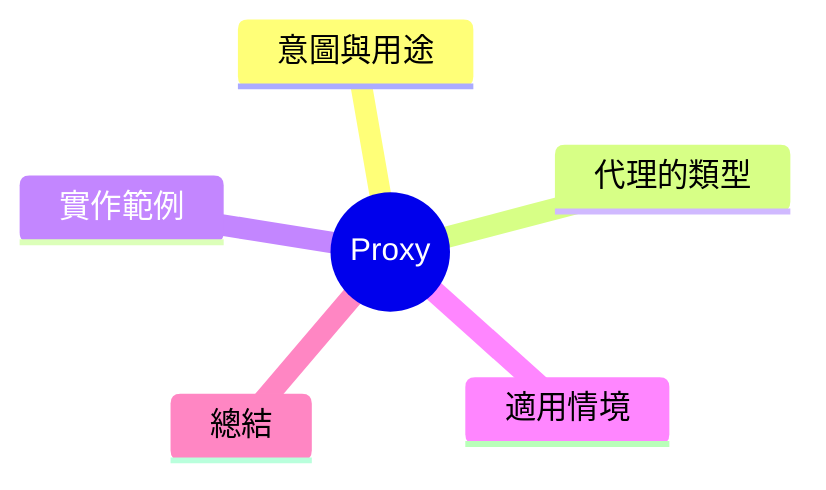

export const metadata = {
  title: '設計模式：代理模式 (Proxy)',
  date: '2026-06-30',
  excerpt: '介紹結構型設計模式中的代理模 —— 何透過一個代理物件控制對原始物件的存取，藉此實現延遲載入、快取、存取控制與日誌等功能。',
  tags: ['軟體設計', '設計模式', 'OOP'],
};

# 設計模式：代理模式 (Proxy)

Proxy 為另一個物件建立一個替身，藉此控制對它的存取。客戶端以為自己在直接跟原始物件互動，實際上是透過代理在打交道。


```mermaid
mindmap
    root((Proxy))
        意圖與用途
        代理的類型
        實作範例
        適用情境
        總結
```

- [意圖與用途](#意圖與用途)
- [代理的類型](#代理的類型)
- [實作範例：快取代理](#實作範例快取代理)
- [適用情境](#適用情境)
- [總結](#總結)

---

## 意圖與用途

Proxy 提供與原始物件相同的介面，在轉送請求的前後加入額外操 —— 完全不改變客戶端的使用方式。

三種主要的應用場景：

- 虛擬代理 (Virtual Proxy)：延後建立費時的物件，等到真正需要時才建立
- 保護代理 (Protection Proxy)：控制存取權限、驗證權限
- 遠端代理 (Remote Proxy)：封裝與遠端物件通訊的細節

---

## 代理的類型

快取代理：把結果存起來，避免重複執行費時的操作。這是實務上最常見的應用。

---

## 實作範例：快取代理

```typescript
interface DataService {
  fetchUser(id: string): Promise<User>;
}

// 真正的資料服務
class RealDataService implements DataService {
  async fetchUser(id: string): Promise<User> {
    console.log(`呼叫 API: /users/${id}`);
    // 假設這是一個很慢的網路請求
    return { id, name: 'Alice', email: 'alice@example.com' };
  }
}

// 快取 Prox —— 同介面，多加一層快取
class CachedDataService implements DataService {
  private cache = new Map<string, User>();

  constructor(private realService: DataService) {}

  async fetchUser(id: string): Promise<User> {
    if (this.cache.has(id)) {
      console.log(`快取命中: ${id}`);
      return this.cache.get(id)!;
    }
    const user = await this.realService.fetchUser(id);
    this.cache.set(id, user);
    return user;
  }
}

// 客戶端只知道 DataService 介面
async function main() {
  const service: DataService = new CachedDataService(new RealDataService());

  await service.fetchUser('123'); // 呼叫 API
  await service.fetchUser('123'); // 快取命中
  await service.fetchUser('456'); // 呼叫 API
  await service.fetchUser('456'); // 快取命中
}

main();
```

客戶端完全不知道背後有快取存在。`CachedDataService` 和 `RealDataService` 介面完全相同，可以自由替換。

---

## 適用情境

適用時機

- 延後建立費時的資源 (虛擬代理)
- 存取控制與權限驗證 (保護代理)
- 結果快取 (快取代理)
- 在不改動原始物件的情況下記錄操作日誌

與 Decorator 的差別

Proxy 的目的是控制存取，Decorator 的目的是附加行為。兩者結構相似，但意圖不同。

---

## 總結

Proxy 在現代前端開發中隨處可見：JavaScript 內建的 `Proxy` 物件、Vue.js 的反應式系統、Angular `HttpClient` 的攔截器，全都是這個模式的實踐。

核心要訣：在不改變介面的前提下，控制對物件的存取與周邊行為。
