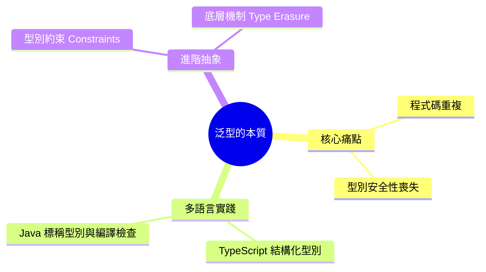

export const metadata = {
  title: '泛型：跨越語言的核心抽象思維',
  date: '2026-06-11',
  excerpt: '介紹泛型的設計目的與核心概念，包含 any 與 Object 的限制、TypeScript 與 Java 的實作對比、型別約束，以及型別擦除的底層機制。',
  tags: ['軟體設計'],
};

# 泛型：跨越語言的核心抽象思維

在軟體開發中，我們常常面對兩個看似矛盾的目標：程式碼重用與型別安全。

為了重用而放棄型別，程式碼會變得脆弱；為了型別安全而把型別寫死 (Hardcode)，又會產生大量重複邏輯。泛型 (Generics) 正是為了解決這個衝突而設計的核心抽象概念。

簡單來說，泛型就是「將型別參數化 —— 設計函式、介面或類別時，先不指定具體型別，而是留一個佔位符，等到實際呼叫時再決定。



- [型別安全的演進：從萬用型別到泛型](#型別安全的演進從萬用型別到泛型)
- [跨語言對比：TypeScript 與 Java 的泛型實踐](#跨語言對比typescript-與-java-的泛型實踐)
- [進階抽象：型別約束 (Constraints)](#進階抽象型別約束-constraints)
- [深入底層：泛型是如何運作的](#深入底層泛型是如何運作的)
- [總結](#總結)

---

## 型別安全的演進：從萬用型別到泛型

在泛型出現之前，建立通用容器只能依賴語言裡的萬用型別，代價是型別錯誤只有到執行期才會浮現。

### 前端 (TypeScript) 的問題

在 TypeScript 中，使用 `any` 等同於完全放棄型別檢查：

```typescript
function copyValue(arg: any): any {
  return arg;
}

const userName = copyValue("Charmy"); 
// userName 的型別被推斷為 any，後續若誤用數字方法，編譯器無法提前預警
```

### 後端 (Java) 的傳統作法

Java 5 之前，通用容器只能依賴頂層的 `Object` 類別，取出資料時必須強制轉型 (Downcasting)：

```java
// 傳統 Java 作法
public class Box {
    private Object object;
    public void set(Object object) { this.object = object; }
    public Object get() { return object; }
}

// 使用時必須強轉，容易在執行期引發 ClassCastException
Box box = new Box();
box.set("Hello");
String str = (String) box.get(); 
```

泛型解決了這個問題：把型別錯誤從執行期提前到了編譯期，讓錯誤在開發階段就能被攔截。

---

## 跨語言對比：TypeScript 與 Java 的泛型實踐

各語言對泛型的底層實現不同，但核心語法與思維高度一致。

### 1. 泛型函式 / 方法

不論在前端處理資料流，還是在後端處理物件映射，泛型都能確保輸入與輸出的型別一致性。

TypeScript：

```typescript
function identity<T>(arg: T): T {
  return arg;
}
const output = identity<string>("Vite + React");
```

Java：

```java
public class Utility {
    public static <T> T identity(T arg) {
        return arg;
    }
}
String output = Utility.<String>identity("Spring Boot");
```

### 2. 泛型類別與資料結構

實務開發中，前後端互動的 API 回傳格式是泛型類別最常見的應用場景之一。

TypeScript (前端 API 響應結構)：

```typescript
interface ApiResponse<T> {
  code: number;
  message: string;
  data: T;
}

interface UserProfile {
  id: string;
  email: string;
}

// 明確定義 data 的結構
const userResponse: ApiResponse<UserProfile> = {
  code: 200,
  message: "Success",
  data: { id: "u_01", email: "charmy@example.com" }
};
```

Java (後端統一傳回物件)：

```java
public class Result<T> {
    private int code;
    private String message;
    private T data;

    // Getters and Setters
}

// 在 Controller 層複用該結構
Result<UserEntity> result = new Result<>();
```

---

## 進階抽象：型別約束 (Constraints)

泛型帶來了彈性，但實務上我們往往需要對型別參數加一些限制，這稱為泛型約束。

### TypeScript 中的結構化約束

TypeScript 採用結構化型別系統 (Structural Typing)，約束的是物件是否符合特定的屬性結構：

```typescript
interface HasId {
  id: string | number;
}

// T 必須滿足 HasId 定義的結構
function processEntity<T extends HasId>(entity: T): void {
  console.log(`Processing entity with ID: ${entity.id}`);
}

processEntity({ id: 101, name: "Product A" }); // 成功
// processEntity({ name: "Invalid" }); // 編譯錯誤：缺少 id
```

### Java 中的標稱型別約束

Java 採用標稱型別系統 (Nominal Typing)，約束的是物件是否屬於特定的類別繼承體系或實作了某個介面：

```java
public interface Identifiable {
    String getId();
}

// T 必須是 Identifiable 的子類別或實作類別
public class EntityProcessor<T extends Identifiable> {
    public void process(T entity) {
        System.out.println("Processing: " + entity.getId());
    }
}
```

---

## 深入底層：泛型是如何運作的

TypeScript 與 Java 雖然是不同的語言生態，但在泛型的底層機制上都採用了類似的策略：型別擦除 (Type Erasure)。

### TypeScript

TypeScript 的泛型完全存在於編譯期。程式碼被編譯成 JavaScript 後，所有的型別標記與泛型符號 (例如 `<T>`) 都會被完全擦除，不會為瀏覽器帶來任何執行期開銷。

### Java

Java 的泛型同樣主要存在於編譯期 (主要是為了向下相容舊版 Java)。編譯成位元碼 (Bytecode) 後，JVM 會將泛型參數替換為它們的上限 (例如 `Object` 或約束的基底類別)，並在適當的地方自動插入強制型別轉換。

這說明泛型本質上是給開發者用的工 —— 助你寫出低出錯率的程式碼，不是改變執行期行為的魔法。

---

## 總結

泛型讓你在不犧牲型別安全的前提下，寫出通用的函式、類別與介面。

合理運用泛型可以：

- 避免因追求通用性而濫用 `any` 或 `Object`
- 讓 API 回傳格式、工具函式等通用結構具備完整的型別推斷
- 透過型別約束，在保持彈性的同時保有安全性
