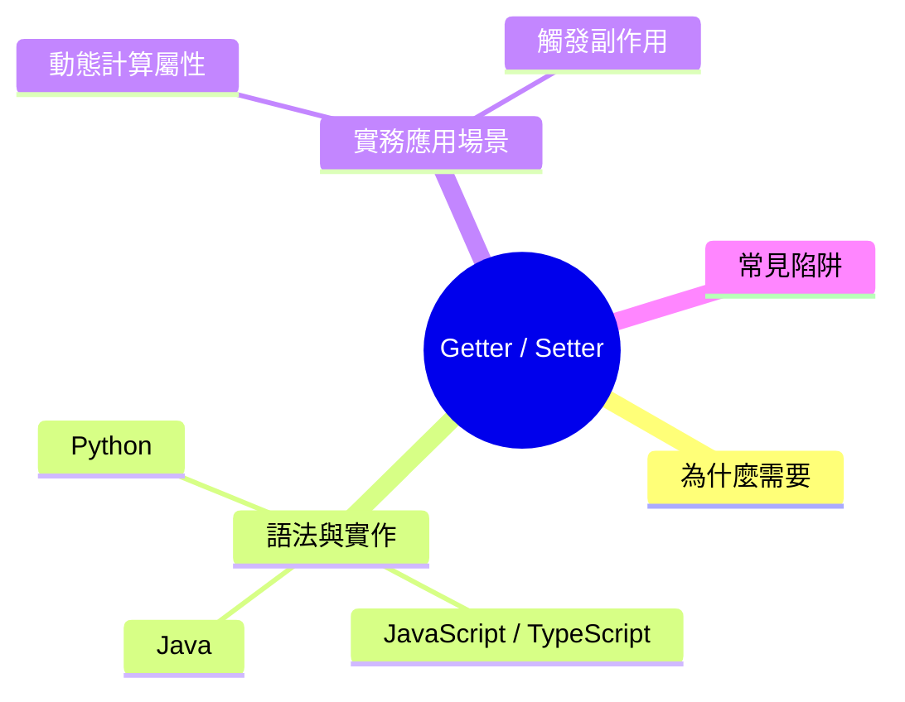

export const metadata = {
  title: 'Getter 與 Setter：資料封裝的核心機制',
  date: '2026-06-17',
  excerpt: '介紹 Getter 與 Setter 的設計目的與運作原理，包含資料驗證、動態計算屬性、副作用觸發等實務應用，並對照 JavaScript、Python、Java 三種語言的實作方式。',
  tags: ['OOP', '軟體設計'],
};

# Getter 與 Setter：資料封裝的核心機制

在物件導向程式設計中，直接讓外部隨意修改物件的內部屬性，很容易讓資料進入不合法的狀態。Getter (讀取器) 與 Setter (寫入器) 就是解決這個問題的機制。

這兩個特殊的存取方法，會在屬性被「讀取」或「寫入」時攔截操作，讓你可以在這個時機點執行資料驗證、動態計算，或觸發其他副作用，同時對外保持乾淨一致的屬性介面，也就是資料封裝 (Encapsulation) 的核心實踐。

雖然許多前端工程師是從 JavaScript (ES6+) 接觸到這個概念，但存取器 (Accessor) 是軟體工程中通用的設計概念，各主流語言都有對應的實作，只是語法各有不同。



- [為什麼需要 Getter 與 Setter](#為什麼需要-getter-與-setter)
- [語法與實作範例](#語法與實作範例)
- [實務應用場景](#實務應用場景)
- [常見陷阱](#常見陷阱)
- [總結](#總結)

---

## 為什麼需要 Getter 與 Setter

從表面看，直接存取屬性與透過存取器存取，結果似乎相同：

```typescript
// 直接存取：沒有任何攔截
user.age = -5; // 髒數據寫入成功

// 透過存取器：具備控制力
user.age = -5; // 內部攔截，拋出錯誤或拒絕寫入
```

但存取器讓你多了幾項關鍵能力：

- 資料驗證 (Validation)：在寫入前確保值符合業務規則 (例如年齡不能是負數)
- 動態計算屬性 (Computed Properties)：屬性值在讀取時即時計算，而不需要實際存在記憶體中 (例如用生日推算年齡)
- 唯讀屬性：只定義 Getter、不定義 Setter，就能合法封鎖外部修改
- 觸發副作用 (Side Effects)：在屬性變更時，自動執行日誌紀錄、狀態同步或 UI 更新

---

## 語法與實作範例

以下用同一個情境 (有私有年齡屬性，並加上負數驗證) 來示範三種語言的實作方式。

### 1. JavaScript / TypeScript

使用 `get` 與 `set` 關鍵字定義存取器。搭配 ECMAScript 原生私有欄位 (`#`)，外部看起來像操作普通屬性，但實際上走的是你定義的邏輯。

```typescript
class User {
  #age: number = 0;

  constructor(age: number) {
    this.age = age; // 走 setter，觸發初始驗證
  }

  get age(): number {
    return this.#age;
  }

  set age(value: number) {
    if (value < 0) {
      throw new Error('Age cannot be negative.');
    }
    this.#age = value;
  }
}

const user = new User(25);
console.log(user.age); // 25
user.age = 30;         // 修改成功
// user.age = -5;      // Error: Age cannot be negative.
```

### 2. Python

Python 用 `@property` 裝飾器定義 Getter，搭配 `@<屬性名>.setter` 定義 Setter，語法簡潔，對外仍維持屬性存取的風格。

```python
class User:
    def __init__(self, age: int):
        self.age = age  # 走 setter

    @property
    def age(self) -> int:
        return self._age  # 慣例以單底線前綴代表私有

    @age.setter
    def age(self, value: int) -> None:
        if value < 0:
            raise ValueError("Age cannot be negative.")
        self._age = value

user = User(25)
print(user.age)  # 25
user.age = 30    # 修改成功
```

### 3. Java

Java 沒有讓方法看起來像屬性存取的語法糖，而是遵循 JavaBean 規範：用 `private` 宣告欄位，再透過公開的 `getX()` 與 `setX()` 方法對外操作。

```java
public class User {
    private int age;

    public User(int age) {
        setAge(age); // 走 setter，確保初始值合法
    }

    public int getAge() {
        return this.age;
    }

    public void setAge(int age) {
        if (age < 0) {
            throw new IllegalArgumentException("Age cannot be negative.");
        }
        this.age = age;
    }
}

public class Main {
    public static void main(String[] args) {
        User user = new User(25);
        System.out.println(user.getAge()); // 25
        user.setAge(30);                   // 修改成功
    }
}
```

---

## 實務應用場景

### 動態計算屬性

不把結果存起來，而是在讀取時即時推算，避免資料不同步的問題：

```typescript
class Product {
  constructor(public price: number, public discount: number) {}

  get finalPrice(): number {
    return this.price * (1 - this.discount);
  }
}

const item = new Product(100, 0.2);
console.log(item.finalPrice); // 80
```

`finalPrice` 沒有對應的儲存欄位，每次讀取都從 `price` 和 `discount` 即時計算。就算 `price` 或 `discount` 改了，`finalPrice` 也不會因為沒手動更新而出錯。

### 觸發副作用

在屬性變更的當下，通知其他模組做出對應反應，常見於前端框架的響應式設計或後端狀態機：

```typescript
class Task {
  #status: string = 'pending';

  get status(): string {
    return this.#status;
  }

  set status(newStatus: string) {
    const oldStatus = this.#status;
    this.#status = newStatus;
    this.onStatusChange(oldStatus, newStatus);
  }

  private onStatusChange(oldState: string, newState: string) {
    console.log(`[LOG] Task state changed: ${oldState} → ${newState}`);
  }
}
```

---

## 常見陷阱

### 無限遞迴 (Stack Overflow)

在 Setter 內部，如果賦值的屬性名稱與 Setter 名稱相同，會觸發自己，造成無限迴圈：

```typescript
// 錯誤
set age(value: number) {
  this.age = value; // 再次觸發 set age()，直到 stack overflow
}
```

解法是使用不同的名稱儲存實際值，例如 `#age` 或 `_age`。

### Getter 裡不該做昂貴的操作

從外部看，`user.age` 像是讀取一個屬性，呼叫者預期它很快。如果 Getter 內部跑了資料庫查詢或大量運算，效能問題會很難被察覺。需要這類操作時，改用明確的方法 (Method) 更合適。

---

## 總結

Getter 與 Setter 讓你在不改變外部使用方式的前提下，完整控制屬性的讀寫邏輯。

這正是開放-封閉原則的實踐：對外介面保持不變，內部的驗證邏輯與儲存結構可以自由調整。合理使用存取器，能讓程式碼在業務邏輯演進時保持穩定，也更容易在屬性變更的關鍵時機攔截錯誤。
