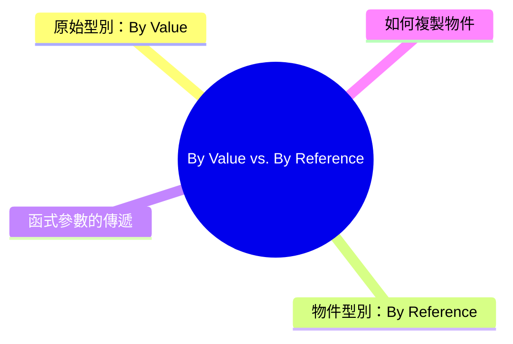

export const metadata = {
  title: 'JavaScript By Value vs By Reference：值與參考的差異',
  date: '2026-03-20',
  excerpt: '介紹 JavaScript By Value 與 By Reference 的差異，包含原始型別與物件型別的賦值行為、函式參數的傳遞方式，以及淺拷貝與深拷貝的正確做法。',
  tags: ['前端', 'JavaScript'],
};

# JavaScript By Value vs By Reference：值與參考的差異

在 JavaScript 中，賦值和傳遞資料的方式取決於資料的型別。

- 原始型別 (Primitive)：By Value，複製的是值本身
- 物件型別 (Object)：By Reference，複製的是記憶體參考

這個差異會直接影響你對資料的操作方式。



- [原始型別：By Value](#原始型別by-value)
- [物件型別：By Reference](#物件型別by-reference)
- [函式參數的傳遞](#函式參數的傳遞)
- [如何複製物件](#如何複製物件)

---

## 原始型別：By Value

JavaScript 的原始型別包含：

`string`、`number`、`boolean`、`null`、`undefined`、`symbol`、`bigint`

賦值時，複製的是值本身，兩個變數互相獨立：

```javascript
let a = 10;
let b = a;

b = 20;

console.log(a); // 10 (沒有被影響)
console.log(b); // 20
```

`b = a` 把 `a` 的值 `10` 複製給 `b`，之後 `b` 的改變不會影響 `a`。

---

## 物件型別：By Reference

物件 (`Object`)、陣列 (`Array`)、函式 (`Function`) 都屬於物件型別。

賦值時，複製的是記憶體參考 (reference)，兩個變數指向同一個物件：

```javascript
const a = { name: 'Charmy' };
const b = a;

b.name = 'Charmying';

console.log(a.name); // "Charmying" (被影響了)
console.log(b.name); // "Charmying"
```

`b = a` 並沒有建立一個新的物件，而是讓 `b` 和 `a` 指向記憶體中同一個物件。修改 `b`，`a` 也會跟著改變。

陣列的情況也一樣：

```javascript
const arr1 = [1, 2, 3];
const arr2 = arr1;

arr2.push(4);

console.log(arr1); // [1, 2, 3, 4] (被影響了)
console.log(arr2); // [1, 2, 3, 4]
```

---

## 函式參數的傳遞

函式參數的傳遞遵循同樣的規則。

### 傳入原始型別

傳入的是值的副本，函式內部的修改不影響外部變數：

```javascript
function double(n) {
  n = n * 2;
  console.log(n); // 20
}

let num = 10;
double(num);
console.log(num); // 10 (沒有被影響)
```

### 傳入物件

傳入的是參考的副本，函式內部修改物件的屬性，外部的物件也會改變：

```javascript
function updateName(user) {
  user.name = 'Charmying';
}

const person = { name: 'Charmy' };
updateName(person);
console.log(person.name); // "Charmying" (被影響了)
```

但如果在函式內部重新賦值整個物件，不會影響外部的變數：

```javascript
function replace(user) {
  user = { name: 'Someone Else' }; // 重新賦值，指向新物件
}

const person = { name: 'Charmy' };
replace(person);
console.log(person.name); // "Charmy" (沒有被影響)
```

因為 `user = { name: 'Someone Else' }` 只是讓函式內部的 `user` 指向一個新物件，不會改變 `person` 原本指向的物件。

---

## 如何複製物件

想要複製物件而不共享參考，需要明確建立新的物件。

### 淺拷貝 (Shallow Copy)

展開運算子 (Spread Operator)

```javascript
const original = { name: 'Charmy', age: 25 };
const copy = { ...original };

copy.name = 'Charmying';

console.log(original.name); // "Charmy" (沒有被影響)
console.log(copy.name);     // "Charmying"
```

Object.assign

```javascript
const copy = Object.assign({}, original);
```

陣列的淺拷貝：

```javascript
const arr = [1, 2, 3];
const arrCopy = [...arr];

arrCopy.push(4);
console.log(arr);     // [1, 2, 3] (沒有被影響)
console.log(arrCopy); // [1, 2, 3, 4]
```

淺拷貝只複製第一層的屬性，如果物件內部還有巢狀物件，巢狀的部分仍然是共享參考：

```javascript
const original = { name: 'Charmy', address: { city: 'Taipei' } };
const copy = { ...original };

copy.address.city = 'Taichung';

console.log(original.address.city); // "Taichung" (仍然被影響)
```

### 深拷貝 (Deep Copy)

JSON.parse / JSON.stringify

```javascript
const original = { name: 'Charmy', address: { city: 'Taipei' } };
const copy = JSON.parse(JSON.stringify(original));

copy.address.city = 'Taichung';

console.log(original.address.city); // "Taipei" (沒有被影響)
```

注意：這個方法無法處理 `undefined`、`function`、`Date`、`RegExp` 等特殊型別。

structuredClone (現代瀏覽器和 Node.js 17+)

```javascript
const original = { name: 'Charmy', address: { city: 'Taipei' } };
const copy = structuredClone(original);

copy.address.city = 'Taichung';

console.log(original.address.city); // "Taipei" (沒有被影響)
```

`structuredClone` 是目前最推薦的深拷貝方式，支援更多型別，也不需要 JSON 轉換的開銷。

---

## 總結

| | 原始型別 | 物件型別 |
| - | - | - |
| 包含 | `string`、`number`、`boolean` 等 | `Object`、`Array`、`Function` |
| 複製方式 | By Value (複製值) | By Reference (複製參考) |
| 修改副本 | 不影響原始值 | 會影響原始物件 |
| 淺拷貝 | — | `...spread`、`Object.assign` |
| 深拷貝 | — | `structuredClone`、`JSON.parse/stringify` |
