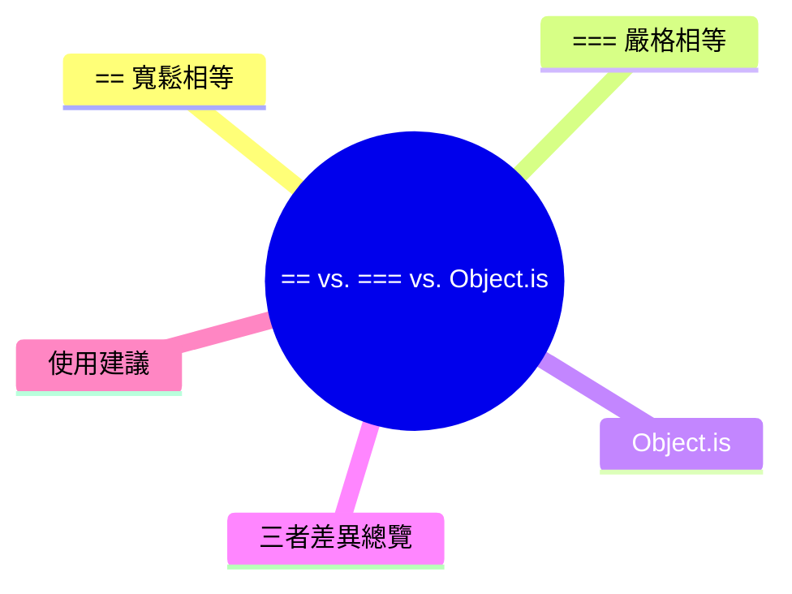

export const metadata = {
  title: 'JavaScript 判斷相等：== vs. === vs. Object.is',
  date: '2026-03-21',
  excerpt: '比較 JavaScript == 、=== 、Object.is 三種相等比較的差異，包含型別轉換規則、NaN 與 -0 的特殊行為，以及各自適合的使用時機。',
  tags: ['前端', 'JavaScript'],
};

# JavaScript 判斷相等：`==` vs. `===` vs. `Object.is`

JavaScript 有三種比較相等的方式，各自有不同的行為：

- `==`：寬鬆相等，比較前會進行型別轉換
- `===`：嚴格相等，不進行型別轉換
- `Object.is`：與 `===` 類似，但對 `NaN` 和 `-0` 的處理不同



- [`==` 寬鬆相等](#-寬鬆相等)
- [`===` 嚴格相等](#-嚴格相等)
- [`Object.is`](#objectis)
- [三者差異總覽](#三者差異總覽)
- [使用建議](#使用建議)

---

## `==` 寬鬆相等

`==` 在比較之前，如果兩個值的型別不同，會先進行型別轉換 (Type Coercion)，再做比較。

這個行為讓結果有時出乎意料：

```javascript
1 == "1"          // true (字串 "1" 被轉為數字 1)
0 == false        // true (false 被轉為數字 0)
0 == ""           // true ("" 被轉為數字 0)
null == undefined // true (特殊規則)
null == 0         // false (null 只等於 undefined)
"" == false       // true
[] == false       // true
[] == 0           // true
```

### 型別轉換規則

`==` 的型別轉換有幾個主要規則：

- `null` 和 `undefined` 互相相等，但不等於其他任何值
- 數字與字串比較，字串轉為數字
- 布林值比較，布林值先轉為數字 (`true` → `1`，`false` → `0`)
- 物件與原始值比較，物件呼叫 `.valueOf()` 或 `.toString()` 轉換

由於規則複雜，`==` 的結果難以預測，容易造成 bug。

---

## `===` 嚴格相等

`===` 不進行型別轉換，型別不同直接回傳 `false`。

```javascript
1 === "1"           // false (型別不同)
0 === false         // false (型別不同)
null === undefined  // false (型別不同)
1 === 1             // true
"hello" === "hello" // true
```

`===` 的規則很簡單：

1. 型別不同 → `false`
2. 型別相同，值相同 → `true`
3. 型別相同，值不同 → `false`

有一個例外：`NaN === NaN` 是 `false`：

```javascript
NaN === NaN // false
```

`NaN` (Not a Number) 在 JavaScript 中不等於任何值，包括它自己。

---

## `Object.is`

`Object.is` 與 `===` 的行為幾乎相同，但有兩個特殊情況的處理不同：

### `NaN` 的比較

```javascript
NaN === NaN         // false
Object.is(NaN, NaN) // true
```

`Object.is` 認為 `NaN` 等於 `NaN`，這在某些情況下更符合直覺。

### `-0` 和 `+0` 的比較

```javascript
-0 === 0           // true
Object.is(-0, 0)   // false
Object.is(-0, -0)  // true
```

`===` 認為 `-0` 和 `+0` 相等，但 `Object.is` 區分兩者。

在大多數情況下，`-0` 和 `+0` 的差異不重要，但在處理方向、座標等需要區分正負零的場景中，`Object.is` 更精確。

---

## 三者差異總覽

| 比較 | `==` | `===` | `Object.is` |
| - | - | - | - |
| `1 == "1"` | `true` | `false` | `false` |
| `0 == false` | `true` | `false` | `false` |
| `null == undefined` | `true` | `false` | `false` |
| `NaN == NaN` | `false` | `false` | `true` |
| `-0 == 0` | `true` | `true` | `false` |
| 型別轉換 | 是 | 否 | 否 |

---

## 使用建議

### 優先使用 `===`

絕大多數情況下，使用 `===` 是最安全的選擇：

- 不會有意外的型別轉換
- 行為可預測，程式碼更易讀

```javascript
// 好的寫法
if (value === null) { ... }
if (typeof x === "string") { ... }

// 避免
if (value == null) { ... } // 雖然能同時判斷 null 和 undefined，但不直觀
```

### `==` 唯一常見的合理用途

有些開發者會用 `== null` 同時判斷 `null` 和 `undefined`：

```javascript
if (value == null) {
  // value 是 null 或 undefined
}
```

等同於：

```javascript
if (value === null || value === undefined) {
  // ...
}
```

但這需要團隊成員都理解這個慣例，否則容易造成困惑，建議明確用 `=== null || === undefined`。

### 何時使用 `Object.is`

需要處理 `NaN` 的比較，或明確區分 `-0` 和 `+0` 時：

```javascript
// 判斷一個值是否為 NaN
function isNaNValue(value) {
  return Object.is(value, NaN);
}

// 比 isNaN() 更精確，因為 isNaN("hello") 也會回傳 true
```

---

## 總結

- `==`：進行型別轉換，結果難以預測，盡量避免
- `===`：不進行型別轉換，行為可預測，是日常開發的首選
- `Object.is`：與 `===` 幾乎相同，但正確處理 `NaN` 和 `-0`，適合需要精確比較的場景
