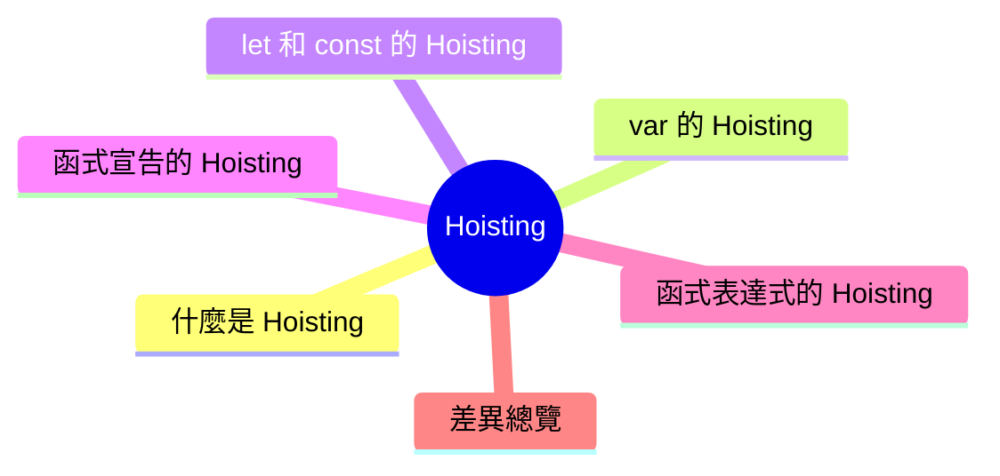

export const metadata = {
  title: 'JavaScript Hoisting：變數與函式提升',
  date: '2026-03-17',
  excerpt: '介紹 JavaScript Hoisting 的運作機制，包含 var、let、const 的提升行為、暫時死區，以及函式宣告與函式表達式的差異。',
  tags: ['前端', 'JavaScript'],
};

# JavaScript Hoisting：變數與函式提升

在 JavaScript 中，變數和函式的宣告會在程式碼執行前被處理，這個行為稱為 Hoisting (提升)。

理解 Hoisting，能幫助你預測程式碼的行為，避免意外的 `undefined` 或 `ReferenceError`。



- [什麼是 Hoisting](#什麼是-hoisting)
- [`var` 的 Hoisting](#var-的-hoisting)
- [`let` 和 `const` 的 Hoisting](#let-和-const-的-hoisting)
- [函式宣告的 Hoisting](#函式宣告的-hoisting)
- [函式表達式的 Hoisting](#函式表達式的-hoisting)
- [差異總覽](#差異總覽)

---

## 什麼是 Hoisting

JavaScript 在執行程式碼之前，會先建立執行環境。在這個階段，JavaScript 會掃描所有的變數和函式宣告，並將它們「提升」到作用域的頂端。

這個過程就是 Hoisting。

Hoisting 不是真的把程式碼移動到上面，而是 JavaScript 引擎在執行前就先處理了這些宣告。

---

## `var` 的 Hoisting

`var` 宣告的變數會被提升，並自動初始化為 `undefined`。

```javascript
console.log(name); // undefined
var name = "Charmy";
```

上面的程式碼，JavaScript 實際執行時等同於：

```javascript
var name;
console.log(name); // undefined
name = "Charmy";
```

宣告被提升了，但賦值沒有，所以在賦值之前存取變數會得到 `undefined`，而不是報錯。

---

## `let` 和 `const` 的 Hoisting

`let` 和 `const` 也會被 Hoisting，但不會自動初始化。

在宣告之前存取它們，會進入暫時死區 (Temporal Dead Zone，TDZ)，直接拋出 `ReferenceError`：

```javascript
console.log(name); // ReferenceError: Cannot access 'name' before initialization
let name = "Charmy";
```

```javascript
console.log(count); // ReferenceError: Cannot access 'count' before initialization
const count = 0;
```

TDZ 從作用域開始，到宣告語句執行為止。這段期間內，變數存在但不能被存取。

TDZ 的設計讓錯誤更容易被發現，避免在宣告前意外使用變數。

---

## 函式宣告的 Hoisting

函式宣告 (Function Declaration) 會被完整提升，包含函式本體。

因此可以在宣告之前呼叫函式：

```javascript
greet(); // "Hello"

function greet() {
  console.log("Hello");
}
```

這段程式碼可以正常執行，因為 JavaScript 在執行前就已經處理了整個函式宣告。

---

## 函式表達式的 Hoisting

函式表達式 (Function Expression) 的行為與變數一致，取決於使用 `var`、`let` 還是 `const`。

### 使用 `var`

```javascript
greet(); // TypeError: greet is not a function

var greet = function () {
  console.log("Hello");
};
```

`var greet` 被提升並初始化為 `undefined`，呼叫 `undefined()` 會拋出 `TypeError`。

### 使用 `let` 或 `const`

```javascript
greet(); // ReferenceError: Cannot access 'greet' before initialization

const greet = function () {
  console.log("Hello");
};
```

`const greet` 被提升但進入 TDZ，在宣告前存取會拋出 `ReferenceError`。

### 箭頭函式

箭頭函式也是函式表達式，行為與上述相同：

```javascript
greet(); // ReferenceError: Cannot access 'greet' before initialization

const greet = () => {
  console.log("Hello");
};
```

---

## 差異總覽

| | Hoisting | 初始化 | 宣告前存取 |
| - | - | - | - |
| `var` | 是 | `undefined` | 回傳 `undefined` |
| `let` | 是 | 無 (進入 TDZ) | `ReferenceError` |
| `const` | 是 | 無 (進入 TDZ) | `ReferenceError` |
| 函式宣告 | 是 (完整提升) | 完整函式 | 可以正常呼叫 |
| 函式表達式 | 同變數規則 | 同變數規則 | 同變數規則 |

---

## 總結

- `var` 被提升並初始化為 `undefined`，宣告前使用不報錯但可能產生難以察覺的 bug
- `let` 和 `const` 被提升但進入 TDZ，宣告前使用會直接報錯，錯誤更容易被發現
- 函式宣告會被完整提升，可以在宣告前呼叫
- 函式表達式不會被完整提升，行為與變數一致

實務上，建議先宣告再使用，避免依賴 Hoisting 的行為，讓程式碼更清晰易讀。
