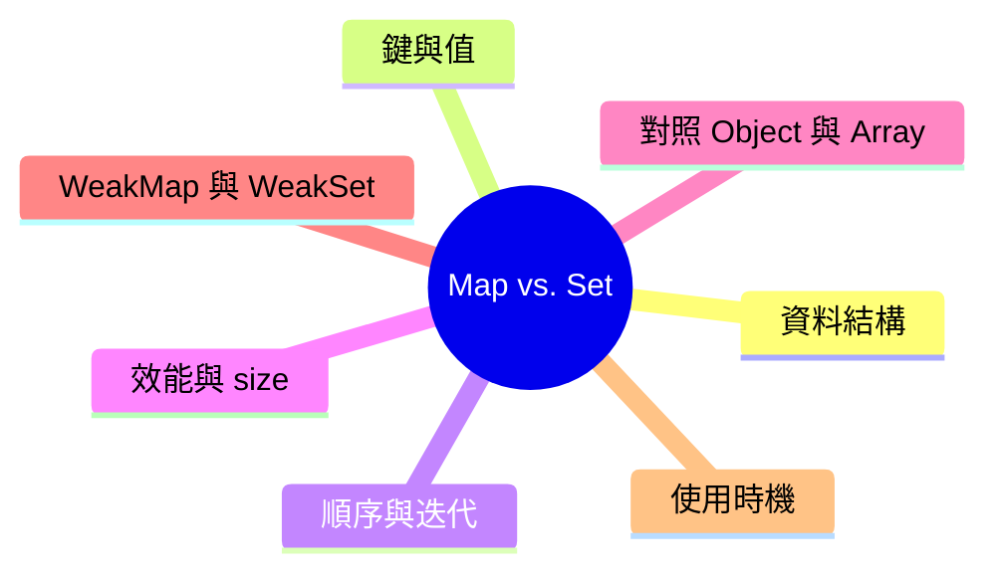

export const metadata = {
  title: 'JavaScript Map vs. Set：差異與使用時機',
  date: '2026-06-28',
  excerpt: '比較 JavaScript 的 Map 與 Set，從資料結構、鍵與值的特性、順序與迭代到效能，並釐清它們和 Object、Array 的取捨，以及各自適合的使用時機。',
  tags: ['前端', 'JavaScript'],
};

# JavaScript Map vs. Set：差異與使用時機

ES6 替 JavaScript 補上了兩個正規的集合資料結構：`Map` 與 `Set`。

在它們之前，我們習慣用物件當字典、用陣列裝清單。多數時候堪用，但碰到「鍵不是字串」「要保證值不重複」「要頻繁增刪」這些情境時，就會開始彆扭。

`Map` 與 `Set` 不只是換個寫法，它們解決的是不同的問題：一個管「鍵到值的對應」，一個管「值的唯一集合」。



- [Map 與 Set 是什麼](#map-與-set-是什麼)
- [建立與基本操作](#建立與基本操作)
- [鍵與值的特性](#鍵與值的特性)
- [順序與迭代](#順序與迭代)
- [效能與 size](#效能與-size)
- [Map 還是 Object](#map-還是-object)
- [Set 還是 Array](#set-還是-array)
- [WeakMap 與 WeakSet](#weakmap-與-weakset)
- [差異總覽](#差異總覽)
- [使用時機](#使用時機)

---

## Map 與 Set 是什麼

`Map` 是「鍵值對」的集合。每一筆資料都是一組 `key → value` 的對應，而且鍵不會重複。

`Set` 是「值」的集合。它只存值、不存對應關係，而且值不會重複。

一句話分辨：Map 在乎「鍵對應到什麼」，Set 在乎「這個值在不在裡面」。

```javascript
// Map：把鍵對應到值
const scores = new Map();
scores.set('Charmy', 95);
scores.get('Charmy'); // 95

// Set：只關心值的有無
const tags = new Set();
tags.add('JavaScript');
tags.has('JavaScript'); // true
```

兩者都是可迭代 (iterable) 的物件，都會記住插入順序，也都用 `size` 取得元素數量。差別在於它們裝的東西不同。

---

## 建立與基本操作

### Map

`Map` 的核心方法是 `set`、`get`、`has`、`delete`：

```javascript
const map = new Map();

map.set('name', 'Charmy');
map.set('age', 28);

map.get('name');   // 'Charmy'
map.has('age');    // true
map.size;          // 2

map.delete('age'); // true
map.size;          // 1

map.clear();       // 清空
```

`set` 會回傳 Map 本身，所以可以串接：

```javascript
const map = new Map()
  .set('a', 1)
  .set('b', 2)
  .set('c', 3);
```

也可以直接用一個「鍵值對陣列」來初始化：

```javascript
const map = new Map([
  ['name', 'Charmy'],
  ['age', 28],
]);
```

### Set

`Set` 的核心方法是 `add`、`has`、`delete`：

```javascript
const set = new Set();

set.add('apple');
set.add('banana');
set.add('apple');     // 重複，被忽略

set.has('apple');     // true
set.size;             // 2

set.delete('banana'); // true
set.clear();          // 清空
```

`add` 同樣會回傳 Set 本身，可以串接。最常見的用法是直接丟一個陣列進去：

```javascript
const set = new Set([1, 2, 2, 3, 3, 3]);
set.size; // 3，重複的值自動被去除
```

---

## 鍵與值的特性

這是 `Map`、`Set` 和傳統物件、陣列差最多的地方。

### 任何型別都能當鍵或值

`Map` 的鍵可以是任何型別：物件、函式、`NaN`、甚至 `undefined` 都行。`Object` 的鍵則只能是字串或 Symbol，連數字都會被偷偷轉成字串。

```javascript
const map = new Map();
const objKey = { id: 1 };

map.set(objKey, '物件可以當鍵');
map.set(NaN, 'NaN 也可以');
map.set(true, '布林值也行');

map.get(objKey); // '物件可以當鍵'
map.get(NaN);    // 'NaN 也可以'
```

`Set` 也一樣，什麼型別的值都收。

### 用物件當鍵時，比的是「參考」

這是最容易踩到的坑。物件的相等是看參考 (reference)，不是看內容：

```javascript
const map = new Map();
map.set({ id: 1 }, 'A');

map.get({ id: 1 }); // undefined，因為是兩個不同的物件
```

兩個 `{ id: 1 }` 長得一樣，但它們是不同的物件，參考不同，所以取不到。想取得就必須留住同一個參考：

```javascript
const key = { id: 1 };
const map = new Map();

map.set(key, 'A');
map.get(key); // 'A'
```

### 唯一性的判定：SameValueZero

`Map` 判斷鍵是否相同、`Set` 判斷值是否重複，用的都是一套叫 SameValueZero 的規則。它和 `===` 幾乎一樣，只有兩個例外：

- `NaN` 會被視為等於 `NaN`
- `+0` 與 `-0` 會被視為相同

```javascript
const set = new Set([NaN, NaN, 0, -0]);
set.size; // 2，NaN 彼此相同、+0 與 -0 相同
```

這一點很實用：用 `Set` 去重時，連 `NaN` 都能正確處理，而 `[NaN].includes(NaN)` 雖然為 `true`，`[NaN].indexOf(NaN)` 卻是 `-1`。

至於物件，依然是比參考：

```javascript
const a = { id: 1 };
const set = new Set([a, a, { id: 1 }]);
set.size; // 2，前兩個是同一個參考，第三個是新物件
```

---

## 順序與迭代

`Map` 和 `Set` 都會記住插入順序，迭代時就照這個順序走。這點和物件不同 —— 物件的整數型鍵會被引擎重新排序。

### 迭代 Map

直接用 `for...of` 迭代 `Map`，每一輪會拿到一組 `[key, value]`：

```javascript
const map = new Map([
  ['name', 'Charmy'],
  ['age', 28],
]);

for (const [key, value] of map) {
  console.log(key, value);
}
// 'name' 'Charmy'
// 'age' 28
```

`Map` 也提供三個迭代器方法：

```javascript
map.keys();    // 'name', 'age'
map.values();  // 'Charmy', 28
map.entries(); // ['name', 'Charmy'], ['age', 28]

map.forEach((value, key) => {
  console.log(key, value);
});
```

### 迭代 Set

`Set` 迭代時直接拿到值：

```javascript
const set = new Set(['a', 'b', 'c']);

for (const value of set) {
  console.log(value); // 'a' 'b' 'c'
}

set.forEach((value) => {
  console.log(value);
});
```

`Set` 為了和 `Map` 的介面對齊，也保留了 `keys()`、`values()`、`entries()`，其中 `entries()` 會回傳 `[value, value]` 這種成對的值。

### 與陣列互轉

`Map` 和 `Set` 都可以用展開運算子或 `Array.from` 轉成陣列，陣列也能反向轉回來：

```javascript
// 陣列去重，最經典的用法
const unique = [...new Set([1, 1, 2, 3, 3])]; // [1, 2, 3]

// Map 與物件互轉
const map = new Map([['a', 1], ['b', 2]]);
Object.fromEntries(map);          // { a: 1, b: 2 }
new Map(Object.entries({ a: 1 })); // Map { 'a' => 1 }
```

---

## 效能與 size

### size 是屬性，不是方法

要知道有幾筆資料，`Map` 和 `Set` 都直接讀 `size`：

```javascript
map.size; // 直接讀，O(1)
set.size;
```

對比之下，物件得自己算 `Object.keys(obj).length`，這會先建出一個陣列，是 O(n)。

### 查找速度

`Map.has`、`Map.get` 與 `Set.has` 在規格上要求平均達到次線性 (sublinear)，實務上大致是 O(1)，不會隨資料量線性變慢。陣列的 `includes`、`indexOf` 則是 O(n)，要從頭找到尾。

```javascript
// 在大量資料中重複檢查成員時，差距很明顯
const list = new Set(bigArray);

items.forEach((item) => {
  if (list.has(item)) {   // 平均接近 O(1)
    // ...
  }
});
```

如果換成 `bigArray.includes(item)`，每一次檢查都得掃整個陣列，整體就會退化成 O(n × m)。需要頻繁判斷成員是否存在時，`Set` 幾乎都是更好的選擇。

---

## Map 還是 Object

兩者都能拿來做「鍵到值的對應」，但取捨點不同。

選 `Map` 的時機：

- 鍵不是字串 (物件、數字、函式都要能當鍵)
- 會頻繁新增、刪除鍵值
- 需要可靠的插入順序與 `size`
- 不想被原型上的屬性干擾

物件有一個容易忽略的問題：它預設就帶著原型鏈，所以某些鍵「看起來存在」：

```javascript
const obj = {};
obj['toString']; // function，來自原型，不是你放的
'toString' in obj; // true

const map = new Map();
map.has('toString'); // false，乾淨許多
```

數字型的鍵在物件裡也會被重新排序，`Map` 則忠實保留插入順序：

```javascript
const obj = {};
obj[2] = 'two';
obj[1] = 'one';
Object.keys(obj); // ['1', '2']，數字鍵被排序了

const map = new Map();
map.set(2, 'two');
map.set(1, 'one');
[...map.keys()]; // [2, 1]，保持插入順序
```

選 `Object` 的時機：

- 需要 `JSON.stringify` 序列化 (`Map` 不會被直接序列化)
- 結構固定、當成有欄位的記錄使用
- 想用字面語法 `{ }` 與解構

---

## Set 還是 Array

兩者都裝一串值，差別在於重複與查找。

選 `Set` 的時機：

- 需要保證值唯一 (去重)
- 需要頻繁判斷「某個值在不在裡面」

```javascript
const arr = [1, 2, 3];
arr.includes(2); // O(n)

const set = new Set([1, 2, 3]);
set.has(2);      // 平均接近 O(1)
```

選 `Array` 的時機：

- 需要順序與索引存取 (`arr[0]`)
- 允許重複值
- 要用 `map`、`filter`、`reduce` 這些豐富的方法
- 需要 `JSON` 序列化

實務上常見的組合，是先用 `Set` 去重、再轉回陣列來處理：

```javascript
const unique = [...new Set(rawList)].sort();
```

---

## WeakMap 與 WeakSet

`Map` 和 `Set` 各有一個「弱參考」版本：`WeakMap` 與 `WeakSet`。它們存在的理由只有一個 —— 不要因為自己持有物件，就害物件無法被垃圾回收。

差異整理：

- `WeakMap` 的鍵、`WeakSet` 的值都只能是物件 (不能放原始型別)
- 它們持有的是弱參考，當物件沒有其他地方參考時，會被垃圾回收
- 不可迭代、沒有 `size`、不能 `clear` (因為內容隨時可能被回收，列舉沒有意義)

最典型的用途是「把額外資料掛在某個物件上」，又不想造成記憶體洩漏，例如做快取：

```javascript
const cache = new WeakMap();

function process(obj) {
  if (cache.has(obj)) return cache.get(obj);

  const result = heavyComputation(obj);
  cache.set(obj, result);
  return result;
}
// 當 obj 在外面不再被參考時，這筆快取會自動被回收
```

如果這裡用的是一般 `Map`，那 `obj` 會因為被 `Map` 當成鍵而一直活著，造成洩漏。

---

## 差異總覽

| | Map | Set |
| - | - | - |
| 儲存內容 | 鍵值對 | 單一值 |
| 唯一性 | 鍵唯一 | 值唯一 |
| 新增 | `set(key, value)` | `add(value)` |
| 取值 | `get(key)` | 用 `has` 檢查存在 |
| 大小 | `size` | `size` |
| 順序 | 插入順序 | 插入順序 |
| 迭代產出 | `[key, value]` | `value` |
| 鍵／值型別 | 任何型別 | 任何型別 |
| 弱參考版本 | `WeakMap` | `WeakSet` |
| 典型用途 | 查表、關聯資料 | 去重、成員檢查 |

---

## 使用時機

### 建議使用 Map

#### 鍵不是字串，或鍵是物件時：
```javascript
const elementState = new Map();
elementState.set(domNode, { active: true });
```

#### 需要頻繁增刪、又在乎順序與大小時：
```javascript
const cart = new Map();
cart.set(productId, quantity);
cart.delete(productId);
cart.size;
```

### 建議使用 Set

#### 去除陣列重複：
```javascript
const unique = [...new Set([1, 1, 2, 3])]; // [1, 2, 3]
```

#### 需要快速判斷成員是否存在：
```javascript
const blocked = new Set(['spam', 'ads']);
if (blocked.has(category)) {
  // 直接擋下
}
```

---

## 總結

`Map` 與 `Set` 補上了物件和陣列照顧不到的場景。

需要「鍵對應到值」、而且鍵不一定是字串，就用 `Map`；需要「一組不重複的值」、並且常常要查某個值在不在，就用 `Set`。

物件和陣列依然好用，尤其在需要序列化、固定結構或索引存取時。重點不是誰取代誰，而是依資料的特性，選對工具。
