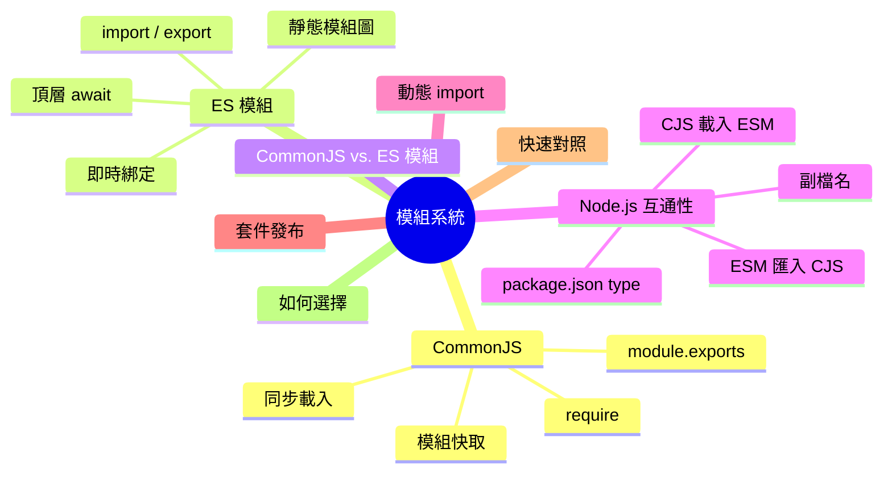
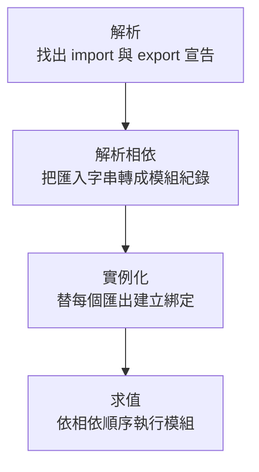
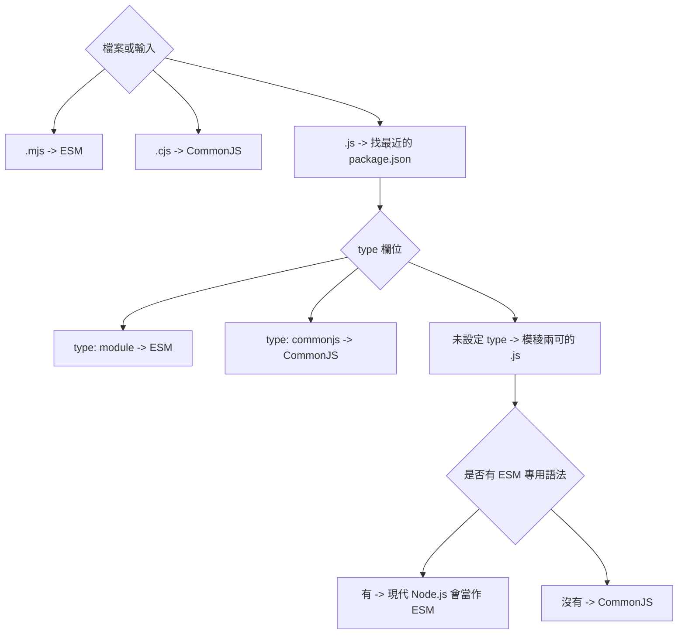

export const metadata = {
  title: 'JavaScript 模組系統：ESM vs. CommonJS',
  date: '2026-06-27',
  excerpt: '介紹 CommonJS 與 ES 模組的核心機制：載入流程、快取、即時綁定、循環相依、Node.js 互通，以及現代套件發布時該注意的取捨。',
  tags: ['前端', 'JavaScript'],
};

# JavaScript 模組系統：ESM vs. CommonJS

ES2015 以前，JavaScript 沒有原生模組系統。瀏覽器中的 script 會共用全域作用域，載入順序會影響程式行為，常見的補救方式是把程式碼包進 IIFE，避免污染全域。

CommonJS 替伺服器端 JavaScript 解決了這個問題：每個檔案都有自己的模組作用域，並透過同步的 `require()` 載入其他模組。後來 ES 模組成為 JavaScript 語言本身的標準模組系統。直到今天，兩者仍然同時存在：舊的 Node.js 專案大量使用 CommonJS，而現代 JavaScript 則以 ESM 為主。

真正重要的不只是語法，而是載入模型：程式什麼時候執行、什麼會被快取、匯入關係能不能被靜態分析，以及匯出的值是否會和原始模組保持連動。



- [CommonJS](#commonjs)
- [ES 模組](#es-模組)
- [CommonJS vs. ES 模組](#commonjs-vs-es-模組)
- [Node.js 互通性](#nodejs-互通性)
- [動態 import()](#動態-import)
- [套件發布](#套件發布)
- [快速對照](#快速對照)
- [如何選擇](#如何選擇)

---

## CommonJS

CommonJS 的設計核心是本機檔案與同步載入。這很適合 Node.js：模組載入器可以解析路徑、從磁碟讀取檔案、立即執行，然後回傳匯出的值。

### `require()` 的運作方式

```javascript
// math.cjs
function add(a, b) {
  return a + b;
}

module.exports = { add };
```

```javascript
// main.cjs
const math = require('./math.cjs');
console.log(math.add(2, 3)); // 5
```

當 Node.js 執行 `require('./math.cjs')` 時，大致會經過這些步驟：

1. 將匯入字串解析成實際檔案。
2. 如果該模組已經載入過，直接回傳快取中的 `module.exports`。
3. 建立 `Module` 物件，並先放入快取。
4. 將檔案包進函式中執行。
5. 回傳 `module.exports`。

這個包裝函式解釋了為什麼 CommonJS 會有幾個看似全域、其實只屬於單一模組的變數：

```javascript
(function (exports, require, module, __filename, __dirname) {
  // 模組程式碼在這裡執行
});
```

頂層的 `var`、`let`、`const` 都留在這個函式作用域內。`require`、`module`、`exports`、`__filename`、`__dirname` 則是 Node.js 傳進來的參數。

### `module.exports` 與 `exports`

`module.exports` 是 `require()` 最後拿到的值。它可以是物件、函式、類別，或任何 JavaScript 值：

```javascript
module.exports = { add, subtract };

module.exports = function greet(name) {
  return `Hello, ${name}`;
};

module.exports = class Calculator {
  add(a, b) {
    return a + b;
  }
};
```

`exports` 一開始只是指向同一個物件的捷徑：

```javascript
exports.add = function (a, b) {
  return a + b;
};

exports.subtract = function (a, b) {
  return a - b;
};
```

容易出錯的地方是重新賦值：

```javascript
// 正確：修改 module.exports 指向的物件
exports.add = add;

// 正確：直接替換整個匯出值
module.exports = { add };

// 錯誤：只改到本地的 exports 變數
exports = { add };
```

如果一個模組只匯出一個主要值，使用 `module.exports = ...`。如果只是逐一新增屬性，使用 `exports.x = ...`。

### 快取與共享狀態

CommonJS 會用解析後的檔名快取模組。模組本體只會執行一次；後續的 `require()` 會拿到同一個匯出值。

```javascript
// counter.cjs
let count = 0;

module.exports = {
  increment() {
    count += 1;
    return count;
  },
  getCount() {
    return count;
  },
};
```

```javascript
// a.cjs
const counter = require('./counter.cjs');
counter.increment();

// b.cjs
const counter = require('./counter.cjs');
console.log(counter.getCount()); // 1
```

這種共享實例常用在設定、連線池、單例物件。也因為如此，模組頂層的副作用在同一個 process 內只會執行一次，而不是每個匯入點都執行一次。

### 動態載入

`require()` 本質上就是函式呼叫，因此可以放在條件式、迴圈或其他函式裡：

```javascript
function loadPlugin(name) {
  return require(`./plugins/${name}.cjs`);
}

if (process.env.NODE_ENV !== 'production') {
  const devTools = require('./dev-tools.cjs');
  devTools.enable();
}
```

這種彈性也是 CommonJS 難以靜態分析的原因。打包工具不一定能在建置時判斷動態 `require()` 會載入哪個檔案，因此 tree shaking 和程式碼分割都會受到限制。

---

## ES 模組

ES 模組 (ES Modules，ESM) 是 JavaScript 的標準模組系統。它是語言規範的一部分，原生支援於瀏覽器、Node.js、Deno、Bun，以及現代建置工具。

### ESM 的載入流程

```javascript
// math.js
export function add(a, b) {
  return a + b;
}
```

```javascript
// main.js
import { add } from './math.js';

console.log(add(2, 3)); // 5
```

ESM 不是從第一個檔案開始一路執行下去。它會先建立並連結完整的靜態模組圖：



因為匯入與匯出在執行前就已知，工具才能理解整張模組圖。可靠的 tree shaking 與較好的編輯器提示，都建立在這個靜態結構上；頂層 `await` 則仰賴 ESM 分離出的、可處理非同步的求值階段。

### 具名、預設與重新匯出

一個模組可以有多個具名匯出：

```javascript
// utils.js
export const PI = 3.14159;

export function square(x) {
  return x * x;
}

export function cube(x) {
  return x * x * x;
}
```

```javascript
import { PI, square } from './utils.js';
import * as utils from './utils.js';

console.log(PI);
console.log(utils.cube(3));
```

一個模組也可以有一個預設匯出：

```javascript
// calculator.js
export default class Calculator {
  add(a, b) {
    return a + b;
  }
}
```

```javascript
import Calculator from './calculator.js';

const calc = new Calculator();
```

具名匯出與預設匯出可以透過 barrel 檔案重新匯出：

```javascript
// index.js
export { add, subtract } from './math.js';
export { formatDate, parseDate } from './date.js';
export { default as Calculator } from './calculator.js';
export * from './utils.js';
```

Barrel 檔案可以讓入口更整齊，但最好保持單純。不要把副作用藏在 barrel 裡；如果一個 barrel 匯入了半個專案，可能會讓 bundle 變大、啟動變慢。

### 即時綁定

ESM 的匯入是即時綁定。匯入的名稱不是本地副本，而是對匯出模組中那個綁定的唯讀視圖。

```javascript
// counter.js
export let count = 0;

export function increment() {
  count += 1;
}
```

```javascript
// main.js
import { count, increment } from './counter.js';

increment();
increment();
console.log(count); // 2
```

匯入方不能重新指派 `count`，但永遠會看到 `counter.js` 指派後的最新值。

CommonJS 不一樣。`require()` 回傳的是一個值，通常是 `module.exports` 物件。如果你從那個物件解構出來，本地變數就只是一般 JavaScript 變數：

```javascript
// counter.cjs
exports.count = 0;
exports.increment = function () {
  exports.count += 1;
};
```

```javascript
// main.cjs
const counter = require('./counter.cjs');
const { count, increment } = counter;

increment();

console.log(count); // 0
console.log(counter.count); // 1
```

CommonJS 當然也能匯出可變物件；它只是沒有 ESM 那種語言層級的即時綁定語義。

### 循環相依

兩套系統都可能出現循環相依，但失敗方式不同。

在 CommonJS 中，如果某個模組 `require()` 了尚未執行完的模組，它可能拿到部分初始化的 `module.exports`。依照賦值順序不同，結果可能是 `undefined` 或缺少某些屬性。

在 ESM 中，所有綁定會在模組求值前先建立，因此模組圖的形狀更早就能確定。這讓許多循環相依比較可預測，但不是萬能：如果在 `let` 或 `const` 匯出完成初始化前就讀取它，仍然可能觸發暫時死區錯誤。

實務上的原則很簡單：避免在模組初始化階段就互相讀取執行期的值。可以把共用型別、常數或介面抽到第三個模組，或把工作延後到函式呼叫時再做。

### 靜態分析與 Tree Shaking

靜態 `import` 宣告只能出現在模組頂層：

```javascript
import { something } from './module.js';

if (condition) {
  // SyntaxError：靜態 import 不能放在區塊內
  import { somethingElse } from './other-module.js';
}
```

這個限制正是設計重點。因為模組圖在執行前就已知，打包工具才能追蹤哪些匯出真的被使用：

```javascript
// utils.js
export function a() {}
export function b() {}
export function c() {}

// main.js
import { a } from './utils.js';

a();
```

如果 `b` 和 `c` 沒有被使用，而且移除它們不會改變副作用，打包工具就可以把它們從輸出中拿掉。tree shaking 仍然取決於打包工具與副作用資訊；ESM 讓分析可行，但不會無視實際會執行的副作用。

### 頂層 `await`

ESM 支援在模組頂層使用 `await`：

```javascript
// config.js
const response = await fetch('/api/config');
export const config = await response.json();
```

```javascript
// main.js
import { config } from './config.js';

console.log(config.apiKey);
```

匯入 `config.js` 的模組會等它完成求值後才繼續。這之所以能成立，是因為 ESM 的求值模型本來就能處理非同步。CommonJS 的 `require()` 沒有同樣的暫停機制。

### 瀏覽器中的模組

在瀏覽器中，ESM 透過 `<script type="module">` 執行：

```html
<script type="module" src="/js/main.js"></script>
```

模組 script 只作用在自己的模組作用域內，會自動使用嚴格模式，也預設是 defer。相對匯入需要寫出瀏覽器能取得的完整檔案路徑，例如 `./utils.js`。

---

## CommonJS vs. ES 模組

| | CommonJS | ES 模組 |
| - | - | - |
| 語法 | `require()` / `module.exports` | `import` / `export` |
| 載入模型 | 同步函式呼叫 | 靜態模組圖，可支援非同步求值 |
| 匯入位置 | `require()` 可出現在任意可執行位置 | 靜態 import 僅能位於頂層 |
| 匯出模型 | 回傳一個值，通常是物件 | 即時綁定 |
| 快取模型 | 依解析後的檔名快取 | 依解析後的模組 URL / 紀錄快取 |
| 頂層 `await` | 不支援 | 支援 |
| 模組頂層的 `this` | `module.exports` | `undefined` |
| 嚴格模式 | 需用 `'use strict'` 自行啟用 | 永遠啟用 |
| Tree shaking | 有限，通常靠推測 | 為靜態分析而設計 |
| 瀏覽器支援 | 非原生 | 原生支援 `<script type="module">` |
| 常見用途 | 既有 Node.js 與 CJS 套件 | 現代應用、瀏覽器與新套件 |

---

## Node.js 互通性

Node.js 同時支援兩套模組系統，但規則要看清楚。

### Node.js 如何判斷模組系統

Node.js 會先看明確標記：



實務上：

- `.mjs` 永遠是 ESM。
- `.cjs` 永遠是 CommonJS。
- `.js` 依照最近的 `package.json` `"type"` 欄位判斷。
- 如果沒有 `"type"`，現代 Node.js 會檢查模稜兩可的 `.js` 檔；只要看到 ESM 專用語法，就會當成 ESM。

即使有語法偵測，套件作者仍然應該明確設定 `"type"`。這能避免歧義、減少解析成本，也讓工具鏈更容易判斷檔案應該怎麼處理。

### 解析規則的差異

CommonJS 和 ESM 的檔案解析方式不同：

```javascript
// CommonJS 可以嘗試副檔名與資料夾 index
require('./startup');

// ESM 在 Node.js 與瀏覽器中都需要明確的相對檔案路徑
import './startup/index.js';
```

對 `import react from 'react'` 這類套件匯入，Node.js 會使用套件解析規則，並在有設定時參考套件的 `exports` 欄位。瀏覽器本身不認得這種裸模組名稱；需要打包工具或 import map。

### 在 ESM 中匯入 CommonJS

ESM 可以匯入 CommonJS。最可靠的形式是預設匯入：

```javascript
// legacy.cjs
module.exports = {
  connect() {
    return 'connected';
  },
};
```

```javascript
// app.js
import legacy from './legacy.cjs';

console.log(legacy.connect());
```

Node.js 也可能透過靜態分析替 CommonJS 提供具名匯出：

```javascript
import legacy, { connect } from './legacy.cjs';
```

但這只能當作便利功能，不該當作保證。偵測是推測性的，而且如果 `module.exports` 後續改變，這些從 CommonJS 推測出的具名匯出不會即時更新。遇到 CJS 模組，預設匯入才是穩定做法。

### 在 CommonJS 中載入 ESM

最通用的做法是動態 `import()`：

```javascript
// app.cjs
async function run() {
  const { default: start, loadConfig } = await import('./app.mjs');
  const config = await loadConfig();

  start(config);
}

run();
```

目前的 Node.js 也可以用 `require()` 載入 ES 模組，但前提是該模組與它的相依模組都完全同步，也就是沒有使用頂層 `await`：

```javascript
// 只適用於目前 Node.js 中的同步 ESM
const mod = require('./sync-module.mjs');
```

預設情況下，回傳值是模組命名空間物件，因此預設匯出會出現在 `mod.default`。Node.js 也支援特殊的 `"module.exports"` 匯出，讓套件在必要時自訂 CommonJS 端拿到的值。

如果 ESM 模組圖裡有頂層 `await`，`require()` 就無法同步載入。若要支援舊版 Node.js，或要載入非同步 ESM，使用 `import()` 仍然是最穩定的做法。

### `__dirname`、`__filename` 與 `require`

CommonJS 會自動提供這些值。ESM 沒有 `require`、`exports` 或 `module.exports`，舊寫法需要小幅替換。

目前的 Node.js 在本機檔案模組中可以直接使用：

```javascript
console.log(import.meta.dirname);
console.log(import.meta.filename);
```

如果要相容舊版 Node.js：

```javascript
import { dirname } from 'node:path';
import { fileURLToPath } from 'node:url';

const __filename = fileURLToPath(import.meta.url);
const __dirname = dirname(__filename);
```

如果 ESM 檔案真的需要呼叫 `require()`，例如載入某個只支援 CommonJS 的 API，可以使用 `createRequire`：

```javascript
import { createRequire } from 'node:module';

const require = createRequire(import.meta.url);
const legacy = require('./legacy.cjs');
```

---

## 動態 import()

`import()` 是 ESM 的執行期載入形式。它可以在 ESM 與 CommonJS 中使用，永遠回傳一個 Promise，解析結果是模組命名空間物件。

```javascript
const moduleName = userSettings.advanced ? './advanced.js' : './basic.js';
const { feature } = await import(moduleName);
```

它也是按需載入程式碼的標準方式：

```javascript
button.addEventListener('click', async () => {
  const { default: Modal } = await import('./modal.js');
  new Modal().open();
});
```

如果模組有預設匯出，它會出現在命名空間物件的 `.default`：

```javascript
const { default: Calculator, LOG_LEVELS } = await import('./calculator.js');
```

打包工具通常會把動態 `import()` 的邊界切成獨立 chunk。Next.js、Nuxt、SvelteKit 等框架的路由層級或元件層級程式碼分割，核心就是這個模型。

CommonJS 仍然可以使用動態 `require()`，但載入時會阻塞目前執行緒。對瀏覽器端程式碼與程式碼分割來說，`import()` 才是更合理的模型。

---

## 套件發布

應用程式通常可以選定一套模組系統後一路使用。函式庫比較麻煩，因為使用者可能來自 ESM，也可能來自 CommonJS。

現代 ESM 套件可以很簡單：

```json
{
  "type": "module",
  "exports": {
    ".": "./dist/index.js"
  }
}
```

雙版本套件可以分別提供給 `import` 和 `require` 使用的入口：

```json
{
  "type": "module",
  "exports": {
    ".": {
      "import": "./dist/index.js",
      "require": "./dist/index.cjs"
    }
  }
}
```

雙版本在遷移期很有用，但成本是真實存在的。你必須讓兩份建置輸出行為一致、同時測試兩個入口，還要避開雙版本套件陷阱：如果應用程式中有一部分匯入 ESM 版本，另一部分又 `require()` CJS 版本，同一個套件可能被載入兩次，形成兩份獨立的模組狀態。

對應用程式來說，純 ESM 通常最乾淨。對函式庫來說，則要看使用者組成、支援政策，以及是否有能力完整測試兩種輸出。

---

## 快速對照

| 任務 | CommonJS | ES 模組 |
| - | - | - |
| 匯出單一值 | `module.exports = value` | `export default value` |
| 匯出多個值 | `exports.name = value` | `export const name = value` |
| 匯入一個模組 | `const mod = require('./mod.cjs')` | `import mod from './mod.js'` |
| 匯入具名值 | `const { x } = require('./mod.cjs')` | `import { x } from './mod.js'` |
| 動態載入 | `require(path)` | `await import(path)` |
| Node.js 副檔名 | `.cjs`、`"type": "commonjs"` 下的 `.js`，或沒有 ESM 語法的模稜兩可 `.js` | `.mjs`、`"type": "module"` 下的 `.js`，或有 ESM 語法的模稜兩可 `.js` |
| 相對路徑 | 可嘗試補副檔名 | 需要完整檔案路徑 |
| 共享狀態 | 共享快取的匯出物件 | 共享模組實例與即時綁定 |
| 頂層 `await` | 不支援 | 支援 |
| 新專案預設選擇 | 少見 | 是 |

---

## 如何選擇

使用 CommonJS 的情況：

- 維護既有的 CommonJS Node.js 專案。
- 關鍵相依或執行路徑仍然需要同步 `require()`。
- 在較舊的環境中撰寫小型 Node.js 腳本。

使用 ES 模組的情況：

- 開始新的應用程式或套件。
- 程式會跑在瀏覽器、edge runtime、Deno、Bun 或現代 Node.js。
- 需要較好的靜態分析、tree shaking 與編輯器支援。
- 需要頂層 `await`。
- 正在發布現代化 API 的套件。

遷移時，不必一次重寫整個專案。先從葉節點模組開始，明確補上副檔名，在 `package.json` 加上 `"type"`，再逐一處理 `__dirname`、`require.resolve`、JSON 載入等舊模式。

---

## 總結

CommonJS 和 ES 模組解決的是同一個問題，但來自不同時代。

CommonJS 實用、同步。它透過 `require()` 回傳一個值，依解析後的檔名快取模組，也自然適合既有 Node.js 程式碼。

ESM 是語言標準。它在求值前建立靜態模組圖，提供即時綁定，支援頂層 `await`，也給工具足夠的結構去最佳化現代應用。

簡短整理：

- CommonJS：`require()` / `module.exports`，同步、動態、快取匯出值。
- ES 模組：`import` / `export`，靜態模組圖、即時綁定、可支援非同步求值。
- 在 Node.js 中，請用 `.mjs`、`.cjs` 或 `package.json` 的 `"type"` 明確表達模組系統。
- ESM 匯入 CommonJS 時，預設匯入最可靠。
- CommonJS 載入 ESM 時，除非刻意依賴目前 Node.js 的同步 `require(esm)` 支援，否則應使用 `import()`。
- 新程式碼預設使用 ESM，除非有明確的相容性需求。

理解模組系統之後，接下來通常會進一步學習：

- 作用域 (Scope)
- 執行環境 (Execution Context)
- 閉包 (Closure)
