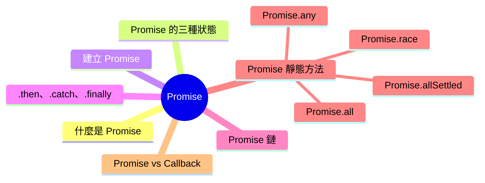
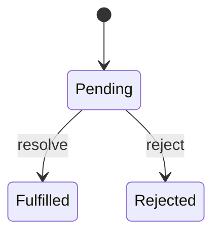

export const metadata = {
  title: 'JavaScript Promise',
  date: '2026-03-19',
  excerpt: '介紹 JavaScript Promise 的核心概念，包含三種狀態、.then、.catch、.finally 的用法、Promise 鏈，以及 Promise.all、Promise.allSettled、Promise.race、Promise.any 靜態方法。',
  tags: ['前端', 'JavaScript'],
};

# JavaScript Promise

Promise 是 ES6 引入的非同步處理方式，用來解決 Callback Hell 的問題，讓非同步程式碼更有結構、更易讀。

簡單來說：Promise 代表一個尚未完成、但未來會有結果的操作。



- [什麼是 Promise](#什麼是-promise)
- [Promise 的三種狀態](#promise-的三種狀態)
- [建立 Promise](#建立-promise)
- [.then、.catch、.finally](#thencatchfinally)
- [Promise 鏈](#promise-鏈)
- [Promise 靜態方法](#promise-靜態方法)
- [Promise vs Callback](#promise-vs-callback)

---

## 什麼是 Promise

Promise 是一個代表非同步操作結果的物件。

---

## Promise 的三種狀態

每個 Promise 只會處於以下三種狀態之一：

- Pending (等待中)：操作尚未完成，初始狀態
- Fulfilled (已成功)：操作成功完成，有結果值
- Rejected (已失敗)：操作失敗，有錯誤原因

狀態一旦從 Pending 轉變為 Fulfilled 或 Rejected，就不能再改變。



---

## 建立 Promise

使用 `new Promise()` 建立，傳入一個執行函式 (executor)，executor 接收兩個參數：`resolve` 和 `reject`。

- 呼叫 `resolve(value)` → Promise 進入 Fulfilled 狀態
- 呼叫 `reject(reason)` → Promise 進入 Rejected 狀態

```javascript
const promise = new Promise(function (resolve, reject) {
  const success = true;

  if (success) {
    resolve("成功的結果");
  } else {
    reject("失敗的原因");
  }
});
```

非同步操作的例子：

```javascript
function delay(ms) {
  return new Promise(function (resolve) {
    setTimeout(function () {
      resolve("完成");
    }, ms);
  });
}

delay(1000).then(function (result) {
  console.log(result); // "完成" (1 秒後)
});
```

---

## .then、.catch、.finally

### .then

`.then` 用來處理 Promise 成功的結果：

```javascript
promise.then(function (result) {
  console.log(result); // "成功的結果"
});
```

`.then` 接收兩個參數，第一個處理成功，第二個處理失敗 (但通常用 `.catch` 代替)：

```javascript
promise.then(
  function (result) { console.log(result); },
  function (error) { console.error(error); }
);
```

### .catch

`.catch` 用來處理 Promise 失敗的情況：

```javascript
const promise = new Promise(function (resolve, reject) {
  reject("出錯了");
});

promise.catch(function (error) {
  console.error(error); // "出錯了"
});
```

### .finally

`.finally` 無論成功或失敗都會執行，通常用來做清理工作：

```javascript
promise
  .then(function (result) {
    console.log(result);
  })
  .catch(function (error) {
    console.error(error);
  })
  .finally(function () {
    console.log("無論如何都會執行");
  });
```

---

## Promise 鏈

`.then` 會回傳一個新的 Promise，所以可以鏈式呼叫，讓多個非同步操作依序執行：

```javascript
fetch("https://api.example.com/user")
  .then(function (response) {
    return response.json();
  })
  .then(function (user) {
    return fetch("https://api.example.com/posts/" + user.id);
  })
  .then(function (response) {
    return response.json();
  })
  .then(function (posts) {
    console.log(posts);
  })
  .catch(function (error) {
    console.error(error);
  });
```

Promise 鏈中，任何一個 `.then` 拋出錯誤或回傳 Rejected Promise，都會跳過後續的 `.then`，直接被 `.catch` 捕獲。

---

## Promise 靜態方法

### Promise.all

同時執行多個 Promise，全部成功才 resolve，回傳所有結果組成的陣列；任一失敗就 reject：

```javascript
const p1 = Promise.resolve(1);
const p2 = Promise.resolve(2);
const p3 = Promise.resolve(3);

Promise.all([p1, p2, p3]).then(function (results) {
  console.log(results); // [1, 2, 3]
});
```

```javascript
const p1 = Promise.resolve(1);
const p2 = Promise.reject("失敗");
const p3 = Promise.resolve(3);

Promise.all([p1, p2, p3]).catch(function (error) {
  console.error(error); // "失敗"
});
```

適合用於多個請求都需要成功才能繼續的情況。

### Promise.allSettled

等待所有 Promise 完成，無論成功或失敗，回傳每個 Promise 的結果：

```javascript
const p1 = Promise.resolve(1);
const p2 = Promise.reject("失敗");
const p3 = Promise.resolve(3);

Promise.allSettled([p1, p2, p3]).then(function (results) {
  console.log(results);
  // [
  //   { status: "fulfilled", value: 1 },
  //   { status: "rejected", reason: "失敗" },
  //   { status: "fulfilled", value: 3 }
  // ]
});
```

適合用於需要知道每個操作結果、不希望因為一個失敗而中斷的情況。

### Promise.race

多個 Promise 同時執行，最快完成的那個 (無論成功或失敗) 決定結果：

```javascript
const p1 = new Promise(resolve => setTimeout(() => resolve("慢"), 1000));
const p2 = new Promise(resolve => setTimeout(() => resolve("快"), 500));

Promise.race([p1, p2]).then(function (result) {
  console.log(result); // "快"
});
```

適合用於設定超時限制的情境。

### Promise.any

多個 Promise 同時執行，任一成功就 resolve；全部失敗才 reject：

```javascript
const p1 = Promise.reject("失敗 1");
const p2 = Promise.resolve("成功");
const p3 = Promise.reject("失敗 2");

Promise.any([p1, p2, p3]).then(function (result) {
  console.log(result); // "成功"
});
```

---

## Promise vs Callback

| | Callback | Promise |
| - | - | - |
| 可讀性 | 多層巢狀時差 | 鏈式呼叫，較清晰 |
| 錯誤處理 | 各層獨立處理 | 統一由 `.catch` 處理 |
| 多個非同步操作 | Callback Hell | Promise 鏈或靜態方法 |

Promise 解決了 Callback Hell 的問題，讓非同步程式碼更線性、更容易維護。

---

## 總結

Promise 讓非同步操作有了清楚的結構，也讓成功和失敗的處理方式變得一致。

- 三種狀態：Pending、Fulfilled、Rejected
- `.then` 處理成功，`.catch` 處理失敗，`.finally` 無論如何都執行
- Promise 鏈讓多個非同步操作可以依序執行
- `Promise.all`、`Promise.allSettled`、`Promise.race`、`Promise.any` 處理多個並行操作

理解 Promise 之後，接下來通常會進一步學習：

- async / await
- Event Loop
- 錯誤處理
