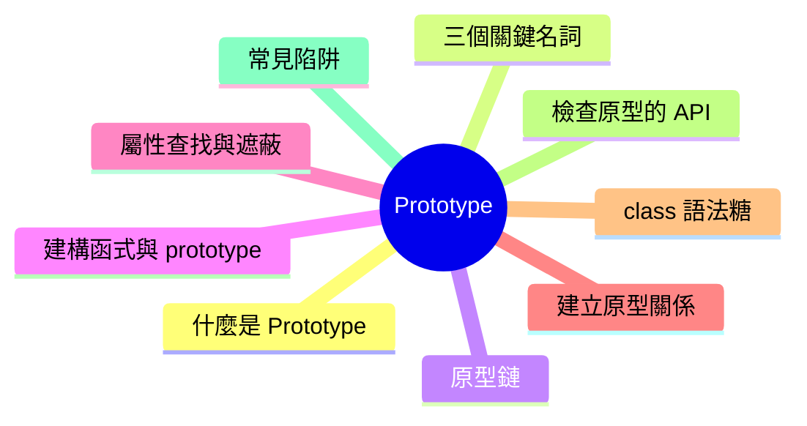
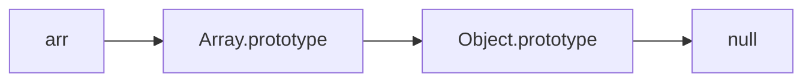

export const metadata = {
  title: 'JavaScript Prototype：原型與原型鏈',
  date: '2026-06-26',
  excerpt: '介紹 JavaScript 原型 (Prototype) 與原型鏈的運作機制，包含 prototype 與 __proto__ 的差別、屬性查找與繼承、建構函式、屬性遮蔽，以及 class 語法糖與常見陷阱。',
  tags: ['前端', 'JavaScript'],
};

# JavaScript Prototype：原型與原型鏈

大多數語言用「類別」實作繼承，JavaScript 卻是少數以「原型 (prototype)」為核心的語言。

每個物件內部都藏著一條連到另一個物件的連結。當你存取一個物件上不存在的屬性時，JavaScript 會沿著這條連結往上 —— 就是原型鏈 (prototype chain)。

理解這套機制，等於理解了 JavaScript 物件、繼承、`class`、`instanceof` 背後共同的底層原理。



- [什麼是 Prototype](#什麼是-prototype)
- [prototype 與 `__proto__` 的差別](#prototype-與-__proto__-的差別)
- [原型鏈 Prototype Chain](#原型鏈-prototype-chain)
- [建構函式與 prototype](#建構函式與-prototype)
- [屬性查找與屬性遮蔽](#屬性查找與屬性遮蔽)
- [為什麼方法要定義在 prototype 上](#為什麼方法要定義在-prototype-上)
- [建立原型關係的四種方式](#建立原型關係的四種方式)
- [class 是 prototype 的語法糖](#class-是-prototype-的語法糖)
- [檢查與操作原型的 API](#檢查與操作原型的-api)
- [常見陷阱](#常見陷阱)
- [規則總覽](#規則總覽)

---

## 什麼是 Prototype

JavaScript 是一門以原型為基礎 (prototype-based) 的語言。每個物件內部都有一個隱藏的連結，指向另一個物件，這個物件就是它的原型。

當你讀取一個物件上沒有的屬性時，JavaScript 不會立刻放棄，而是順著這條連結到原型上繼續找。物件因此能「繼承」原型的屬性與方法，自己不必擁有一份。

這個隱藏連結在規格中稱為 `[[Prototype]]`，是物件的一個內部插槽 (internal slot)。

```javascript
const animal = {
  eats: true,
};

const dog = {
  barks: true,
};

Object.setPrototypeOf(dog, animal); // 讓 dog 的原型指向 animal

console.log(dog.barks); // true (dog 自己的屬性)
console.log(dog.eats);  // true (沿原型在 animal 上找到)
```

`dog` 本身沒有 `eats`，但 JavaScript 沿著 `[[Prototype]]` 找到了 `animal.eats`。

---

## prototype 與 `__proto__` 的差別

剛接觸原型最容易卡住的，是三個長得很像、意義卻完全不同的名詞。先把它們分清楚，後面就會順很多。

- `[[Prototype]]`：規格中的內部插槽，每個物件都有，指向它的原型。無法直接用程式碼存取，只能透過 API 讀寫。
- `__proto__`：`Object.prototype` 上的一個存取器 (getter / setter)，讓你讀寫某個物件的 `[[Prototype]]`。它屬於歷史遺留語法 (規格的 Annex B)，現代程式碼應改用 `Object.getPrototypeOf` 與 `Object.setPrototypeOf`。
- `prototype`：只存在於「函式」上的一般屬性。它不是函式自己的原型，而是「用 `new` 呼叫這個函式時，建立出來的實例會把它當成原型」。

| 名詞 | 存在於 | 用途 |
| - | - | - |
| `[[Prototype]]` | 每個物件 | 內部插槽，指向該物件的原型 |
| `__proto__` | 透過 `Object.prototype` | 存取器，讀寫 `[[Prototype]]` (舊語法) |
| `prototype` | 函式 | `new` 出來的實例會以它為原型 |

```javascript
function Person() {}

const p = new Person();

// p 的原型，就是 Person.prototype
console.log(Object.getPrototypeOf(p) === Person.prototype); // true
console.log(p.__proto__ === Person.prototype);              // true (等價，但不建議使用)

// prototype 只存在於函式上，一般物件沒有
console.log(p.prototype);             // undefined (p 是物件，沒有 prototype 屬性)
console.log(typeof Person.prototype); // "object" (函式才有 prototype，而它是個物件)
```

一句話記住：`prototype` 是函式給「未來實例」用的原型，`__proto__` 是某個物件「現在」的原型。

---

## 原型鏈 Prototype Chain

原型本身也是物件，所以它也有自己的原型。一層接一層連起來，就形成了原型鏈。

屬性查找會沿著這條鏈往上走，在某一層找到屬性就停下來；如果一路走到鏈的盡頭 `null` 都沒找到，存取結果就是 `undefined`。

```javascript
const arr = [1, 2, 3];

console.log(arr.hasOwnProperty("length")); // true，length 是 arr 自己的屬性
console.log(typeof arr.map);               // "function"，繼承自 Array.prototype
console.log(typeof arr.hasOwnProperty);    // "function"，繼承自 Object.prototype
```

`arr` 的原型鏈如下 (每個箭頭代表一條 `[[Prototype]]` 連結)：



以上面的查找為例：

- `length` 是 `arr` 自己的屬性，第一層就找到。
- `map` 不在 `arr` 身上，往上一層在 `Array.prototype` 找到。
- `hasOwnProperty` 連 `Array.prototype` 都沒有，再往上在 `Object.prototype` 找到。

`Object.prototype` 位於幾乎所有原型鏈的頂端，而它的 `[[Prototype]]` 是 `null`，這就是鏈的終點。

---

## 建構函式與 prototype

回頭看 `new` 與 `prototype` 的關係。當你定義一個函式並用 `new` 呼叫它時，原型鏈是自動接起來的。

```javascript
function Animal(name) {
  this.name = name;
}

Animal.prototype.speak = function () {
  console.log(this.name + " makes a sound");
};

const cat = new Animal("Cat");
cat.speak(); // "Cat makes a sound"
```

`new Animal("Cat")` 在背後做了四件事：

1. 建立一個新的空物件
2. 把新物件的 `[[Prototype]]` 設為 `Animal.prototype`
3. 以 `this` 指向新物件，執行 `Animal` 的程式碼
4. 回傳這個新物件 (除非建構函式自己回傳了一個物件)

所以 `cat` 身上並沒有 `speak`，卻能透過 `[[Prototype]]` 在 `Animal.prototype` 上找到它。

每個函式的 `prototype` 預設都帶有一個 `constructor` 屬性，指回函式本身：

```javascript
console.log(Animal.prototype.constructor === Animal); // true
console.log(cat.constructor === Animal);              // true (沿原型鏈找到)
```

---

## 屬性查找與屬性遮蔽

讀取 (read) 與寫入 (write) 屬性的行為並不對稱，這是很多 bug 的源頭。

- 讀取屬性：沿原型鏈往上找。
- 寫入屬性：直接在「物件自己身上」建立或覆寫，不會改到原型。這個現象稱為屬性遮蔽 (shadowing)。

```javascript
const animal = { legs: 4 };
const dog = Object.create(animal);

console.log(dog.legs); // 4 (繼承自 animal)

dog.legs = 2;          // 在 dog 自己身上建立 legs，遮蔽原型上的 legs

console.log(dog.legs);    // 2 (dog 自己的)
console.log(animal.legs); // 4 (原型完全不受影響)
```

正因為寫入只會動到實例自己，所以在原型上放「可變的物件或陣列」非常危 —— 會被所有實例共用同一份：

```javascript
function Team() {}
Team.prototype.members = []; // 放在原型上，所有實例共用

const a = new Team();
const b = new Team();

a.members.push("Alice"); // 改的是原型上的那一個陣列

console.log(b.members); // ["Alice"]，b 也跟著被影響
```

正確做法是把可變狀態放在實例上 (在建構函式內用 `this` 建立)，讓每個實例各自獨立。

---

## 為什麼方法要定義在 prototype 上

如果把方法直接寫在建構函式裡用 `this` 指派，每建立一個實例就會多一份函式複本，白白浪費記憶體：

```javascript
function User(name) {
  this.name = name;
  this.greet = function () {        // 每個 user 都帶一份自己的 greet
    console.log("Hi, " + this.name);
  };
}
```

放在 `prototype` 上，所有實例就共用同一份方法：

```javascript
function User(name) {
  this.name = name;
}

User.prototype.greet = function () { // 所有 user 共用這一份
  console.log("Hi, " + this.name);
};

const u1 = new User("A");
const u2 = new User("B");

console.log(u1.greet === u2.greet); // true，是同一個函式
```

原則很清楚：行為 (方法) 適合共用，放在原型上；狀態 (資料) 每個實例各自獨立，放在 `this` 上。

---

## 建立原型關係的四種方式

JavaScript 有四種常見的方式可以指定一個物件的原型：

1. `Object.create(proto) —— 指定的原型建立新物件
2. 建構函式搭配 `new`
3. `class —— 質仍是原型 (下一節說明)
4. `Object.setPrototypeOf(obj, proto) —— 改既有物件的原型 (效能較差，盡量避免)

```javascript
// 1. Object.create
const base = { hello() { return "hi"; } };
const obj = Object.create(base);
console.log(obj.hello()); // "hi"

// 2. 建構函式 + new
function Foo() {}
const f = new Foo(); // f 的原型是 Foo.prototype

// 4. setPrototypeOf
const target = {};
Object.setPrototypeOf(target, base);
console.log(target.hello()); // "hi"
```

另外，`Object.create(null)` 會建立一個「完全沒有原型」的物件，常拿來當作乾淨的字典 (dictionary)，因為它不會繼承到 `toString`、`hasOwnProperty` 等屬性，可以避免鍵名衝突：

```javascript
const dict = Object.create(null);
console.log(dict.toString); // undefined，完全乾淨，沒有任何繼承屬性
```

---

## class 是 prototype 的語法糖

ES6 的 `class` 看起來像其他語言的類別，但底層運作的仍然是原型。

```javascript
class Animal {
  constructor(name) {
    this.name = name;
  }

  speak() {
    console.log(this.name + " makes a sound");
  }
}
```

它大致等價於：

```javascript
function Animal(name) {
  this.name = name;
}

Animal.prototype.speak = function () {
  console.log(this.name + " makes a sound");
};
```

`speak` 一樣是被放到 `Animal.prototype` 上：

```javascript
console.log(typeof Animal.prototype.speak); // "function"
```

`extends` 則會同時接起「兩條」原型 —— 例的鏈，以及靜態 (static) 成員的鏈：

```javascript
class Dog extends Animal {
  speak() {
    console.log(this.name + " barks");
  }
}

const d = new Dog("Rex");

// 實例鏈：d → Dog.prototype → Animal.prototype → Object.prototype
console.log(Object.getPrototypeOf(Dog.prototype) === Animal.prototype); // true

// 靜態鏈：Dog → Animal (因此子類別能繼承父類別的 static 方法)
console.log(Object.getPrototypeOf(Dog) === Animal); // true
```

不過要注意，`class` 並不「完全等於」建構函式，有幾個實質差異：

- `class` 內部一律以嚴格模式 (strict mode) 執行。
- `class` 宣告雖然會被提升 (hoisting)，但在宣告前處於暫時性死區 (TDZ)，無法提前使用。
- `class` 一定要用 `new` 呼叫，直接呼叫會丟出 `TypeError`。
- 定義在 `class` 上的方法是不可列舉的 (non-enumerable)，`for...in` 不會列出它們。

---

## 檢查與操作原型的 API

```javascript
const arr = [1, 2, 3];

// 取得某物件的原型
Object.getPrototypeOf(arr); // Array.prototype

// 某物件是否出現在另一個物件的原型鏈上
Array.prototype.isPrototypeOf(arr); // true

// instanceof：檢查建構函式的 prototype 是否在原型鏈上
console.log(arr instanceof Array);  // true
console.log(arr instanceof Object); // true (Object.prototype 也在鏈上)

// 區分「自己的」與「繼承的」屬性
console.log(arr.hasOwnProperty("length")); // true (length 是自己的)
console.log("map" in arr);                  // true (in 會看整條原型鏈)
console.log(arr.hasOwnProperty("map"));     // false (map 是繼承來的)
```

`instanceof` 的判斷依據，正是原型鏈：`obj instanceof Constructor` 會檢查 `Constructor.prototype` 是否出現在 `obj` 的原型鏈中。

`in` 與 `hasOwnProperty` 的差別也很實用，前者看整條鏈，後者只看物件自己：

| 操作 | 是否包含繼承屬性 |
| - | - |
| `obj.hasOwnProperty(key)` | 否，只看自己的屬性 |
| `key in obj` | 是，會沿原型鏈往上找 |

---

## 常見陷阱

### 不要修改內建原型

在 `Array.prototype`、`Object.prototype` 上加方法看似方便，卻會污染所有同類型物件，可能與未來的語言特性或第三方函式庫衝突，也會讓 `for...in` 跑出意料之外的鍵。

```javascript
Array.prototype.last = function () {
  return this[this.length - 1];
}; // 看起來方便，但會影響到程式中所有陣列，實務上應避免
```

### 物件字面值裡的 `__proto__` 是特例

```javascript
const obj = {
  __proto__: someProto, // 這是在「設定原型」，不是建立一個叫 __proto__ 的屬性
};
```

在物件字面值中，`__proto__:` 帶有特殊語意 (設定該物件的原型)。如果你真的需要一個名為 `__proto__` 的一般屬性，要改用 `Object.defineProperty`。

### 動態改變原型會傷害效能

`Object.setPrototypeOf(obj, proto)` 或 `obj.__proto__ = proto` 會讓 JavaScript 引擎放棄對該物件已最佳化的內部結構 (hidden class / shape)，拖慢後續的屬性存取。需要指定原型時，優先在「建立物件當下」就用 `Object.create` 或 `class` 決定好。

### 原型鏈不是越長越好

每多一層，找不到的屬性查找就要多走一步。多數情況下感受不到，但在極深的鏈或熱路徑 (hot path) 上，仍可能成為效能瓶頸。

---

## 規則總覽

| 概念 | 說明 |
| - | - |
| `[[Prototype]]` | 每個物件的內部插槽，指向它的原型 |
| `__proto__` | 存取 `[[Prototype]]` 的存取器 (歷史語法) |
| `prototype` | 函式專屬，`new` 出的實例會以它為原型 |
| 屬性讀取 | 沿原型鏈往上找，直到 `null` |
| 屬性寫入 | 一律寫在實例自己身上 (遮蔽) |
| `constructor` | `prototype` 上指回函式本身的屬性 |
| `instanceof` | 檢查 `Constructor.prototype` 是否在鏈上 |
| `class` | 原型繼承的語法糖，底層仍是原型鏈 |

---

## 總結

- JavaScript 以原型實現繼承：每個物件透過 `[[Prototype]]` 連到另一個物件。
- 讀取找不到的屬性時，會沿原型鏈往上找，直到 `null` 為止。
- `prototype` 是函式上的屬性，決定 `new` 出來的實例的原型；`__proto__` 則是存取既有物件原型的舊語法。
- 方法放在原型上 (共用)，狀態放在實例的 `this` 上 (各自獨立)。
- `class` 是這整套機制的語法糖，底層運作的仍然是原型鏈。
