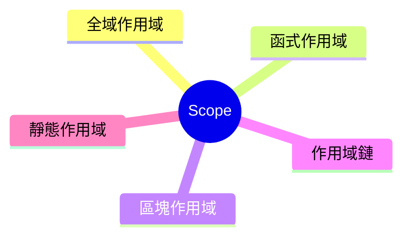

export const metadata = {
  title: 'JavaScript Scope：作用域',
  date: '2026-03-16',
  excerpt: '介紹 JavaScript 作用域的核心概念，包含全域作用域、函式作用域、區塊作用域、作用域鏈與靜態作用域。',
  tags: ['前端', 'JavaScript'],
};

# JavaScript Scope：作用域

Scope (作用域) 決定了變數在哪裡可以被存取。

理解作用域，是理解 JavaScript 變數行為、避免錯誤的基礎。



- [什麼是 Scope](#什麼是-scope)
- [全域作用域](#全域作用域)
- [函式作用域](#函式作用域)
- [區塊作用域](#區塊作用域)
- [作用域鏈](#作用域鏈)
- [靜態作用域](#靜態作用域)

---

## 什麼是 Scope

Scope 定義了變數的「可見範圍」。

簡單來說：在某個位置宣告的變數，只能在特定範圍內被存取。

JavaScript 有三種作用域：

- 全域作用域 (Global Scope)
- 函式作用域 (Function Scope)
- 區塊作用域 (Block Scope)

---

## 全域作用域

在所有函式和區塊外宣告的變數，屬於全域作用域，任何地方都可以存取：

```javascript
var name = "Charmy";

function greet() {
  console.log(name); // "Charmy"
}

greet();
console.log(name); // "Charmy"
```

全域變數雖然方便，但容易造成問題：

- 不同程式碼之間可能產生命名衝突
- 變數可能被意外修改
- 難以追蹤變數的來源與變化

現代 JavaScript 開發中，應盡量避免宣告全域變數。

---

## 函式作用域

在函式內宣告的變數，只能在函式內部存取，外部無法取得：

```javascript
function greet() {
  var message = "Hello";
  console.log(message); // "Hello"
}

greet();
console.log(message); // ReferenceError: message is not defined
```

每個函式都會建立自己獨立的作用域，函式之間的同名變數不會互相干擾：

```javascript
function funcA() {
  var value = 1;
  console.log(value); // 1
}

function funcB() {
  var value = 2;
  console.log(value); // 2
}

funcA();
funcB();
```

---

## 區塊作用域

ES6 引入了 `let` 和 `const`，帶來了區塊作用域的概念。

用 `{}` 包住的區塊，會形成獨立的作用域：

```javascript
{
  let a = 1;
  const b = 2;
  console.log(a); // 1
  console.log(b); // 2
}

console.log(a); // ReferenceError: a is not defined
console.log(b); // ReferenceError: b is not defined
```

`var` 不具備區塊作用域，不受 `{}` 限制：

```javascript
{
  var c = 3;
}

console.log(c); // 3
```

區塊作用域常見於 `if`、`for`、`while` 等語句中：

```javascript
if (true) {
  let result = "inside";
  console.log(result); // "inside"
}

console.log(result); // ReferenceError: result is not defined
```

```javascript
for (let i = 0; i < 3; i++) {
  // i 只存在於這個區塊
}

console.log(i); // ReferenceError: i is not defined
```

---

## 作用域鏈

當程式碼存取一個變數時，JavaScript 會先在目前的作用域尋找，找不到就往外層作用域尋找，一層一層往上，直到全域作用域為止。

這個查找機制稱為作用域鏈 (Scope Chain)。

```javascript
const a = 1;

function outer() {
  const b = 2;

  function inner() {
    const c = 3;
    console.log(a); // 1，往外找到全域
    console.log(b); // 2，往外找到 outer
    console.log(c); // 3，在自己的作用域找到
  }

  inner();
}

outer();
```

查找只會往外，不會往內：

```javascript
function outer() {
  function inner() {
    const x = 10;
  }
  console.log(x); // ReferenceError: x is not defined
}

outer();
```

`outer` 無法存取 `inner` 內部的變數。

如果一直往外都找不到，JavaScript 就會拋出 `ReferenceError`。

---

## 靜態作用域

JavaScript 採用靜態作用域 (Lexical Scope)。

意思是：作用域在程式碼撰寫時就已決定，與函式在哪裡被呼叫無關。

```javascript
const name = "global";

function printName() {
  console.log(name);
}

function main() {
  const name = "local";
  printName();
}

main(); // "global"
```

`printName` 被定義在全域，所以它的 `name` 來自全域作用域，即使它是在 `main` 內部被呼叫也不影響結果。

靜態作用域是理解閉包 (Closure) 的基礎概念。

---

## 總結

| 作用域 | 宣告位置 | 範圍 |
| - | - | - |
| 全域作用域 | 最外層宣告 | 整個程式 |
| 函式作用域 | 函式內部 | 函式內部 |
| 區塊作用域 | `{}` 內，使用 `let` / `const` | 區塊內部 |

理解作用域後，接下來通常會進一步學習：

- Hoisting
- Closure
- `this`
- Execution Context

這些概念都與作用域密切相關。
