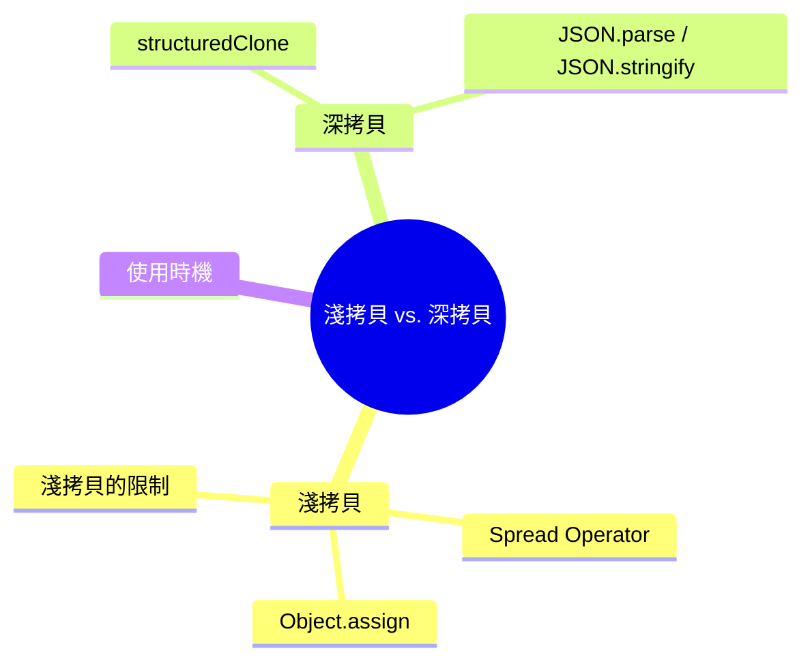

export const metadata = {
  title: 'JavaScript Shallow Copy vs Deep Copy：淺拷貝與深拷貝',
  date: '2026-03-20',
  excerpt: '介紹 JavaScript 淺拷貝與深拷貝的差異，包含 Spread Operator、Object.assign、structuredClone、JSON.parse/stringify 的使用方式與限制，以及各自適合的使用時機。',
  tags: ['前端', 'JavaScript'],
};

# JavaScript Shallow Copy vs Deep Copy：淺拷貝與深拷貝

複製物件在 JavaScript 中並不像看起來那麼簡單。

由於物件是 By Reference 傳遞的，直接賦值只會複製參考，不會建立新物件。要真正複製一個物件，需要明確地建立新物件，而複製的深度決定了結果的行為。

- Shallow Copy (淺拷貝)：只複製第一層，巢狀物件仍然共享參考
- Deep Copy (深拷貝)：完整複製所有層級，不共享任何參考



- [淺拷貝](#淺拷貝)
- [深拷貝](#深拷貝)
- [使用時機](#使用時機)

---

## 淺拷貝

淺拷貝只複製物件的第一層屬性。

如果某個屬性的值本身也是物件，淺拷貝複製的是那個物件的參考，而不是建立新的物件。

### Spread Operator

```javascript
const original = { name: 'Charmy', age: 25 };
const copy = { ...original };

copy.name = 'Charmying';

console.log(original.name); // "Charmy" (未受影響)
console.log(copy.name);     // "Charmying"
```

對於第一層的原始值，修改 `copy` 不會影響 `original`。

### Object.assign

```javascript
const copy = Object.assign({}, original);
```

效果與 Spread Operator 相同。

### 陣列的淺拷貝

```javascript
const arr = [1, 2, 3];
const copy = [...arr];

copy.push(4);

console.log(arr);  // [1, 2, 3] (未受影響)
console.log(copy); // [1, 2, 3, 4]
```

其他陣列的淺拷貝方法：

```javascript
const copy = arr.slice();
const copy = Array.from(arr);
```

### 淺拷貝的限制

當物件有巢狀結構時，Shallow Copy 只複製第一層，巢狀物件仍然指向同一個參考：

```javascript
const original = {
  name: 'Charmy',
  address: { city: 'Taipei' }
};

const copy = { ...original };

copy.name = 'Charmying';        // 第一層，不影響 original
copy.address.city = 'Taichung'; // 巢狀物件，影響 original

console.log(original.name);         // "Charmy" (未受影響)
console.log(original.address.city); // "Taichung" (受影響)
```

`copy.address` 和 `original.address` 指向同一個物件，修改其中一個，另一個也會改變。

---

## 深拷貝

深拷貝完整複製物件的所有層級，不共享任何參考。修改副本不會影響原始物件。

### structuredClone

`structuredClone` 是現代 JavaScript 內建的深拷貝方法，支援大多數常見的資料型別：

```javascript
const original = {
  name: 'Charmy',
  address: { city: 'Taipei' },
  scores: [90, 85, 92]
};

const copy = structuredClone(original);

copy.name = 'Charmying';
copy.address.city = 'Taichung';
copy.scores.push(100);

console.log(original.name);         // "Charmy" (未受影響)
console.log(original.address.city); // "Taipei" (未受影響)
console.log(original.scores);       // [90, 85, 92] (未受影響)
```

`structuredClone` 支援的型別包括：`Object`、`Array`、`Date`、`Map`、`Set`、`RegExp`、`ArrayBuffer` 等。

不支援的型別：`Function`、`DOM 節點`、`class 實例的方法`。

### JSON.parse / JSON.stringify

透過 JSON 序列化再還原，也可以達到深拷貝的效果：

```javascript
const original = {
  name: 'Charmy',
  address: { city: 'Taipei' }
};

const copy = JSON.parse(JSON.stringify(original));

copy.address.city = 'Taichung';

console.log(original.address.city); // "Taipei" (未受影響)
```

但這個方法有明確的限制，以下型別無法正確處理：

```javascript
const original = {
  name: 'Charmy',
  greet: function () {},     // function → 會被忽略
  createdAt: new Date(),     // Date → 轉為字串，不再是 Date 物件
  value: undefined,          // undefined → 會被忽略
  pattern: /hello/,          // RegExp → 轉為空物件 {}
};

const copy = JSON.parse(JSON.stringify(original));

console.log(copy.greet);     // undefined (被忽略)
console.log(copy.createdAt); // string (不是 Date)
console.log(copy.value);     // undefined (被忽略)
console.log(copy.pattern);   // {} (不是 RegExp)
```

---

## 使用時機

### 使用淺拷貝

物件只有一層，或者你確定不需要複製巢狀物件時：

```javascript
// 更新狀態時建立新物件 (例如 React state)
const newState = { ...state, name: 'Charmying' };

// 複製陣列
const newArr = [...arr];
```

淺拷貝效能好，語法簡潔，適合大多數日常使用場景。

### 使用深拷貝

物件有巢狀結構，且需要完全獨立的副本時：

```javascript
// 複製複雜的設定物件
const configCopy = structuredClone(config);

// 複製 API 回傳的資料後再修改
const dataCopy = structuredClone(apiData);
```

優先使用 `structuredClone`，只有在需要相容舊環境或物件結構非常簡單時才考慮 `JSON.parse / JSON.stringify`。

---

## 總結

| | 淺拷貝 | 深拷貝 |
| - | - | - |
| 複製深度 | 第一層 | 所有層級 |
| 巢狀物件 | 共享參考 | 完全獨立 |
| 常用方法 | `...spread`、`Object.assign` | `structuredClone`、`JSON.parse/stringify` |
| 效能 | 較快 | 較慢 (依物件大小) |
| 適合場景 | 扁平物件、狀態更新 | 有巢狀結構的完整複製 |
