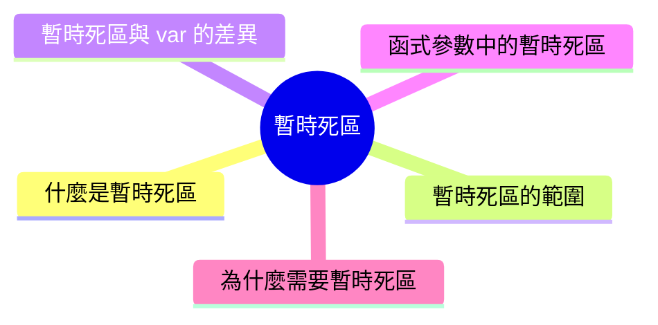

export const metadata = {
  title: 'JavaScript 暫時死區 (Temporal Dead Zone)',
  date: '2026-03-17',
  excerpt: '介紹 JavaScript 暫時死區 (TDZ) 的運作機制，包含暫時死區的範圍、與 var 的差異、函式參數中的暫時死區，以及為什麼需要暫時死區。',
  tags: ['前端', 'JavaScript'],
};

# JavaScript 暫時死區 (Temporal Dead Zone)

使用 `let` 或 `const` 宣告變數時，如果在宣告之前就嘗試存取它，會直接報錯。

這段「宣告前無法存取」的期間，就是暫時死區 (Temporal Dead Zone，TDZ)。



- [什麼是暫時死區](#什麼是暫時死區)
- [暫時死區的範圍](#暫時死區的範圍)
- [暫時死區與 `var` 的差異](#暫時死區與-var-的差異)
- [函式參數中的暫時死區](#函式參數中的暫時死區)
- [為什麼需要暫時死區](#為什麼需要暫時死區)

---

## 什麼是暫時死區

`let` 和 `const` 宣告的變數，在進入作用域時就會被 Hoisting，但不會被初始化。

從作用域開始，到宣告語句被執行為止，這段期間就是暫時死區。

在 暫時死區內存取變數，會拋出 `ReferenceError`：

```javascript
console.log(name); // ReferenceError: Cannot access 'name' before initialization
let name = "Charmy";
```

宣告語句執行之後，暫時死區結束，變數才能正常使用：

```javascript
let name = "Charmy";
console.log(name); // "Charmy"
```

---

## 暫時死區的範圍

暫時死區從變數所在的作用域開始，到宣告語句執行為止。

```javascript
{
  // 暫時死區開始

  console.log(name); // ReferenceError

  let name = "Charmy"; // 暫時死區結束

  console.log(name); // "Charmy"
}
```

暫時死區是以作用域為單位的，不是以整個檔案為單位。

換句話說，同一個變數在不同的作用域裡，暫時死區的起點也不同：

```javascript
let name = "global";

{
  // 這個區塊有自己的暫時死區
  console.log(name); // ReferenceError，不是 "global"
  let name = "local";
}
```

內層的 `let name` 在這個區塊內建立了自己的暫時死區，遮蔽了外層的 `name`，所以在宣告前存取會報錯，而不是取到外層的值。

---

## 暫時死區與 `var` 的差異

`var` 沒有暫時死區，宣告前存取會得到 `undefined`，而不是報錯：

```javascript
console.log(a); // undefined
var a = 1;

console.log(b); // ReferenceError
let b = 2;
```

兩者的差異在於初始化時機：

- `var`：Hoisting 時就自動初始化為 `undefined`
- `let` / `const`：Hoisting 時不初始化，進入暫時死區，直到宣告語句執行才初始化

---

## 函式參數中的暫時死區

暫時死區也出現在使用預設參數的函式中。

參數的預設值是在呼叫時從左到右依序求值的，如果後面的參數引用了前面還沒初始化的參數，就會觸發暫時死區：

```javascript
// 正常：b 的預設值引用了已經初始化的 a
function greet(a = 1, b = a) {
  console.log(a, b); // 1 1
}

greet();
```

```javascript
// 錯誤：a 的預設值引用了還沒初始化的 b
function greet(a = b, b = 1) {
  console.log(a, b);
}

greet(); // ReferenceError: Cannot access 'b' before initialization
```

---

## 為什麼需要暫時死區

暫時死區的設計是刻意的，目的是讓程式碼更安全、錯誤更容易被發現。

`var` 的 Hoisting 行為雖然不會報錯，但得到 `undefined` 可能讓 bug 悄悄藏起來，不容易追蹤：

```javascript
console.log(count); // undefined，不報錯，容易忽略
var count = 10;
```

`let` 和 `const` 改為直接報錯，讓問題在第一時間浮現：

```javascript
console.log(count); // ReferenceError，馬上知道哪裡出問題
let count = 10;
```

暫時死區讓「先宣告再使用」成為強制規範，而不只是建議。

---

## 總結

- 暫時死區是 `let` 和 `const` 宣告前無法存取的期間
- 暫時死區從作用域開始，到宣告語句執行為止
- 在暫時死區內存取變數會拋出 `ReferenceError`
- `var` 沒有暫時死區，宣告前存取會得到 `undefined`
- 暫時死區的設計讓錯誤更容易被發現，強制先宣告再使用

理解 暫時死區之後，接下來通常會進一步學習：

- Hoisting
- Scope
- Execution Context
